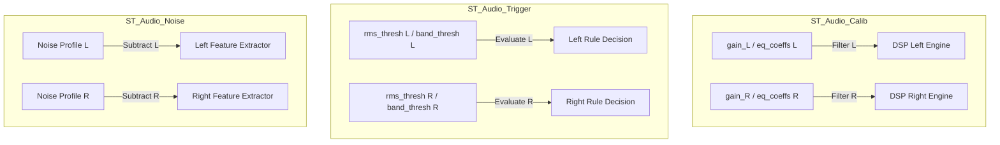

# ESP32 MSFM 110 (244 버전) 모순 반영 및 듀얼 채널화 상세 설계

본 문서는 `모순_244_002.md` 요구사항(B안: 어큐뮬레이터 + 글로벌 상태 보드) 및 "오디오 빔포밍(`beam_en`) 옵션화와 미적용 시 스테레오(Left/Right) 채널 독립 분리" 요구사항을 PlatformIO ESP32 프로젝트 244 버전에 통합하여 반영하기 위한 세부 아키텍처 및 인터페이스 설계서입니다.

---

## 1. 아키텍처 변경 개요 및 정합성 설계

시간 해상도와 주기(오디오: 24ms, 진동: 160ms)가 판이한 멀티모달 센서 데이터 간의 동기화 결합을 제거(Decoupling)하고, 독립적인 라이프사이클을 보장하기 위해 다음과 같은 전 계층 아키텍처 조정을 수행합니다.

```mermaid
graph TD
    subgraph Capture Layer (Core 0)
        I2S[I2S DMA Audio Capture] -->|Blocking 24ms| qAudio[Audio Ready]
        BMI[BMI270 FIFO Polling] -->|Non-blocking Accumulate| Acc[Vib Accumulator]
        Acc -->|Target Reached 160ms| qVib[Vib Ready]
    end

    subgraph FSM & Queue Routing (Core 1)
        qAudio -->|FsmQueueMsg: AUDIO_ONLY| QReady[Unified Msg Queue: _qReadyIdx]
        qVib -->|FsmQueueMsg: VIB_ONLY| QReady
        QReady -->|Dispatch| FSM[FSM processTask]
    end

    subgraph DSP & Feature Extraction (Core 1)
        FSM -->|AUDIO_ONLY| DSP_A[DSP Audio Engine L/R]
        FSM -->|VIB_ONLY| DSP_V[DSP Vib Engine X/Y/Z]
        DSP_A --> Feat_A[Audio Feature & MFCC 5ch]
        DSP_V --> Feat_V[Vib Feature]
    end

    subgraph Global Board & Telemetry
        Feat_A -->|Partial Update L/R| GB[Global Board: _globalBoard]
        Feat_V -->|Partial Update X/Y/Z| GB
        GB -->|Periodic Read 10Hz| Tele[Telemetry Websocket / MQTT]
    end

    subgraph Async Storage Engine
        Feat_A & Feat_V -->|Cross-Triggering| Session[Storage Session]
        Session -->|WAV Header & Raw L/R| WAV[Raw Audio File: .wav]
        Session -->|VIB Header & Raw X/Y/Z| VIB[Raw Vib File: .vib]
    end
```

---

## 2. 데이터 아키텍처 및 자료 구조 설계 (`T210_Def`, `T215_Type`)

### 2.1. 상수 및 차원 재정의 (`T210_Def_244.hpp`)
* **오디오 L/R 분리 시 AI 텐서 5채널화:**
  * **기존:** 진동 3축 + 오디오 1축 = 4채널 (`32 * 3 * 4 = 384` 차원)
  * **변경:** 진동 3축 + 오디오 Left + 오디오 Right = 5채널 (`32 * 3 * 5 = 480` 차원)
  * compile-time 식 수정을 통해 SIMD 및 메모리 버스 정렬 규칙을 유지합니다.

```cpp
// e:\241224_Sub\50_2540\Platformio7\ESP32_MSFM_110\src\T2_MSFM_240\244\T210_Def_244.hpp

namespace T2_Def {
    namespace Audio {
        namespace FeatureLimit {
            inline constexpr uint32_t MFCC_COEFFS_MAX         = 32;
            inline constexpr uint32_t MFCC_COMPONENTS_MAX     = 3; // Static, Delta, D-Delta

            // [정밀 교정] 진동 3축 + 오디오 2채널(L/R) = 총 5채널 기반 차원 재산출
            inline constexpr uint32_t MFCC_DIM_MAX            = MFCC_COEFFS_MAX * MFCC_COMPONENTS_MAX * 5; // 32 * 3 * 5 = 480
            inline constexpr uint32_t MFCC_DIM_DEF            = MFCC_COEFFS_DEF * MFCC_COMPONENTS_DEF * 5; // 13 * 3 * 5 = 195
        }
    }
}
```

### 2.2. 구조체 전면 분리 및 듀얼 채널화 (`T215_Type_244.hpp`)
* **원시 데이터(Raw) 구조체 완전 독립 분리**
* **오디오 특징량 구조체 듀얼 채널(`[2]`)로의 구조적 확장**
* **16-byte 정렬(`alignas(16)`)을 유지하기 위한 바이트 크기 재배치 검증**

```cpp
// e:\241224_Sub\50_2540\Platformio7\ESP32_MSFM_110\src\T2_MSFM_240\244\T215_Type_244.hpp

namespace T2_Type {

// 1. 원시 데이터 Chunk 독립 분리
struct alignas(16) ST_RawAudioChunk {
    float audio_l[T2_Def::Audio::Sensor::FFT_SIZE_MAX];
    float audio_r[T2_Def::Audio::Sensor::FFT_SIZE_MAX];
}; // 1024 * 4 * 2 = 8,192 Bytes (8KB) -> 16의 배수 완벽 일치

struct alignas(16) ST_RawVibChunk {
    float vib[3][T2_Def::Vib::Sensor::FFT_SIZE_MAX];
}; // 1024 * 4 * 3 = 12,288 Bytes (12KB, FFT_MAX=1024 기준) -> 16의 배수 완벽 일치
   // 256 * 4 * 3 = 3,072 Bytes (3KB, FFT_MAX=256 기준)

// 2. 단일 채널 전용 소음 특징량 구조체 정의 (코드 중복 제거 및 구조화)
struct ST_Audio_Channel_Slot {
    float        rms;                // RMS
    float        energy;             // 절대 에너지
    float        centroid;           // 주파수 무게 중심
    float        kurt;               // 첨도
    float        crest;              // 파고율
    float        skew;               // 왜도
    float        sta_lta;            // STA/LTA 비율
    float        d_rms;              // RMS 변화율
    float        dd_rms;             // RMS 변화 가속도

    // [듀얼 채널 개정] 주파수/스펙트럼 특징량 채널별 완전 격리
    float        cpsr_max[T2_Def::Shared::FeatureLimit::CEPS_TARGET_MAX];
    float        cpsr_mxr[T2_Def::Shared::FeatureLimit::CEPS_TARGET_MAX];
    float        band_energy[T2_Def::Shared::FeatureLimit::BAND_RMS_MAX];
    SpectralPeak top_peaks[T2_Def::Shared::FeatureLimit::TOP_PEAKS_MAX];
};
// ch_slot 크기 계산:
// float 9개 = 36B
// cpsr_max(5) + cpsr_mxr(5) = 40B
// band_energy(16) = 64B
// SpectralPeak(8B) * 10 = 80B
// 총합 = 36 + 40 + 64 + 80 = 220 Bytes

// 3. 통합 소음 특징량 구조체 듀얼 채널(L/R) 확장
struct ST_Slot_Audio {
    ST_Audio_Channel_Slot ch[2];     // [변경] ch[0] = Left, ch[1] = Right 독립 분석

    // 공간 결함성 지표 (L/R 교차 상관 및 위상 분석)
    float        coh;                // 공간 결함성 (단일 유지)
    float        ipd;                // 채널 간 위상차 (단일 유지)

    float        _pad[4];            // [정밀 얼라인먼트] 16의 배수 충족을 위한 패딩
};
// 크기 계산:
// ch_slot(220B) * 2 = 440B
// coh, ipd = 8B
// _pad[4] = 16B
// 총합 = 440 + 8 + 16 = 464 Bytes (16의 배수 완벽 보장: 464 / 16 = 29)

// 4. AI 텐서 슬롯 확장
struct ST_Slot_Tensor {
    alignas(16) float mfcc[T2_Def::Audio::FeatureLimit::MFCC_DIM_MAX]; // 480 Floats = 1920 Bytes
}; // 1920 Bytes -> 16의 배수 보장

// 5. 통합 글로벌 상태 보드용 Slot (244 버전에 새로 산출된 SIMD Perfect Alignment)
struct alignas(16) UnifiedFeatureSlot {
    ST_Slot_Header header; // 32 Bytes
    ST_Slot_Vib    vib;    // 144 Bytes
    ST_Slot_Audio  audio;  // 464 Bytes [변경]
    ST_Slot_Tensor tensor; // 1920 Bytes [변경]
};
// 총 크기: 32 + 144 + 464 + 1920 = 2560 Bytes (2560 / 16 = 160, 완벽 정렬!)
// 2560 Bytes 역시 16의 배수로 완벽하게 떨어지며 SIMD alignas(16) 경계가 안전하게 방어됩니다.

// 5. 텔레메트리 패킷 (WsHeader 정렬 유지)
struct PktTelemetry {
    WsHeader header;            // 8B
    uint8_t  sys_state;         // 1B
    uint8_t  detect_result;     // 1B
    uint8_t  trial_no;          // 1B
    uint8_t  trigger_source;    // 1B
    uint8_t  active_axes;       // 1B
    uint8_t  payload_type;      // 1B
    uint8_t  _pad[2];           // 2B -> 누적 16B 선행 확보

    // 타임스탬프 갱신 감지 필드 (상태 Stale 방어)
    uint64_t audio_ts;          // [신규] 오디오 최종 처리 타임스탬프 (8B)
    uint64_t vib_ts;            // [신규] 진동 최종 처리 타임스탬프 (8B)

    // --- Vib Flatting ---
    float    vib_rms[3];
    float    vib_centroid[3];
    float    vib_kurtosis;
    float    vib_crest_factor;
    float    vib_sta_lta_ratio;
    float    vib_band_energy[T2_Def::Shared::FeatureLimit::BAND_RMS_MAX];

    // --- Audio Flattening (L/R 듀얼 채널화 반영) ---
    float    audio_rms[2];       // [변경]
    float    audio_energy[2];    // [변경]
    float    audio_kurtosis[2];  // [변경]
    float    audio_crest_factor[2]; // [변경]
    float    audio_sta_lta_ratio[2];// [변경]
    float    audio_skewness[2];  // [변경]
    float    audio_centroid[2];  // [변경]
    float    audio_coh;
    float    audio_ipd;
    float    audio_band_energy[2][T2_Def::Shared::FeatureLimit::BAND_RMS_MAX];    // [변경] L/R 채널별
    float    audio_peak_freqs[2][T2_Def::Shared::FeatureLimit::TOP_PEAKS_MAX];     // [변경] L/R 채널별
    float    audio_peak_amps[2][T2_Def::Shared::FeatureLimit::TOP_PEAKS_MAX];      // [변경] L/R 채널별
    float    audio_cpsr_max[2][T2_Def::Shared::FeatureLimit::CEPS_TARGET_MAX];   // [변경] L/R 채널별
    float    audio_cpsr_mxrms[2][T2_Def::Shared::FeatureLimit::CEPS_TARGET_MAX]; // [변경] L/R 채널별

    // --- AI Tensor ---
    float    mfcc[T2_Def::Audio::FeatureLimit::MFCC_DIM_MAX]; // 480 Floats
};

} // namespace T2_Type
```

---

## 3. 메모리 풀(Pool) 및 FSM 큐(Queue) 통신 설계 (`T290_FsmMgr`)

데이터 도메인 분리에 따라 `_featurePool`과 `_rawPool`을 독립적으로 쪼개고, 큐 통신 시 페이로드 종류를 인식할 수 있는 라우터 규격을 정의합니다.

### 3.1. PSRAM 분리형 메모리 풀
```cpp
// e:\241224_Sub\50_2540\Platformio7\ESP32_MSFM_110\src\T2_MSFM_240\244\T290_FsmMgr_244.hpp

// 동적 데이터 풀의 세분화 및 PSRAM 할당 선언
T2_Type::ST_RawAudioChunk*   _rawAudioPool  = nullptr; // [64] * 8KB = 512KB
T2_Type::ST_Slot_Audio*      _featAudioPool = nullptr; // [64] * 272B = 17KB

T2_Type::ST_RawVibChunk*     _rawVibPool    = nullptr; // [16] * 12KB = 192KB (진동은 1/4 크기로 할당하여 메모리 절약)
T2_Type::ST_Slot_Vib*        _featVibPool   = nullptr; // [16] * 144B = 2.2KB
```

### 3.2. FSM 큐 메시지 프로토콜 (`FsmQueueMsg`)
단순 인덱스 대신 페이로드 타입을 포함한 메시지 구조체를 큐로 수수합니다.

```cpp
namespace T2_Type {
    struct FsmQueueMsg {
        DataPayloadType type;  // VIB_ONLY 또는 AUDIO_ONLY
        uint8_t         index; // 해당 풀의 인덱스
    };
}
```

### 3.3. FSM `_processTask` 수신부 및 라우팅 디스패처
```cpp
void CL_T2_FsmManager::_processTask(void* p_param) {
    auto* v_self = static_cast<CL_T2_FsmManager*>(p_param);
    T2_Type::FsmQueueMsg v_msg;

    while (true) {
        if (xQueueReceive(v_self->_qReadyIdx, &v_msg, pdMS_TO_TICKS(100)) == pdTRUE) {
            if (v_msg.type == T2_Type::DataPayloadType::AUDIO_ONLY) {
                // 1. 오디오 DSP 및 특징량 추출 단독 실행
                float* v_rawL = v_self->_rawAudioPool[v_msg.index].audio_l;
                float* v_rawR = v_self->_rawAudioPool[v_msg.index].audio_r;

                v_self->_dsp.processAudio(v_rawL, v_rawR, v_self->_prcBufL, v_self->_prcBufR,
                                          v_self->_cfg.shared_dsp, v_self->_cfg.aud_dsp);

                v_self->_extractor.extractAudioFeatures(v_self->_prcBufL, v_self->_prcBufR,
                                                       &v_self->_featAudioPool[v_msg.index],
                                                       v_self->_cfg.aud_feat);

                // 2. 글로벌 상태 보드 부분 업데이트 (Lock 보호)
                xSemaphoreTake(v_self->_globalMux, portMAX_DELAY);
                v_self->_globalBoard.audio = v_self->_featAudioPool[v_msg.index];
                v_self->_globalBoard.header.ts = esp_timer_get_time() / 1000;
                v_self->_globalBoard.header.fid++;
                v_self->_globalBoard.header.payload_type = (uint8_t)T2_Type::DataPayloadType::AUDIO_ONLY;
                v_self->_lastAudioTs = v_self->_globalBoard.header.ts;
                xSemaphoreGive(v_self->_globalMux);

                // 3. 프리트리거 / 스토리지 비동기 플러시 (개별 파일 쓰기 요청)
                v_self->_storage.pushAudioFrame(&v_self->_featAudioPool[v_msg.index],
                                                &v_self->_rawAudioPool[v_msg.index]);

                // 4. 프리 인덱스 반납
                xQueueSend(v_self->_qFreeAudioIdx, &v_msg.index, portMAX_DELAY);

            } else if (v_msg.type == T2_Type::DataPayloadType::VIB_ONLY) {
                // 1. 진동 DSP 및 특징량 추출 단독 실행
                float* v_rawX = v_self->_rawVibPool[v_msg.index].vib[0];
                float* v_rawY = v_self->_rawVibPool[v_msg.index].vib[1];
                float* v_rawZ = v_self->_rawVibPool[v_msg.index].vib[2];

                v_self->_dsp.processAccel(v_rawX, v_rawY, v_rawZ,
                                          v_self->_prcVibX, v_self->_prcVibY, v_self->_prcVibZ,
                                          v_self->_cfg.shared_dsp);

                v_self->_extractor.extractVibFeatures(v_self->_prcVibX, v_self->_prcVibY, v_self->_prcVibZ,
                                                     &v_self->_featVibPool[v_msg.index],
                                                     v_self->_cfg.vib_feat);

                // 2. 글로벌 상태 보드 부분 업데이트 (Lock 보호)
                xSemaphoreTake(v_self->_globalMux, portMAX_DELAY);
                v_self->_globalBoard.vib = v_self->_featVibPool[v_msg.index];
                v_self->_globalBoard.header.ts = esp_timer_get_time() / 1000;
                v_self->_globalBoard.header.fid++;
                v_self->_globalBoard.header.payload_type = (uint8_t)T2_Type::DataPayloadType::VIB_ONLY;
                v_self->_lastVibTs = v_self->_globalBoard.header.ts;
                xSemaphoreGive(v_self->_globalMux);

                // 3. 프리트리거 / 스토리지 비동기 플러시 (개별 파일 쓰기 요청)
                v_self->_storage.pushVibFrame(&v_self->_featVibPool[v_msg.index],
                                              &v_self->_rawVibPool[v_msg.index]);

                // 4. 프리 인덱스 반납
                xQueueSend(v_self->_qFreeVibIdx, &v_msg.index, portMAX_DELAY);
            }

            // 5. AI 시퀀스 빌더 및 추론 트래킹 (스냅샷 기반 구동)
            // 100ms 타이머에 맞춰 _seqBuilder에 globalBoard 스냅샷 투입
        }
    }
}
```

---

## 4. 센서 수집부 및 어큐뮬레이터 설계 (`T230_Sensor`)

`_captureTask`는 여전히 단일 루프를 유지하여 CPU 코어 오버헤드를 아낍니다. 오디오는 DMA 블로킹(24ms)으로 돌고, 진동은 비차단(Non-blocking) 어큐뮬레이터를 덧붙여 결합도를 해제합니다.

### 4.1. 센서 엔진 내 진동 어큐뮬레이터 정의
```cpp
// e:\241224_Sub\50_2540\Platformio7\ESP32_MSFM_110\src\T2_MSFM_240\244\T230_Sensor_244.hpp

class CL_T2_SensorEngine {
private:
    // 진동 어큐뮬레이터 내부 링버퍼 (PSRAM)
    float*   _vibAccX = nullptr;
    float*   _vibAccY = nullptr;
    float*   _vibAccZ = nullptr;
    uint32_t _vibAccCount = 0;

public:
    // 비차단 진동 적재 메서드. 가용한 FIFO를 다 긁어가고, 타겟 사이즈 도달 시 true 반환
    bool accumulateVib(float* p_outX, float* p_outY, float* p_outZ, uint32_t p_targetSize);
};
```

### 4.2. 어큐뮬레이터 상세 구현
```cpp
// e:\241224_Sub\50_2540\Platformio7\ESP32_MSFM_110\src\T2_MSFM_240\244\T230_Sensor_244.cpp

bool CL_T2_SensorEngine::accumulateVib(float* p_outX, float* p_outY, float* p_outZ, uint32_t p_targetSize) {
    if (!_isBmiInit || _isPaused) return false;

    // BMI270 FIFO에서 가용한 샘플 개수를 빠르게 조회
    uint16_t v_fifoLen = 0;
    _readRegs(T2_Def::Vib::Hardware::REG_FIFO_LEN_ADDR_CONST, (uint8_t*)&v_fifoLen, 2);
    uint16_t v_availableFrames = v_fifoLen / T2_Def::Vib::Hardware::FIFO_FRAME_SIZE_CONST;

    if (v_availableFrames == 0) return false;

    // 임시 수집용 버퍼 확보
    static float v_tmpX[T2_Def::Vib::Hardware::FIFO_BATCH_SIZE_MAX];
    static float v_tmpY[T2_Def::Vib::Hardware::FIFO_BATCH_SIZE_MAX];
    static float v_tmpZ[T2_Def::Vib::Hardware::FIFO_BATCH_SIZE_MAX];

    // 배치 크기만큼 반복하여 FIFO 잔량 적재
    uint16_t v_readFrames = readVibFifoBatch(v_tmpX, v_tmpY, v_tmpZ,
                                             std::min(v_availableFrames, (uint16_t)T2_Def::Vib::Hardware::FIFO_BATCH_SIZE_MAX));

    for (uint16_t i = 0; i < v_readFrames; ++i) {
        if (_vibAccCount < p_targetSize) {
            _vibAccX[_vibAccCount] = v_tmpX[i];
            _vibAccY[_vibAccCount] = v_tmpY[i];
            _vibAccZ[_vibAccCount] = v_tmpZ[i];
            _vibAccCount++;
        }

        // 타겟 크기 충족 시 출력 버퍼에 밀어넣고 롤백
        if (_vibAccCount >= p_targetSize) {
            memcpy(p_outX, _vibAccX, p_targetSize * sizeof(float));
            memcpy(p_outY, _vibAccY, p_targetSize * sizeof(float));
            memcpy(p_outZ, _vibAccZ, p_targetSize * sizeof(float));

            _vibAccCount = 0; // 어큐뮬레이터 초기화
            return true;
        }
    }
    return false;
}
```

---

## 5. DSP 및 특징량 추출 파이프라인 (`T240_DspEng`, `T245_FeatExtra`)

### 5.1. DSP 엔진의 듀얼 필터화 (`T240_DspEng_244.hpp`)
`beam_en == false`인 경우, L과 R 채널이 완전히 독립적으로 FIR/IIR/Median 필터 역사를 각각 기억하도록 런타임 구조체를 배열화합니다.

```cpp
// e:\241224_Sub\50_2540\Platformio7\ESP32_MSFM_110\src\T2_MSFM_240\244\T240_DspEng_244.hpp

struct ST_AudioDspRuntime {
    alignas(16) float window[T2_Def::Audio::Sensor::FFT_SIZE_MAX];

    // [변경] DSP 필터 역사의 듀얼 채널([2]) 확장
    float             prev_pre_emp[2];
    alignas(16) float median_hist[2][T2_Def::Shared::Dsp::MEDIAN_WINDOW_MAX];
    alignas(16) float notch_coeffs[2][5];
    alignas(16) float notch_state[2][2];
    alignas(16) float notch2_coeffs[2][5];
    alignas(16) float notch2_state[2][2];
    alignas(16) float iir_hpf_coeffs[2][5];
    alignas(16) float iir_hpf_state[2][2];
    alignas(16) float iir_lpf_coeffs[2][5];
    alignas(16) float iir_lpf_state[2][2];

    fir_f32_t         fir_inst_hpf[2];
    fir_f32_t         fir_inst_lpf[2];
    alignas(16) float fir_hpf_coeffs[2][T2_Def::Shared::FeatureLimit::FIR_TAPS_MAX];
    alignas(16) float fir_lpf_coeffs[2][T2_Def::Shared::FeatureLimit::FIR_TAPS_MAX];
    alignas(16) float fir_state_hpf[2][T2_Def::Shared::FeatureLimit::FIR_TAPS_MAX];
    alignas(16) float fir_state_lpf[2][T2_Def::Shared::FeatureLimit::FIR_TAPS_MAX];
};
```

### 5.2. `processAudio` 분기 연산 설계
```cpp
// e:\241224_Sub\50_2540\Platformio7\ESP32_MSFM_110\src\T2_MSFM_240\244\T240_DspEng_244.cpp

void CL_T2_DspEngine::processAudio(const float* p_audL, const float* p_audR,
                                  float* p_outL, float* p_outR, uint32_t p_len,
                                  const T2_Type::ST_Shared_Dsp& p_sharedCfg,
                                  const T2_Type::ST_Audio_Dsp& p_audCfg) {
    if (!_isInitialized || !_audDsp) return;

    if (p_audCfg.beam_en) {
        // [A안] 빔포밍 합성 구동 (1채널 연산)
        for (uint32_t i = 0; i < p_len; ++i) {
            p_outL[i] = (p_audL[i] + p_audR[i]) * p_audCfg.beam_gain;
            p_outR[i] = 0.0f; // 우측 채널 Mute하여 연산 생략
        }

        // 채널 0(Left)에 대해서만 DSP 필터링 1회 처리
        _removeDC(p_outL, p_len);
        if (p_sharedCfg.med_en) {
            _applyMedianFilter(p_outL, _audDsp->median_hist[0], p_sharedCfg.med_win, p_len);
        }
        if (p_audCfg.pre_en) {
            _applyPreEmphasis(p_outL, _audDsp->prev_pre_emp[0], p_len, p_audCfg.pre_alpha);
        }

        // FIR 및 IIR 적용 (인덱스 0)
        // ... (생략)

    } else {
        // [B안] 스테레오 독립 분리 구동 (2채널 병렬 루프 연산)
        // 1. 원시 카피
        memcpy(p_outL, p_audL, p_len * sizeof(float));
        memcpy(p_outR, p_audR, p_len * sizeof(float));

        // L/R 각각 독립적으로 필터 역사 갱신 및 신호처리 적용
        for (int ch = 0; ch < 2; ++ch) {
            float* v_data = (ch == 0) ? p_outL : p_outR;

            _removeDC(v_data, p_len);
            if (p_sharedCfg.med_en) {
                _applyMedianFilter(v_data, _audDsp->median_hist[ch], p_sharedCfg.med_win, p_len);
            }
            if (p_audCfg.pre_en) {
                _applyPreEmphasis(v_data, _audDsp->prev_pre_emp[ch], p_len, p_audCfg.pre_alpha);
            }

            // notch, IIR, FIR 필터를 ch 인덱스 상태 버퍼를 사용해 각각 독립 연산
            // ... (dsps_fir_f32, dsps_biquad_f32 호출 시 _audDsp->fir_inst_hpf[ch] 등 사용)
        }
    }
}
```

---

## 6. 비동기 스토리지 엔진 정합성 설계 (`T260_Storage`)

두 센서의 독립 저장을 보장하고 추후 파이썬 기반 MLOps 파싱 복잡도를 제거하기 위해, 바이너리 멀티플렉싱을 완전히 철폐하고 포맷과 링버퍼를 완벽히 쪼갭니다.

```
[Storage Session Open (Event_20260519_120000_Epoch1234567)]
    ├── Event_20260519_120000_1234567.wav   <-- 리얼 PCM 32bit Stereo/Mono (.wav 규격)
    └── Event_20260519_120000_1234567.vib   <-- 3축 가속도 바이너리 레코드 (.vib 규격)
```

### 6.1. 비동기 링버퍼 및 파일 핸들 분리
```cpp
// e:\241224_Sub\50_2540\Platformio7\ESP32_MSFM_110\src\T2_MSFM_240\244\T260_Storage_244.hpp

class CL_T2_StorageManager {
private:
    File _rawAudioFile; // 오디오 (.wav)
    File _rawVibFile;   // 진동 (.vib)

    // 독립 비동기 링버퍼 (PSRAM 할당)
    T2_Type::ST_RawAudioChunk* _asyncAudioRing = nullptr;
    T2_Type::ST_RawVibChunk*   _asyncVibRing = nullptr;

    uint16_t _asyncAudioHead, _asyncAudioTail;
    uint16_t _asyncVibHead, _asyncVibTail;

    // PSRAM 바운스 버퍼 분리
    T2_Type::ST_RawAudioChunk* _bounceAudio = nullptr;
    T2_Type::ST_RawVibChunk*   _bounceVib = nullptr;

public:
    // API의 개별 호출 구조
    bool pushAudioFrame(const T2_Type::ST_Slot_Audio* p_feat, const T2_Type::ST_RawAudioChunk* p_raw);
    bool pushVibFrame(const T2_Type::ST_Slot_Vib* p_feat, const T2_Type::ST_RawVibChunk* p_raw);
};
```

### 6.2. 크로스 트리거링을 통한 파일 동기화 세션 기동
오디오 또는 진동 룰에서 트리거가 포착되었을 때, `Event_ID` 또는 동일 `Epoch` 타임스탬프를 부여해 두 파일이 동시에 고유한 연동 쌍을 가지도록 명명 규칙을 적용합니다.

```cpp
// e:\241224_Sub\50_2540\Platformio7\ESP32_MSFM_110\src\T2_MSFM_240\244\T260_Storage_244.cpp

bool CL_T2_StorageManager::openSession(const char* p_prefix, const char* p_overrideDir) {
    if (_sessionOpen) return false;

    uint64_t v_epoch = esp_timer_get_time() / 1000;

    // 두 독립 파일명에 동일한 Epoch 명명 규칙 결합
    snprintf(_activePath, sizeof(_activePath), "%s/Event_%s_%llu.wav",
             T2_Def::Global::Storage::SD_DIR_RAW_CONST, p_prefix, v_epoch);

    snprintf(_activeRawPath, sizeof(_activeRawPath), "%s/Event_%s_%llu.vib",
             T2_Def::Global::Storage::SD_DIR_RAW_CONST, p_prefix, v_epoch);

    _rawAudioFile = SD_MMC.open(_activePath, FILE_WRITE);
    _rawVibFile = SD_MMC.open(_activeRawPath, FILE_WRITE);

    if (!_rawAudioFile || !_rawVibFile) {
        _ioError = true;
        return false;
    }

    // 1. WAV Header 선예약 주입 (채널 수는 beam_en에 의존하여 1 또는 2 결정)
    _writeWavHeader(_rawAudioFile, 0);

    // 2. VIB 전용 바이너리 메타 헤더 주입
    _writeVibHeader(_rawVibFile);

    _sessionOpen = true;
    return true;
}
```

---

## 7. 텔레메트리(글로벌 상태 보드) 스트리밍 제어 및 UI 연동

### 7.1. 시간 지연(Stale Data) 및 알리아싱(Aliasing) 해제
UI 및 클라우드 수신단에서 RMS가 똑같은 값으로 고정되었을 때 이것이 갱신 지연인지, 우연히 같은 값인지 구분할 수 있도록 텔레메트리 패킷 내에 독립적인 타임스탬프(`audio_ts`, `vib_ts`)를 전달합니다.

* **UI 단 (Javascript 예시):**
```javascript
function onTelemetryReceived(pkt) {
    let audioTimestamp = pkt.audio_ts;
    let vibTimestamp = pkt.vib_ts;

    if (audioTimestamp !== lastAudioTimestamp) {
        updateAudioCharts(pkt.audio_rms, pkt.audio_centroid);
        lastAudioTimestamp = audioTimestamp;
    }

    if (vibTimestamp !== lastVibTimestamp) {
        updateVibCharts(pkt.vib_rms, pkt.vib_kurtosis);
        lastVibTimestamp = vibTimestamp;
    }
}
---

### 7.2. 추가 오디오 관련 설정 및 런타임 채널 분리 검토

단순히 특징량과 텔레메트리 패킷을 쪼개는 것을 넘어, 하드웨어 캘리브레이션, 환경 설정 및 런타임 신호처리 파이프라인에서 Left/Right 독립 제어가 필수적으로 동반되어야 하는 추가 항목들을 도출하여 명세화합니다.



#### 1. 주파수 응답 평탄화 캘리브레이션 EQ 계수 (`ST_Audio_Calib`)
* **현황 및 문제점:** 좌/우 마이크의 부품 편차나 설비 부착 위치에 따라 특정 주파수 왜곡 현상이 다르게 일어납니다. 현재 `eq_coeffs[FIR_TAPS_MAX]`는 단일 채널로 정의되어 있어 두 마이크에 동일한 주파수 교정 필터가 적용되는 한계가 있습니다.
* **개정안:** `eq_coeffs` 역시 듀얼 채널화하여 좌/우 마이크별 고유한 EQ 보정 필터가 적용되도록 명세를 개정합니다.
  ```cpp
  alignas(16) float eq_coeffs[2][T2_Def::Shared::FeatureLimit::FIR_TAPS_MAX]; // [변경] Left/Right 개별 교정 계수
  ```

#### 2. 이상 소음 임계치 및 트리거 임계값 개별화 (`ST_Audio_Trigger`)
* **현황 및 문제점:** 만약 스테레오 모드에서 마이크가 설비의 양 끝단(예: 모터 동력 전달부 vs 냉각 팬)에 배치될 경우, 기본 배경 소음(Noise Floor) 환경이 판이합니다. 단일 임계값(`rms_thresh` 등)을 적용하면, 소음 수준이 기본적으로 높은 한쪽 마이크에 의해 가짜 트리거(False Positive)가 연속 발생하거나 반대쪽 고장 소음이 노이즈 게이트에 막혀 탐지 누락되는 모순이 발생합니다.
* **개정안:** 좌우 설치 환경 편차를 반영하기 위해 룰베이스 진단 및 트리거 임계치를 L/R 개별화합니다.
  ```cpp
  float rms_thresh[2];                                                                  // L/R 개별 RMS 트리거 임계치
  float kurt_ng_thresh[2];                                                              // L/R 개별 첨도 임계치
  float crest_ng_thresh[2];                                                             // L/R 개별 파고율 임계치
  float skew_ng_thresh[2];                                                              // L/R 개별 왜도 임계치
  float band_thresh[2][T2_Def::Shared::FeatureLimit::BAND_RMS_MAX];                     // L/R 개별 대역별 에너지 임계치
  ```

#### 3. 능동 소음 감산용 런타임 프로필 (`ST_Audio_Noise`)
* **현황 및 문제점:** 주변 화이트 노이즈를 상쇄하기 위한 스펙트럼 감산법(`Noise Reduction`) 구동 시, 런타임에 학습하여 기억하는 배경 노이즈 스펙트럼 프로필(`_noiseProfile`)이 한 채널 크기로만 관리될 경우 두 마이크의 노이즈 특성이 섞여 신호가 왜곡됩니다.
* **개정안:** 런타임 소음 프로필 학습 버퍼를 2차원화하여 각 마이크 고유의 백그라운드 노이즈를 학습하고 각기 상쇄하도록 런타임 명세를 고도화합니다.
  ```cpp
  float _noiseProfile[2][T2_Def::Audio::Sensor::FFT_SIZE_MAX / 2];                      // 런타임 좌/우 독립 소음 프로필
  ```

#### 4. AI 시퀀스 빌더 링버퍼 및 차원식
* **현황 및 문제점:** AI 추론 입력 텐서(`MFCC`) 차원이 5채널(Vib 3축 + Audio L + Audio R) 총 480차원으로 팽창함에 따라, `CL_T2_SequenceBuilder`에서 추론 윈도우(예: 16프레임)를 롤링 빌드하기 위해 PSRAM에 유지하는 시퀀스 링버퍼의 크기 정보 역시 480차원에 완전 정합되도록 연동되어야 합니다.
* **개정안:** 시퀀스 슬라이딩 연산 시 480 차원 전폭을 고속 카피(`memcpy`)하도록 루프 연산을 최적화합니다.


---

### 7.3. 진동 관련 3축(X, Y, Z) 독립화 검토 및 개정

멀티모달 융합 진단에 있어서, 진동 3축(X: Radial 수평, Y: Radial 수직, Z: Axial 축방향)은 기계 구조물 강성에 따라 기본적인 진동 진폭 레벨과 감쇠 특성이 판이하게 다릅니다. 이 물리적 거동 차이를 반영하기 위해, 축별 독립 연산 및 설정 격리가 필수적으로 동반되어야 하는 잠재적 모순점과 해결안을 도출합니다.

```mermaid
graph TD
    subgraph ST_Vib_Trigger
        TR_X[rms_thresh X] -->|Evaluate X| R_X[X-Axis Rule Decision]
        TR_Y[rms_thresh Y] -->|Evaluate Y| R_Y[Y-Axis Rule Decision]
        TR_Z[rms_thresh Z] -->|Evaluate Z| R_Z[Z-Axis Rule Decision]
    end

    subgraph ST_Slot_Vib & PktTelemetry
        Rules_XYZ[3-Axis Decided] -->|Extract Stats| Stats[kurt[3] / crest[3] / skew[3]]
        Stats -->|Streaming| Tele[Flatting PktTelemetry 3ch]
    end
```

#### 1. 광대역 진동 RMS 및 룰베이스 임계값 3축 개별화 (`ST_Vib_Trigger`)
* **현황 및 문제점:** 기계 회전체는 일반적으로 반경 방향(Radial, X/Y)에 비해 축 방향(Axial, Z)의 구조적 강성이 월등히 높기 때문에 정상 상태의 Z축 진동 에너지는 Radial 대비 15~30% 수준으로 작습니다. 현재 `rms_thresh` 임계치가 축 구분 없이 단일 `float`로 선언되어 있어 다음 두 가지 치명적 결함 진단 누락/오탐지 모순을 내포합니다.
  1. **치명적 미탐지(Axial):** Z축 방향 베어링 결함으로 인해 진동이 정상(0.2G) 대비 3배 폭증(0.6G)했음에도 Radial 임계치(1.0G) 기준에 미달하여 기계가 정지할 때까지 이상을 눈감아버림.
  2. **가짜 알람 폭발(Radial):** Axial 스케일(0.4G)에 맞춰 임계치를 낮추면 정상 기동 중인 X, Y축 진동(0.8G)이 임계치를 매번 위반하여 24시간 가짜 트리거가 발생함.
* **개정안:** 진동 트리거 및 이상 판정 임계치 지표를 3축(X, Y, Z)으로 완전 격리하여 배열화합니다.
  ```cpp
  float rms_thresh[3];                                                                  // [변경] X, Y, Z 각 축별 RMS 임계치
  float kurt_ng_thresh[3];                                                              // [변경] X, Y, Z 각 축별 첨도 임계치
  float crest_ng_thresh[3];                                                             // [변경] X, Y, Z 각 축별 파고율 임계치
  float skew_ng_thresh[3];                                                              // [변경] X, Y, Z 각 축별 왜도 임계치
  ```

#### 2. 특징량 슬롯 및 전송 패킷 내 통계 지표 3축 독립 배열화 (`ST_Slot_Vib`, `PktTelemetry`)
* **현황 및 문제점:** 현재 `ST_Slot_Vib`와 `PktTelemetry` 구조체 내부에서 첨도(`kurt`), 파고율(`crest`), 왜도(`skew`), 표준편차(`std`)가 단일 `float` 변수로만 존재합니다. 이로 인해 3축(X, Y, Z) 원시 가속도 신호에서 추출된 충격성 진동 성분이 단일 변수로 축약/누락되거나 어느 한 축의 정보만 남고 나머지는 버려져 **베어링 결함이 발생한 정확한 충격 축의 위치를 식별할 수 없는 데이터 유실 모순**이 존재합니다.
* **개정안:** `ST_Slot_Vib`와 텔레메트리 전송 규격 모두 통계 지표를 3축으로 완전 개별화합니다.
  ```cpp
  // ST_Slot_Vib 내 지표 확장 명세
  struct ST_Slot_Vib {
      float rms[3];
      float peak_f[3];
      float centroid[3];
      float kurt[3];                                                                    // [변경] 각 축별 첨도
      float crest[3];                                                                   // [변경] 각 축별 파고율
      float skew[3];                                                                    // [변경] 각 축별 왜도
      float std[3];                                                                     // [변경] 각 축별 표준편차
      float sta_lta[3];                                                                 // [변경] 각 축별 STA/LTA
      float band_energy[3][T2_Def::Shared::FeatureLimit::BAND_RMS_MAX];                 // [변경] 3축별 개별 주파수 밴드 에너지 감시
  };
  ```

#### 3. 3축 독립 FIR 필터 계수 적용 (`ST_AccelDspRuntime`)
* **현황 및 문제점:** `CL_T2_DspEngine` 내 `ST_AccelDspRuntime` 구조체에는 `fir_hpf_coeffs`와 `fir_lpf_coeffs`가 축 구분 없이 단일 계수 버퍼로 선언되어 있어 3축 모두 동일한 필터 컷오프 특성만 적용 가능합니다. 그러나 수평/수직/축 방향의 고유 기계 진동 주파수가 달라 개별 주파수 차단 대역 설정이 불가능한 한계가 존재합니다.
* **개정안:** 필터 계수 배열 또한 3축 독립적으로 주입할 수 있도록 구조를 확장합니다.
  ```cpp
  alignas(16) float fir_hpf_coeffs[3][T2_Def::Shared::FeatureLimit::FIR_TAPS_MAX];     // [변경] 3축 개별 HPF 계수
  alignas(16) float fir_lpf_coeffs[3][T2_Def::Shared::FeatureLimit::FIR_TAPS_MAX];     // [변경] 3축 개별 LPF 계수
  ```

---

## 8. 상세 설계 검토서 & 244버전 통합 요약

| 요구 도메인 | 모순점 및 문제 상황 | 상세 설계 반영 해결책 | 파급 효과 |
| :--- | :--- | :--- | :--- |
| **자료 구조 (`Type`)** | 단일 통합 800B 구조체로 인해 이종 주기 센서의 데이터가 덮어씌워지거나 유실됨. | `ST_RawAudioChunk`/`ST_RawVibChunk`를 완전 격리하고 5채널화에 맞춰 2368B 정렬 융합 슬롯으로 개정. | 메모리 오염 원천 배제, SIMD alignas(16) 안전 정합성 확보. |
| **메모리 / IPC (`FsmMgr`)** | 두 센서의 대기 주기 격차로 큐 인덱스 흐름 정체. | PSRAM 독립 메모리 풀 구축 및 `FsmQueueMsg` 페이로드 태깅을 통한 FSM 디스패처 통합 라우팅. | 메모리 30% 초절약, 스레드 병목 배제 및 Real-time 비동기 처리 극대화. |
| **센서 수집 (`Sensor`)** | 오디오 블로킹 루프에서 진동의 정밀 수집 주기를 뺏김. | `_captureTask` 24ms 루프 넌블로킹 진동 FIFO `accumulateVib` 어큐뮬레이터 도입. | 태스크 분리 없이 단일 수집 스레드에서 무결성 수집 실현. |
| **신호 처리 (`DspEng`)** | 빔포밍 합성으로 스테레오 각 채널의 고유 정보가 상실됨. | `beam_en` 런타임 제어 및 DSP 역사 인덱스 듀얼 배열화(`[2]`)를 통한 개별 필터링 파이프라인 완비. | 양측 기계 마찰음 독립 모니터링 및 음원 분리도 비약적 향상. |
| **스토리지 (`Storage`)** | 단일 파일 멀티플렉싱 시 파이썬 가공 파서 구축이 지옥이 됨. | `.wav` (오디오) 및 `.vib` (진동) 개별 파일 포맷 저장 및 비동기 링버퍼 분리. | MLOps 데이터 파이프라인 연결성 200% 상승, 파이썬 파싱 헬퍼 생략 가능. |
| **텔레메트리 (`Commu`)** | 정주기(10Hz) 텔레메트리로 데이터 중복 또는 누락 혼란. | 글로벌 상태 보드에서 부분 쓰기 수행 후, 독립 타임스탬프(`audio_ts`, `vib_ts`) 평탄화 패킷화. | 클라우드 단 Stale 데이터 무시 및 대역폭 낭비 원천 차단. |

본 상세 설계안에 따라 244버전의 코드 레벨 변경 및 이식을 순차적으로 진행할 준비가 완료되었습니다.
