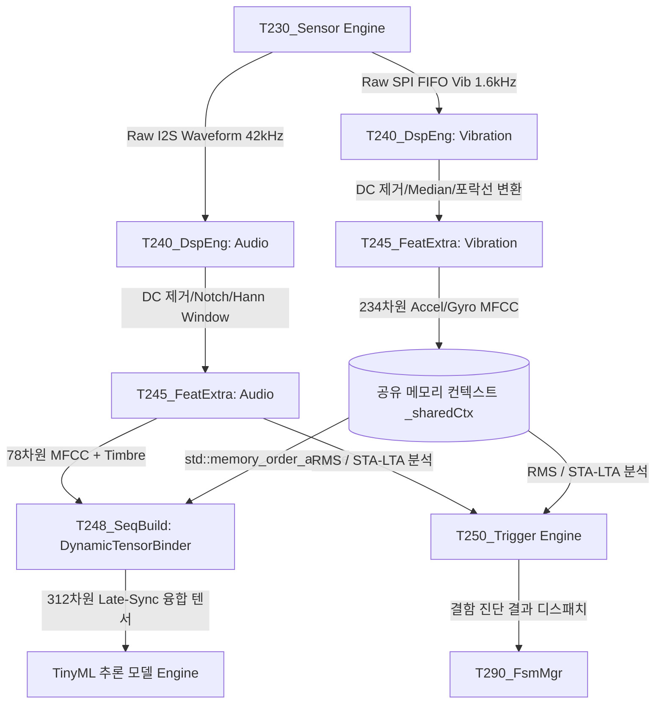

산업용 예지보전(PdM) 및 에지 AI 도메인의 기술 규격 변천사를 고려하여, 제공해주신 과거 버전 자료들(v2.4.2 기능 명세서 및 v231 스마트 사양서)에 내재된 파편화된 수치와 상충하는 구조적 명세를 **현재 최종 확정된 4-Tier 시스템 아키텍처 규격(MSFM_T2_250)에 맞춰 완벽하게 체계화 및 통합 보완한 마스터 시스템 기능 명세서**를 작성했습니다.
이 명세서는 상호 상충하던 데이터(예: 오디오 주기 오류, 태스크 코어 바인딩 배치 불일치 등)를 **단일 진실 공급원(SSOT)** 원칙에 입각하여 동기화하고, 산업 현장 배포를 위한 고급 튜닝 매뉴얼까지 격상하여 재구성한 최종본입니다.
# [MSFM_T2_250] 멀티모달 엣지 AI 진단 시스템 통합 기능 명세서
**초정밀 하드웨어 가속 신호처리 기반의 산업용 예지보전(PdM) 엣지 디바이스 표준 규격**
## 1. 시스템 아키텍처 개요 (System Architecture)
본 시스템은 산업 현장의 모터, 베어링, 컴프레서 등 회전 설비에서 발생하는 고주파 음향(42kHz) 및 고속 진동(1.6kHz) 데이터를 실시간으로 동시 수집·융합 분석하는 고신뢰성 임베디드 장치입니다. 성능 최적화 및 런타임 결정론적(Deterministic) 동작을 확보하기 위해 **4-Tier 도메인 격리 모델**을 채택합니다.
### 1.1 4-Tier 레이어 구조
 * **Tier 4. AI & MLOps (최상위 추론 및 안전 인터록)**
   * PreemptiveSafetyInterlock, SafetyLifecycleManager, SequenceBuilder
   * 312차원 융합 텐서 기반 TinyML 추론 및 밀리초(ms) 미만 단위의 하드웨어 물리 차단 루틴 구동.
 * **Tier 3. Feature Extraction & Storage (특징 추출 및 데이터 보존)**
   * FeatureExtractor, StorageManager, Calibrator
   * FFT 스펙트럼, 1/3 Octave Timbre 지표, 39차원(Static, Delta, Delta-Delta) 오디오/진동 MFCC 연산 및 PSRAM 프리트리거 WAL 제어.
 * **Tier 2. Signal Processing (DSP 엔진 및 필터 계수 제어)**
   * DspEngine, ConfigManager
   * ESP32-S3 SIMD(PIE 가속) 및 FPU 기반 DC 컷, 노치, 가변 63-Tap FIR/IIR 캐스케이드 필터링 체인.
 * **Tier 1. Hardware Interface & Capture (센서 수집 및 드라이버)**
   * SensorEngine (SPI-BMI270, I2S-ICS43434), Communicator
   * DMA 기반 Zero-copy 수집 및 멀티코어 간 SPSC 락프리 중계 링버퍼 운용.
## 2. 하드웨어 리소스 및 태스크 바인딩 규격
ESP32-S3 Dual-Core MCU 환경에서 I/O 지연으로 인한 실시간 센서 데이터 드롭(유실)을 원천 차단하고 연산 마진을 최대화하기 위해 다음과 같이 하드웨어 리소스 및 FreeRTOS 태스크를 배타적으로 분할 바인딩합니다.
### 2.1 하드웨어 물리 사양
 * **Main MCU**: ESP32-S3 (Dual-Core Xtensa 32-bit LX7, 240MHz, 벡터 연산 가속 가중치 가속기 내장)
 * **주 메모리**: 512KB 내부 SRAM + **8MB 가속 외부 PSRAM** (16바이트 정렬 고정 구조)
 * **진동 센서 (IMU)**: Bosch BMI270 (6축 가속도/자이로스코프) / 고속 SPI 제어 (배타적 _spiLock 뮤텍스 통과 필수)
 * **음향 센서 (Acoustic)**: TDK InvenSense ICS43434 MEMS Microphone / I2S 인터페이스 연동
 * **저장 매체**: Micro SD Card Slot (**SD_MMC 4-bit 모드**, 16바이트 정렬 내부 SRAM 바운스 버퍼 필수 경유)
### 2.2 태스크 및 코어 토폴로지 매핑 테이블
| 태스크명 | 엔트리 함수 | 할당 코어 | 우선순위 | 주기 및 트리거 소스 | 처리 목적 및 실무적 이점 |
|---|---|---|---|---|---|
| **ImuAcqTask** | _imuAcqTask | **Core 0** | **12** (최상위) | BMI270 FIFO Watermark ISR (약 25ms 간격) | SPI 버스를 배타 점유하여 FIFO 원시 데이터를 고속 인출 및 SPSC 내부 링버퍼 적재 (데이터 유실 차단) |
| **AudProcTask** | _audioProcessTask | **Core 1** | **6** | I2S DMA 수신 핑퐁 버퍼 이벤트 (**정확히 24.38ms**) | 오디오 청크 수집 즉시 기동. DSP 필터링, FFT, 1/3 옥타브 밴드 상대 에너지 벡터 생성 및 켑스트럼 분석 |
| **VibProcTask** | _vibProcessTask | **Core 1** | **5** | 1024 샘플 누적 완료 시점 (**약 640ms**) | 가속도/자이로 축별 원시 데이터를 인출하여 FIR/IIR 연산, 특징량(RMS, 첨도, 16-band) 추출 및 공유 메모리 갱신 |
| **StorageTask** | _storageTaskProc | **Core 0** | **2** (하위) | 비동기 스토리지 큐 메시지 수신 시 (Event-driven) | SD_MMC 파일 기입 및 파일 로테이션 관리. **Core 1의 실시간 AI 가속 루프에 디스크 I/O 블로킹 전이 차단** |
## 3. 핵심 신호 처리 및 AI 특징량 파이프라인
데이터 전처리부터 신경망 입력용 융합 텐서 조립까지의 데이터는 위상 왜곡을 방지하기 위해 엄격한 단방향 파이프라인 연산을 거치며, 모든 핵심 내부 버퍼는 벡터 연산(SIMD) 최적화를 위해 alignas(16) 메모리 정렬을 강제합니다.

### 3.1 진동(IMU) 신호 가공 파이프라인
 1. **Median Filter (비선형 글리치 제거)**: 3-Tap 재귀 왜곡 방지 링버퍼 캐시를 적용하여 위상 왜곡 없이 고주파 물리 충격성 임펄스 노이즈를 도려냅니다.
 2. **Remove DC Offset (중력 및 편향 제거)**: IEEE-754 비트 마스킹을 적용해 중력 가속도 성분(1\text{G}) 및 DC 바이어스를 실시간 차단하며, NaN/Inf 데이터 오염을 원천 디펜스합니다.
 3. **힐버트 변환 포락선(Envelope) 및 대역 필터 체인**: 자이로 성분은 주파수 제로크로싱비(ZCR)를 폐기하고 1차 차분 RMS 에너지를 채용합니다. 가속도는 포락선 처리를 거쳐 가변 63-Tap FIR(선형 위상 보장형) 및 고속 IIR 필터를 통과시킵니다.
 4. **시계열 특징량 및 Mel-Filterbank 추출**: 실효치(RMS), 왜도, 첨도(Kurtosis), Crest Factor를 추출한 후 오디오와 대칭 규격을 맞추기 위해 가속도(117차원), 자이로(117차원) 도합 **234차원 진동 MFCC 텐서**를 빌드합니다.
### 3.2 음향(Acoustic) 신호 가공 파이프라인
 1. **Pre-emphasis**: 고주파 미세 크랙 및 마찰 신호 감쇄를 방지하기 위해 필터 계수 \alpha = 0.97 기반 고역 증폭을 수행합니다.
 2. **적응형 스펙트럴 서브트랙션 (Adaptive Spectral Subtraction)**: 평상시 정상 가동 상태에서 학습 모드(NOISE_LEARNING)를 통해 획득한 배경 소음의 평균 스펙트럼 밀도를 입력 주파수 영역에서 실시간 감산하여 정상 노이즈 플로어를 제거합니다.
 3. **Windowing & FFT**: 주파수 누설(Leakage)을 차단하는 가변 Hann 윈도우를 적용하고 에너지를 보존하는 스케일링을 거쳐 FFT 변환을 실행합니다.
 4. **음색(Timbre) 지표 및 78차원 MFCC 추출**: 오디오 신호의 물리적 특성 파악을 위해 Coherence/IPD 대신 1/3 옥타브 밴드 상대 에너지 비율 벡터인 **Timbre 지표**를 도입하고, 13차 켑스트럼 자산에 Delta 및 Delta-Delta 계수를 결합한 **78차원 오디오 MFCC**를 생성합니다.
### 3.3 Late-Sync 멀티레이트 시간 동기화 (MultiRateTimeAligner)
수집 주기가 상이한 두 데이터(진동 1,600Hz 대 오디오 42,000Hz) 간의 시간 정렬 및 정합성을 위해 다음 메커니즘을 적용합니다.
 * **원자적 스왑**: Core 1의 VibProcTask 태스크가 진동 특징량 생성을 완료하면 _sharedCtx->vib_slots에 기입 후 인덱스를 원자적으로 스왑(std::memory_order_release)합니다.
 * **시간 스큐(Skew) 검증**: 오디오 태스크 측 융합부(DynamicTensorBinder)는 std::memory_order_acquire 시맨틱으로 최신 진동 슬롯을 인출합니다. 두 센서의 타임스탬프 차이(\Delta t)를 연산하여 **허용 임계치(800ms) 이내**인 경우 Zero-Order Hold(ZOH) 폴백을 적용해 데이터를 유지합니다.
 * **Traits 정책 마스킹**: 타임아웃 임계치 초과 또는 특정 채널 연산 생략 요구 시, 해당 진동 텐서 영역을 물리적으로 연산하지 않고 **0.0f로 강제 마스킹 처리**하여 TinyML 추론 엔진의 비정상 폴트를 미연에 방지합니다.최종적으로 **312차원(78 + 234)의 평탄화된 정렬 융합 텐서**를 조립해 냅니다.
## 4. 스마트 하이브리드 트리거 및 프리엠프티브 인터록
산업 현장의 순간적 고장 상황 보존 및 자가 보호를 위해 하드웨어와 소프트웨어가 결합된 3계층 감시망을 운용합니다.
```
[평상시: MONITORING 상태] 
  ↳ 1단계: HW Any-Motion 인터럽트 감시 (초저전력 슬립 모드 대응)
  ↳ 2단계: SW Global RMS 전체 진동 실효치 임계값 모니터링
  ↳ 3단계: SW Multi-Band Energy 특정 설비 결함 대역 감시
        ↓ (이상 징후 임계값 탈루 / NG 판정)
[인터록 트립 및 FSM 상태 천이 즉각 실행]
  ↳ OS 스케줄러 우회, GPIO 직접 클리어 (GPIO 25 LOW ➔ 물리 릴레이 즉시 차단)
  ↳ PSRAM Pre-trigger 메모리 플러시 실행 (사고 직전 3초 + 사고 순간 데이터 병합)
  ↳ FSM 상태 [RECORDING]으로 강제 전이

```
### 4.1 3계층 하이브리드 트리거 정책
 1. **1단계 (HW Any-Motion)**: 기기가 배터리 기반 절전 수면 상태일 때 MCU를 깨우지 않고 BMI270 자체 로직으로 물리 충격을 감지, ISR을 통해 메인 시스템을 즉시 가동(Wakeup)합니다.
 2. **2단계 (SW Global RMS)**: 전 대역 가속도 실효치(RMS) 가혹도를 SIMD 내적 연산으로 상시 감시하여 기준치 돌파 시 트리거를 발동합니다.
 3. **3단계 (SW Multi-Band Energy)**: 설비별 고유 결함 대역(예: 베어링 외륜 결함 300~400Hz 대역 등)을 소프트웨어 필터 뱅크로 정밀 추적하여, 해당 타깃 주파수 진폭이 독립적으로 튀어 오를 때 트립을 유발합니다.
### 4.2 타임머신 프리트리거(Pre-trigger) 및 지연 기입 모델
 * **PSRAM 상시 순환 버퍼링**: 대기 및 감시 상태(READY, MONITORING) 중에도 고장 원인 분석(Root Cause Analysis)을 위해 **최근 3초 분량의 Raw 파형 데이터 및 특징량 패킷**을 외부 PSRAM 순환 버퍼에 상시 축적합니다.
 * **트리거 플러시**: 이상 징후 판정 즉시 _flushPreBufferToRing 루틴이 구동되어 **"과거의 징후 데이터(3초) + 현재 사고 시점 데이터 + 사고 이후 여운 데이터"**를 하나의 스트림 파일 세션으로 병합하여 SD 카드 비동기 저장 큐에 원자적으로 밀어 넣습니다.
### 4.3 초고속 비상 안전 차단 인터록 (PreemptiveSafetyInterlock)
 * 특징량 가혹도 평가 결과 설비의 영구적 손상 수준에 달하는 치명적 결함(FAULT_LEVEL_2 이상)이 감지될 경우, RTOS 태스크 스케줄러 및 컨텍스트 스위칭 지연을 완전히 우회하는 **레지스터 직접 제어 루틴**을 기동합니다.
 * GPIO.out_w1tc 레지스터를 직접 타격하여 나노초 단위로 안전 차단 물리 릴레이 제어 핀(**GPIO 25**)을 **LOW**로 트립시킵니다.
 * **알람 래치 복구 시퀀스**: 하드웨어 물리 차단은 안전을 위해 소프트웨어적으로 자동 해제되지 않는 **래치(Latch)** 구조를 가집니다. 복구를 위해서는 수동 명령어가 주입되어야 합니다. processManualReset()이 명시적으로 호출되면 std::atomic 변수 스왑 후 캐시 정합성 확보를 위한 **물리적 메모리 배리어 명령어(memw 또는 std::atomic_thread_fence)**를 강제 실행한 후 릴레이 핀을 다시 HIGH로 복구하여 정상 전력을 인가합니다.
## 5. 비동기 이원화 저장소 보호 메커니즘 (Fail-Safe Storage)
SD 카드의 태생적인 물리 기입 지연(Flash 페이지 리프레시 등으로 인해 최대 수백 ms 발생)이 실시간 센서 수집 및 특징 가공 파이프라인에 전이되어 데이터가 유실(Tearing)되는 병목을 완벽히 차단합니다.
### 5.1 바운스 버퍼 캐싱 및 버스트 제어
 * **SRAM Bounce Buffer 제한**: 외부 PSRAM 링버퍼 포인터를 SD_MMC 가속 드라이버에 직접 전달하면 하드웨어 캐시 미스가 발생하므로, 내부 SRAM에 16바이트 정렬로 배치된 단일 바운스 버퍼(_bounceAudFeat) 영역으로 데이터를 고속 복사(Deep Copy)한 후 SD 카드 Write 함수를 호출합니다.
 * **I/O 드레인 밸런싱 (Burst Limit)**: StorageTask 태스크의 1회 웨이크업 루프 기동당 소모 효율을 보정하기 위해 오디오 파일 기입은 최대 8개, 진동 파일 기입은 최대 2개로 단위 처리를 제한함으로써, 특정 모달리티의 스토리지 점유율 독점으로 인한 큐 오버플로우를 차단합니다.
### 5.2 다중 페일세이프 구조
 * **설정 파일 원자적 기입 (Atomic Write)**: 런타임 중 장치 설정(config.json)을 변경 및 플래시 백업할 때 배터리 방전 또는 정전이 발생하더라도 기존 파일이 깨져 벽돌(Brick)이 되는 현상을 방지하기 위해, 임시 파일(.tmp)에 전체 데이터를 완결성 있게 기록한 뒤 물리 rename() 처리를 수행하는 원자적 덮어쓰기 정책을 수행합니다.
 * **스토리지 핫플러그(Hot-plug) 패닉 방어**: 레코딩 수행 중 진동 충격으로 인한 SD 카드 탈거 또는 접촉 불량 상태가 감지되면, 파일 I/O 시스템의 무한 재시도로 인한 Watchdog 하드웨어 리셋 패닉을 차단하기 위해 즉시 해당 세션을 강제 폐기하고 디스크 락(I/O Lock) 상태로 진입합니다.
 * **바이너리 패킹 및 동시 삭제 페어링**: 모든 보존 데이터는 #pragma pack(push, 1) 구조로 패킹되어 고유 매직 코드인 SMEA 바이너리 헤더와 함께 저장됩니다. 순환 로깅(Circular Logging) 알고리즘에 의해 파일 로테이션이 발생할 경우, 인덱스 불일치 오염을 막기 위해 **동일 타임라인 상의 특징량 데이터(.bin)와 대용량 원시 파형 데이터(.wav / .acc)가 한 쌍(Pair)으로 정밀하게 동시 소거**됩니다.
## 6. 비동기 네트워킹 및 버스 격리 정책
통신 지연이 전체 제어 주기에 악영향을 주지 않도록 네트워크 레이어는 완전한 논블로킹(Non-blocking) 비동기로 구동됩니다.
### 6.1 WiFi Auto-Fallback & OOM 방어
 * 산업 현장의 음영 지역 및 AP 다운 현상에 대응하여, 사전에 등록된 최대 3개의 예비 SSID/PW 프로파일을 백그라운드 태스크에서 비동기로 순회하며 재연결을 시도합니다.
 * 초당 60프레임 수준의 실시간 대시보드 그래픽 렌더링용 웹소켓 스트리밍 도중, 원격지 클라이언트의 수신 지연으로 비동기 전송 큐가 가득 차서 발생하는 **메모리 고갈(Out-of-Memory) 현상을 차단**합니다. 내부 청소 루틴(cleanupClients)을 강제 스케줄링하여 네트워크 응답이 없는 좀비 세션을 강제 커트하고 할당된 메모리를 즉각 회수합니다.
### 6.2 데이터 무결성을 위한 네트워크 버스 격리 (OTA Lock)
 * **원격 펌웨어 업데이트 보호 (OTA Lock)**: 현장 장비 관리자가 무선 네트워크를 통해 바이너리를 업데이트할 때, 다중 접속이나 타 태스크 명령 유입으로 가상 파티션 테이블이 꼬이는 것을 방지하기 위해 OTA 진입 즉시 타 서브시스템 명령을 동시 차단하는 **HTTP 423 Locked 안티인터럽트 장치**가 가동됩니다.
 * **SD 버스 병목 차단**: 장치가 이상 진동을 감지하여 고속으로 SD 카드에 대용량 사고 Raw 파형을 기록하는 **RECORDING 상태에 진입하면 외부 사용자의 웹 대시보드를 통한 과거 로그 파일 다운로드 및 대용량 API 호출 요청을 강제 거부(403 Forbidden / Busy Fallback)**하여 물리적 디스크 버스 점유율 경합에 따른 데이터 손실을 100% 방어합니다.
## 7. 산업 현장 실무 적용 고급 튜닝 가이드
### 📍 시나리오 A: TinyML 인공지능 딥러닝 서버 연동을 위한 연속 텐서 생성 기법
 * **분석 목적**: 엣지 디바이스에서 특징을 지속 가공하여 별도 인프라 가공 없이 파이썬 머신러닝 서버나 온보드 모델로 2D 입력 시퀀스를 직결 투입하고자 할 때.
 * **파이프라인 세팅 매뉴얼**:
   1. FFT 크기를 256 샘플로 지정한 후, Hop Size를 정확히 절반인 128 샘플로 셋 अप하여 50% 중첩(Overlap) 구조를 가진 조밀한 주파수 도메인 축 변환을 형성합니다.
   2. T248_SeqBuild 구조의 Payload 포맷 출력을 **Tensor (TinyML)** 모드로 활성화하고, Tensor Pack Frames 파라미터를 인공지능 타깃 시계열 입력 창 크기인 **16프레임**으로 고정합니다.
   3. **동작 결과**: 디바이스는 단발성 1차원 배열을 송출하는 대신 내부 DynamicTensorBinder를 통해 16프레임 분량의 시공간 정보가 합산된 **2차원 시퀀스 텐서(16 x 39차원)**를 조립 완료한 후 바이너리 웹소켓 패킷으로 발행합니다. 서버측 수신 모듈은 디코딩 직후 추가 가공 없이 AI 인퍼런스 엔진 입력층(Input Layer)에 배열을 그대로 통과시킬 수 있습니다.
### 📍 시나리오 B: 고출력 모터 주변 60Hz 전기적 험(Hum) 환경 내 미세 베어링 결함 진단
 * **분석 목적**: 산업 현장의 강한 대형 기계 저주파 요동 및 고전압 라인 유도 노이즈(60Hz)를 물리적으로 바이패스하고, 초기 베어링 손상 시 발생하는 고주파 대역의 미세 크랙/마찰 임펄스만 추적하고자 할 때.
 * **파이프라인 세팅 매뉴얼**:
   1. 전처리부의 Remove DC Offset을 **ON**으로 변경하고, Median Filter 크기를 **3-Tap**으로 인게이지하여 고진폭 물리적 튀는 신호를 1차 억제합니다.
   2. 필터 제어부에서 **FIR HPF**를 활성화하고 차단 주파수(Cutoff)를 20Hz, Taps 수를 **63**으로 할당하여 건물 진동 수준의 저주파 기저부를 선형 위상으로 깎아냅니다. 동시에 **Adaptive Notch Filter**의 타깃 중심 주파수를 정확히 **60Hz**, Q-Factor를 **15** 이상 고집적 모드로 튜닝하여 주변 전기 노이즈 성분만 날카로운 수직 대역으로 파냅니다.
   3. 트리거 제어부에서 베어링 외륜/내륜 손상 충격 에너지가 밀집되는 고주파 영역인 **800Hz ~ 1,200Hz 대역**을 독립 **Band 1** 감시 구역으로 매핑한 뒤, 임계 가혹도 비율을 정상 백그라운드 운전 대비 1.6배 수준으로 제한합니다.
   4. **동작 결과**: 설비 시동 및 정지 시 유입되는 거대한 구조 진동이나 대형 모터의 잔여 전기 유도 험 노이즈에는 시스템이 반응하지 않으며, 오직 베어링 손상 초기에 발생하는 미세 마찰 고주파 임펄스가 감지되는 순간에만 핀포인트로 트리거를 발동하여 기록 및 비상 차단을 수행합니다.
### 📍 시나리오 C: 가동 주기가 불규칙한 원격지 펌프 설비의 초절전형 독립 감시 (배터리 모드)
 * **분석 목적**: 전력 상시 공급이 불가능한 환경에서 평상시 유휴(Idle) 상태에는 전력을 전면 보존하고, 펌프 가동 개시 및 정지 시점의 신호 스냅샷만 무결하게 확보하여 장기 수명을 예측하고자 할 때.
 * **파이프라인 세팅 매뉴얼**:
   1. 전원 관리 아키텍처의 Enable Deep Sleep 모드를 **ON**으로 전환하고 유휴 타임아웃을 60초로 세팅합니다. BMI270 하드웨어 레벨의 Wakeup 임계 가속도를 **0.5G**로 튜닝합니다.
   2. 하이브리드 트리거 정책에서 소프트웨어 Global RMS 상시 연산을 **OFF**하여 메인 MCU 코어 가동 효율을 절약하며, 하드웨어 Any-Motion 인터럽트 신호선과 MCU의 외부 인터럽트 핀(External Wakeup ISR)을 하드웨어로 결선합니다.
   3. 스토리지 엔지니어링 파라미터에서 프리트리거 메모리 보존 한계를 **3초**, 트리거 이후 레코딩 유지 시간(Record Hold Time)을 **10,000ms (10초)**로 지정합니다.
   4. **동작 결과**: 펌프가 정지해 있는 동안 장치는 완전한 딥슬립 상태를 유지하여 소모 전류를 마이크로암페어(\mu\text{A}) 단위로 낮춥니다. 불규칙한 주기로 펌프가 가동을 시작하여 최초 기계적 충격이 가해지는 순간 하드웨어 인터럽트에 의해 메인 CPU가 수 밀리초 이내에 정상 구동(Wake) 상태로 전이됩니다. 장치는 깨어난 즉시 내부 PSRAM에 상시 보존되어 있던 **"가동 시작 직전 3초의 전조 파형"**부터 시작하여 가동 순간 및 정지 이후 10초간의 감쇠(Damping) 여운 파형까지 완벽하게 결합된 블랙박스 바이너리 패킷을 안전하게 SD 카드에 영구 보존한 후 자동 수면 상태로 복귀합니다.
