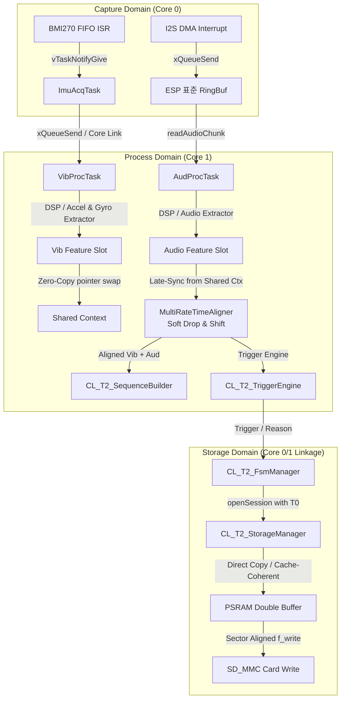

# [MSFM_T2_250] 전체 시스템 기능 규격서 (Overall System Functional Specification)

본 문서는 **MSFM_T2_250** 임베디드 펌웨어의 전체 시스템 기능 규격서입니다. 시스템 아키텍처, 전역 데이터 흐름(Data Flow), 태스크/코어 바인딩 모델 및 도메인 격리 원칙을 수립하여 개발자가 시스템 전체를 유기적으로 파악하고 개발할 수 있도록 돕습니다.

---

## 1. 4-Tier 시스템 아키텍처 및 데이터 흐름

본 시스템은 높은 주파수의 소음(Audio) 데이터와 진동(IMU: Accel/Gyro) 데이터를 동시 처리하기 위해 **4-Tier 도메인 격리 모델**을 채택하고 있으며, 코어 간 효율적인 처리와 데이터 일관성 유지를 위해 락 프리 링버퍼와 비동기 큐 스케줄링을 사용합니다.

---

## 2. 통합 데이터 흐름 상세 (Unified Data Flow)

1.  **설정 및 타입 정의**: 시스템 부팅 직후 [T210_Def](../T210_Def_250.hpp)의 전역 상수(SSOT)와 [T215_Type](../T215_Type_250.hpp)의 데이터 규격을 기반으로 모든 파이프라인 버퍼가 정적 선언되며 런타임 설정 매칭이 수행됩니다.
2.  **수집 (Capture)**:
    *   [T230_Sensor](../T230_Sensor_250.hpp) 모듈이 Core 0에서 I2S DMA 인터럽트와 SPI FIFO 이벤트를 통해 데이터를 초고속 수집합니다.
    *   **L1 캐시 일관성 제어**: `esp_cache_msync` API를 통해 DMA 버퍼 및 외부 PSRAM 간의 캐시 불일치를 방지합니다.
    *   **SPI 트랜잭션 스케줄링**: SPI 버스 경합을 막기 위해 모든 SPI 작업은 `ST_SpiTransaction_t` 스케줄러 큐를 경유하도록 설계되었습니다.
3.  **전처리 (DSP)**:
    *   [T240_DspEng](../T240_DspEng_250.hpp)가 SIMD 및 FPU 명령어로 DC 제거, 노치 필터, 대역 필터(IIR/FIR), 복소수 FFT(2*N 크기 강제 정렬)를 수행합니다.
    *   고정 필터 계수는 플래시 ROM(`SMEA_FLASH_RODATA`)에서 직접 페치하여 SRAM을 보존하며, 동적 Notch 필터 계수는 런타임 변경을 위해 RAM 영역에 독립 상주합니다.
    *   자이로는 고차 FIR 필터를 제거하고 초경량 4차 IIR 바이쿼드 필터를 적용하여 메모리를 극대화 절약합니다.
4.  **추출 (Features)**:
    *   [T245_FeatExtra](../T245_FeatExtra_250.hpp)가 스펙트럼 에너지 및 특징 추출을 수행합니다. 복사를 최소화하기 위해 링버퍼 주소를 직접 가리키는 제로 카피 원칙을 준수합니다.
5.  **조립 및 동기화**:
    *   [T248_SeqBuild](../T248_SeqBuild_250.hpp)의 `MultiRateTimeAligner`가 이종 주기(진동 1600Hz, 오디오 42000Hz) 데이터의 시간축 정렬을 수행합니다.
    *   **Software PLL**: 가속도 SPI 폴링 편차와 오디오 샘플링 편차 누적 시, 소프트웨어 Drop & Shift(단조 시계 스위칭 시 급변 방지를 위한 25틱 muting 필터 포함) 기법을 사용하여 시간축을 정렬합니다.
6.  **판정 (Decision)**:
    *   [T250_Trigger](../T250_Trigger_250.hpp) 룰 엔진이 임계치를 분석하여 결함 판정을 수행합니다. 부팅 후 30초 동안 `WARM_UP` 시스템 상태를 유지하여 오경보 알람을 방어합니다.
7.  **저장 및 송출**:
    *   [T260_Storage](../T260_Storage_250.hpp)가 SD카드 비동기 지연 쓰기를 처리합니다.
    *   **락 디커플링 (Lock Decoupling)**: 물리 쓰기 및 flush 동작 시 `_lock` 뮤텍스를 소유하지 않고 비동기 태스크에서 기입하도록 분리하여, 쓰기 지연에 의한 실시간 링버퍼 데이터 유실을 방지합니다.
    *   **NVS 대체**: 기존의 복잡한 WAL 저널 로그를 전면 폐기하고, NVS 표준 저장소와 10초 주기 Lazy-Write 캐시를 도입하여 신뢰성을 높이고 플래시 마모를 방지합니다.
    *   [T270_Commu](../T270_Commu_250.hpp)가 WebSocket 및 MQTT로 상태를 실시간 송출합니다. SD 카드 I/O 에러 감지 시, FSM 상태를 ERROR로 전이하고 바이너리 텔레메트리 송출을 중단(Mute)한 후 긴급 알람 패킷을 최우선 송출합니다.

---

## 3. 멀티코어 및 멀티태스킹 아키텍처

ESP32-S3 Dual Core MCU 제약을 극복하고 실시간 수집 마진을 확보하기 위해 FreeRTOS 태스크를 다음과 같이 바인딩합니다.

| 태스크명 | 할당 코어 | 우선순위 | 주기 및 트리거 | 목적 및 설명 |
| :--- | :---: | :---: | :---: | :--- |
| `ImuAcqTask` | **Core 0** | 12 (최상위) | BMI270 FIFO Watermark ISR (약 25ms) | SPI 버스를 배타 점유하여 FIFO 원시 데이터를 고속 인출 및 내부 링버퍼 적재 |
| `AudProcTask` | **Core 1** | 6 | I2S DMA 수신 이벤트 (약 12.2ms) | 오디오 핑퐁 버퍼 수신 시 기동하여 DSP 필터링, 특징 추출, 켑스트럼 분석 수행 |
| `VibProcTask` | **Core 1** | 5 | 1024 샘플 수집 주기 (약 640ms) | 가속도/자이로 축별 누적 링버퍼 데이터를 가져와 FIR/IIR 처리 및 특징 연산 (포인터 교환을 이용한 제로 카피 중계) |
| `StorageTask` | **Core 0** | 2 (하위) | 비동기 스토리지 큐 메시지 수신 시 | SD 카드 파일 쓰기 및 용량/시간 한계 도달 시 파일 로테이션 관리 (락 디커플링 적용) |

> [!IMPORTANT]
> **SPI 트랜잭션 큐 스케줄러 기반 상호 배제**:
> 수집 태스크와 설정/교정 태스크가 동시에 SPI 버스에 접근하지 않도록 모든 SPI 제어는 `ST_SpiTransaction_t` 스케줄러 큐를 경유해야 합니다.
>
> **VFS 파일시스템 보호를 위한 fsLock**:
> Lazy Write 데몬, 노이즈 프로필 파일 쓰기 등이 다중 코어에서 LittleFS 파일 시스템에 동시 진입하여 발생하는 붕괴를 방지하기 위해 `_fsLock` 세마포어로 상호 배제를 적용합니다.

---

## 4. 메모리 관리 및 동적 제어 정책

1.  **메모리 정렬 (`alignas(16)`) 및 할당**:
    *   ESP32-S3 FPU/SIMD 하드웨어의 벡터 연산 장치를 직접 사용하기 위해 주요 데이터 버퍼는 반드시 `alignas(16)`를 유지합니다.
    *   TinyML 용 융합 텐서 플랫 버퍼(`_dataFlat`)는 `heap_caps_aligned_alloc`을 사용하여 외부 PSRAM 영역에 16바이트 경계 정렬 할당하며, 소멸 및 재초기화 시 반드시 `heap_caps_free`를 사용하여 메모리 손상과 누수를 차단합니다.
2.  **동적 할당(Dynamic Allocation) 배제**:
    *   실시간 감시 루프 내부에서 `malloc`, `new`, `std::vector` 확장을 사용하지 않습니다. 
3.  **바이너리 패킷 팩킹**:
    *   원시 특징 패킷은 `#pragma pack(push, 1)` 매크로를 이용해 빈 공간 없이 1바이트 크기로 패킹되어 전송 및 저장됩니다.
4.  **락 프리 링버퍼 메모리 오더링**:
    *   듀얼 코어 동시 접근 환경에서 `_head`, `_tail` 포인터 갱신 시 `std::atomic_thread_fence(std::memory_order_release)` 하드웨어 배리어를 적용하여 쓰기 완료 가시성을 완벽히 전파합니다.

---

## 5. 모듈별 기능 규격서 인덱스

| 대상 파일 | 기능 규격서 링크 | 주요 역할 |
| :--- | :--- | :--- |
| [T200_Main_250.h](../T200_Main_250.h) | [T200_Main_FuncSpec_250.md](./T200_Main_FuncSpec_250.md) | 4-Tier 시스템 부팅 시퀀스 제어 및 ISR 디바운싱 |
| [T210_Def_250.hpp](../T210_Def_250.hpp) | [T210_Def_FuncSpec_250.md](./T210_Def_FuncSpec_250.md) | 4-Tier 시스템 상수 정의 및 전역 파라미터 제어 SSOT |
| [T215_Type_250.hpp](../T215_Type_250.hpp) | [T215_Type_FuncSpec_250.md](./T215_Type_FuncSpec_250.md) | 4-Tier 데이터 타입 및 전송용 바이너리 패킷 규격 |
| [T216_RingBuf_250.hpp](../T216_RingBuf_250.hpp) | [T216_RingBuf_FuncSpec_250.md](./T216_RingBuf_FuncSpec_250.md) | 멀티코어 간 SPSC 락프리 순환 링 버퍼 중계 엔진 |
| [T220_CfgMgr_250.hpp](../T220_CfgMgr_250.hpp) | [T220_CfgMgr_FuncSpec_250.md](./T220_CfgMgr_FuncSpec_250.md) | JSON 파싱 및 RAM-Flash(SSOT) 설정 비동기 백업 |
| [T230_Sensor_250.hpp](../T230_Sensor_250.hpp) | [T230_Sensor_FuncSpec_250.md](./T230_Sensor_FuncSpec_250.md) | BMI270 SPI 링버퍼 적재 및 I2S 오디오 청크 수집 |
| [T240_DspEng_250.hpp](../T240_DspEng_250.hpp) | [T240_DspEng_FuncSpec_250.md](./T240_DspEng_FuncSpec_250.md) | SIMD 가속 DC 제거, 노치, IIR/FIR 필터 연산 |
| [T245_FeatExtra_250.hpp](../T245_FeatExtra_250.hpp) | [T245_FeatExtra_FuncSpec_250.md](./T245_FeatExtra_FuncSpec_250.md) | 파워 스펙트럼 및 MFCC / 델타-델타 계수 이력 연산 |
| [T246_MelGen_250.hpp](../T246_MelGen_250.hpp) | [T246_MelGen_FuncSpec_250.md](./T246_MelGen_FuncSpec_250.md) | 오디오/IMU 전용 Mel-Scale 삼각 필터 가중치 행렬 생성 |
| [T248_SeqBuild_250.hpp](../T248_SeqBuild_250.hpp) | [T248_SeqBuild_FuncSpec_250.md](./T248_SeqBuild_FuncSpec_250.md) | 멀티레이트 시간 동기화(Aligner) 및 추론용 조립 텐서 관리 |
| [T250_Trigger_250.hpp](../T250_Trigger_250.hpp) | [T250_Trigger_FuncSpec_250.md](./T250_Trigger_FuncSpec_250.md) | 다차원 RMS 및 STA/LTA 비율 판정 룰 엔진 |
| [T260_Storage_250.hpp](../T260_Storage_250.hpp) | [T260_Storage_FuncSpec_250.md](./T260_Storage_FuncSpec_250.md) | PSRAM 링버퍼 비동기 입출력, 프리트리거, 파일 로테이션 |
| [T270_Commu_250.hpp](../T270_Commu_250.hpp) | [T270_Commu_FuncSpec_250.md](./T270_Commu_FuncSpec_250.md) | AsyncWebServer WebSocket 및 IDF Native MQTT 클라이언트 |
| [T280_Calibrator_250.hpp](../T280_Calibrator_250.hpp) | [T280_Calibrator_FuncSpec_250.md](./T280_Calibrator_FuncSpec_250.md) | Welch's PSD 분석 기반 자동/수동 마이크 EQ 추출 |
| [T290_FsmMgr_250.hpp](../T290_FsmMgr_250.hpp) | [T290_FsmMgr_FuncSpec_250.md](./T290_FsmMgr_FuncSpec_250.md) | 시스템 상태 전이(FSM), 프리엠프티브 인터록, 수명주기 관리 |

---

## 6. 변경 및 갱신 이력 (Revision History)

*   **v2.50 (2026-06-21)**:
    *   구현설계서 v2 규격을 완벽 반영하여 데이터 흐름 다이어그램 현행화.
    *   WAL 저널링 제거 및 NVS 대체, SPI 트랜잭션 스케줄러 큐, WARM_UP FSM 상태 도입 반영.
    *   `esp_cache_msync` 캐시 일관성, Storage 락 디커플링, LittleFS `_fsLock`, 제로 카피 링버퍼 및 메모리 배리어 정책 추가.
