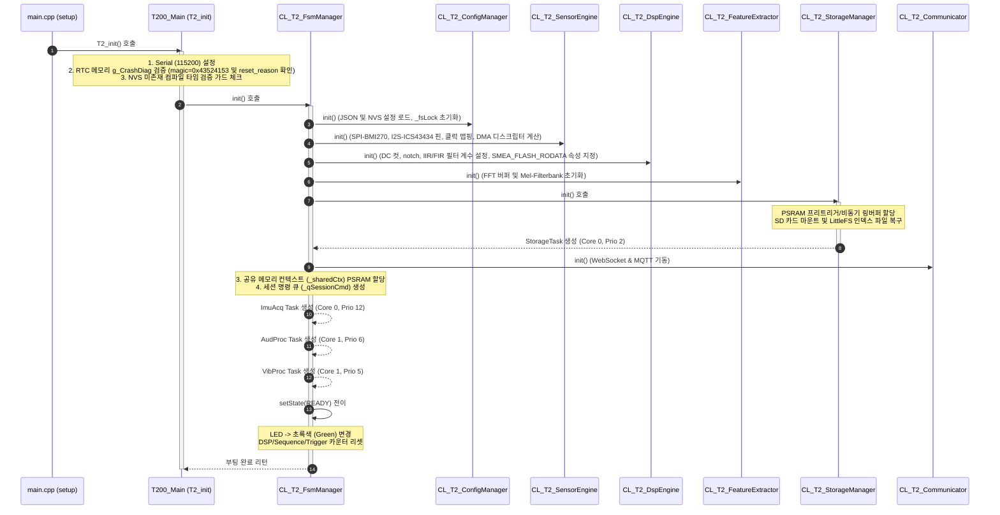
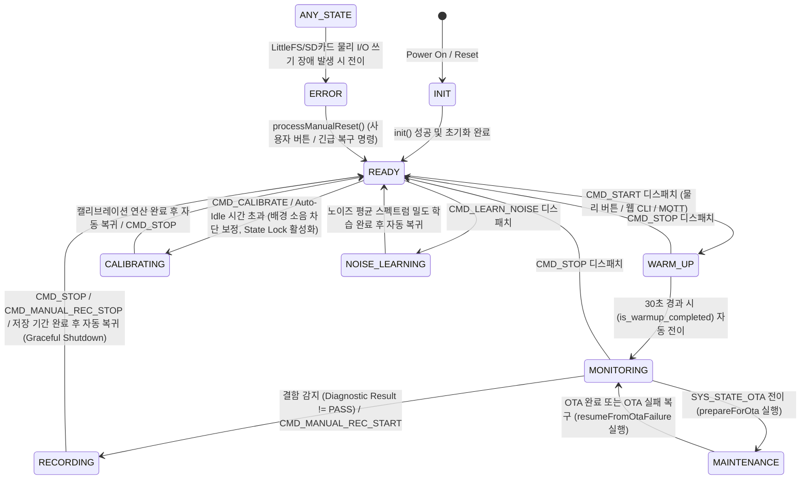
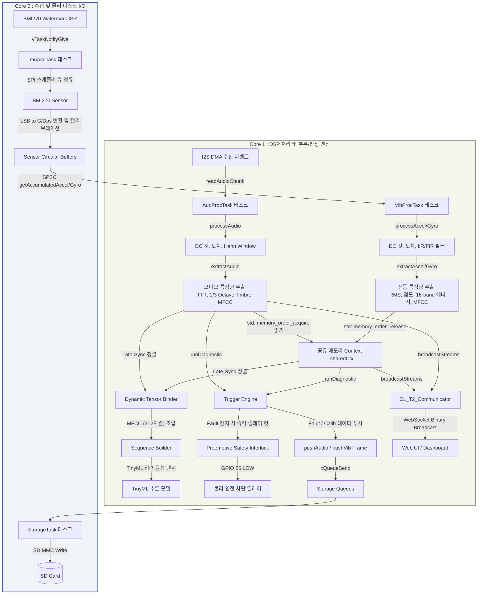
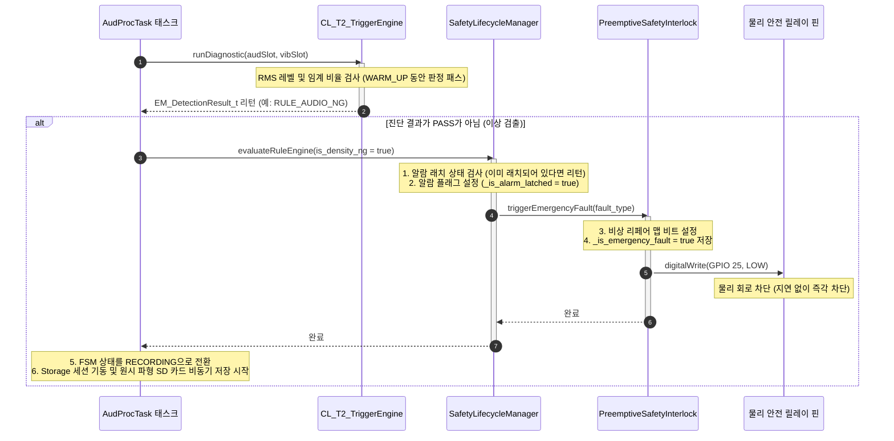
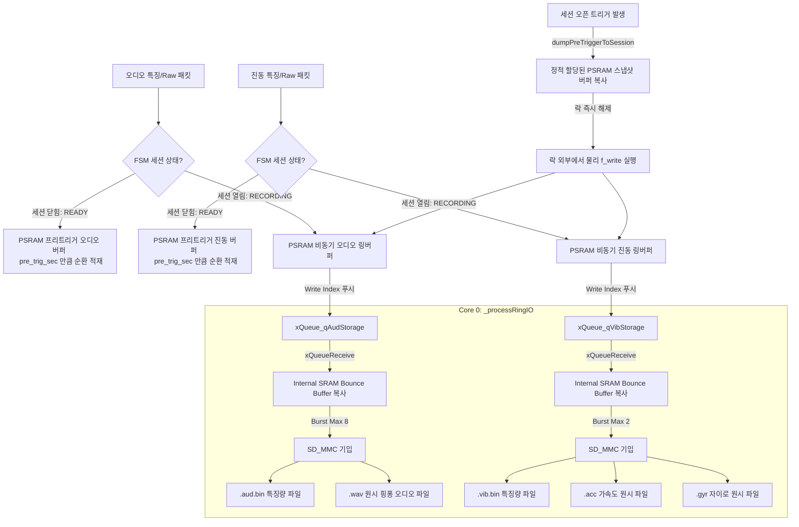

# [MSFM_T2_250] 시스템 기능 상세 흐름도 (Detailed System Function Flowchart)

본 문서는 **MSFM_T2_250** 임베디드 펌웨어의 핵심 동작 시퀀스, 코어/태스크 구성, 실시간 데이터 파이프라인, 비동기 스토리지 기입 모델, 프리엠프티브 인터록 메커니즘을 시각적 다이어그램(Mermaid) 및 단계별 설명으로 구체화한 개발 가이드라인 문서입니다.

---

## 1. 하드웨어 리소스 및 태스크 코어 바인딩 모델

ESP32-S3 Dual-Core MCU 제약을 극복하고, 고주파수 오디오 수집(42kHz) 및 진동 수집(1.6kHz) 환경에서 데이터 유실 없는 처리를 수행하기 위해 다음과 같이 코어 및 우선순위를 배타 배정합니다.

| 태스크명              | 실행 함수               |   할당 코어    |   우선순위   |              주기 및 트리거              | 목적 및 설명                                                   |
| :---------------- | :------------------ | :--------: | :------: | :--------------------------------: | :-------------------------------------------------------- |
| **`ImuAcqTask`**  | `_imuAcqTask`       | **Core 0** | 12 (최상위) | BMI270 FIFO Watermark ISR (약 25ms) | SPI 버스 점유, FIFO 원시 데이터 고속 인출 및 링버퍼 적재                     |
| **`AudProcTask`** | `_audioProcessTask` | **Core 1** |    6     |     I2S DMA 수신 이벤트 (약 12.2ms)      | 오디오 핑퐁 버퍼 수신 시 기동하여 DSP 필터링, 특징 추출, 켑스트럼 분석 및 융합 판정/저장 지시 |
| **`VibProcTask`** | `_vibProcessTask`   | **Core 1** |    5     |     1024 샘플 수집 완료 시 (약 640ms)      | 가속도/자이로 축별 누적 링버퍼 데이터를 가져와 FIR/IIR 처리, 특징 연산 및 비동기 저장 지시  |
| **`StorageTask`**  | `_storageTaskProc`  | **Core 0** |  2 (하위)  |        비동기 스토리지 큐 메시지 수신 시         | SD 카드 파일 쓰기 및 용량/시간 한계 도달 시 파일 로테이션 관리 (락 디커플링 적용)                    |

> [!IMPORTANT]
> **SPI 트랜잭션 스케줄러 기반 상호 배제**:
> 수집 태스크와 설정/교정 태스크가 동시에 SPI 버스에 접근하지 않도록 모든 SPI 제어는 `ST_SpiTransaction_t` 스케줄러 큐를 경유해야 합니다.
>
> **VFS 파일시스템 보호를 위한 fsLock**:
> Lazy Write 데몬, 노이즈 프로필 파일 쓰기 등이 다중 코어에서 LittleFS 파일 시스템에 동시에 진입하여 발생하는 붕괴를 방지하기 위해 `_fsLock` 세마포어로 상호 배제를 적용합니다.

---

## 2. 시스템 초기화 및 부팅 흐름 (System Bootstrap)

시스템 전원이 켜진 후, 4-Tier 시스템 프레임워크가 구동되고 각 서브시스템과 태스크가 가동되는 흐름입니다.

---

## 3. FSM 상태 전이 흐름 (System FSM State Transitions)

`CL_T2_FsmManager`가 주도하는 시스템의 상태와 상태별 전환 트리거 및 LED 인디케이터 맵핑입니다.

---

## 4. 실시간 멀티태스킹 데이터 가공 파이프라인 (Real-time Pipeline)

실시간 데이터 파이프라인은 코어 0에서 고속 수집된 원시 데이터를 코어 1로 안전하게 넘기기 위해 **SPSC (Single-Producer Single-Consumer) 락프리 순환 링버퍼 구조**를 채택하고 있습니다. 

---

## 5. 트리거 및 실시간 안전 차단 인터록 흐름

특징량의 특정 한계치(RMS 및 STA/LTA 비율)가 무너졌을 때 CPU 점유 및 OS 지연을 우회하여 비상 정지를 수행하기 위한 안전 장치입니다.

### 알람 래치 복구 시퀀스
물리 안전 차단은 비상 상황 이후에도 래치(Latch)되어 풀리지 않습니다. 복구를 위해서는 사용자 명령어가 직접 유입되어야 합니다.
1. 사용자가 물리 버튼을 누르거나 웹 대시보드에서 **`CMD_RESET`** 또는 **`processManualReset`** 요청을 입력합니다.
2. `CL_T2_FsmManager::processManualReset()`이 기동됩니다.
3. `SafetyLifecycleManager::processManualReset()` 호출 ➔ `_is_alarm_latched = false`로 변경하고 멀티코어 메모리 배리어(`std::atomic_thread_fence`, `memw`)를 사용하여 모든 코어의 캐시 상태를 동기화합니다.
4. `PreemptiveSafetyInterlock::clearEmergencyLatch()` 호출 ➔ 결함 마스크 비트를 리셋하고 릴레이 제어 핀을 다시 **`HIGH`**로 변경하여 정상 전력을 복구합니다.
5. FSM 상태를 다시 **`READY`** 상태로 복귀시킵니다.

---

## 6. 비동기 이원화 저장소 파일 기입 흐름

SD 카드의 고질적인 물리 쓰기 지연(최대 수백 ms)으로 인해 실시간 데이터 수집 태스크가 영향을 받지 않도록, `StorageTask` 태스크가 비동기 링버퍼 및 대기 전용 프리트리거 메모리를 제어하여 병렬 기입을 처리합니다.

---

## 7. 변경 및 갱신 이력 (Revision History)

*   **v2.50 (2026-06-21)**:
    *   구현설계서 v2에 의거하여 부팅 시퀀스(NVS 검증, Crash Diag 검증, fsLock 추가) 현행화.
    *   FSM 상태 전이에 `WARM_UP` 단계(30초) 및 SD I/O 에러 정책 추가.
    *   OTA Graceful Pause/Resume 프로세스 시퀀스 추가.
    *   프리트리거 덤프 시 스택 오버플로우 및 락 경합 방지를 위한 PSRAM 스냅샷 바운스 버퍼 플러시 흐름 반영.
