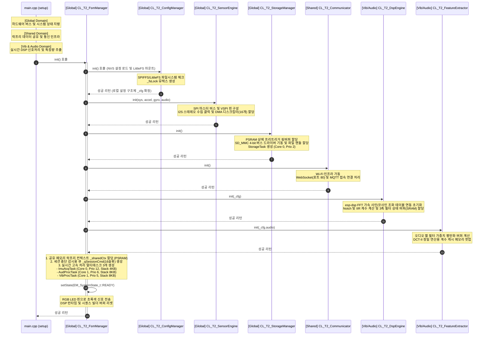
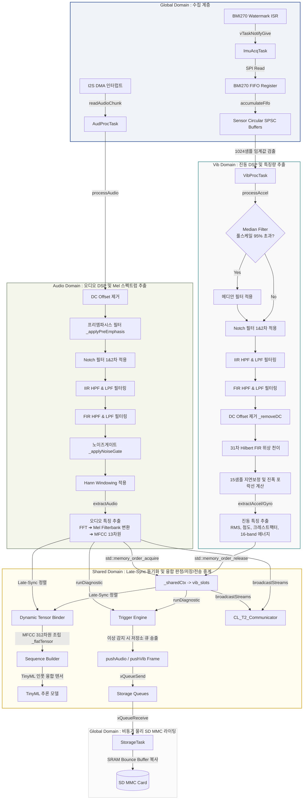
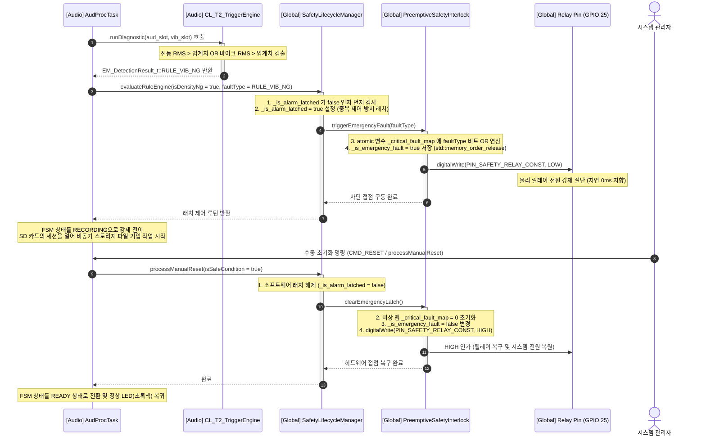

# [MSFM_T2_250] 주요 처리 흐름도 및 상세 명세 (Major Function Flow Spec)

본 문서는 **MSFM-T250** 임베디드 펌웨어의 핵심 동작 시나리오에서 예외 처리를 제외하고, 정상 경로(Happy Path)를 기준으로 시스템의 생명주기와 데이터 파이프라인, 안전 인터록의 흐름을 상세히 기술합니다. 특히 **4-Tier 도메인 격리 모델(Global, Shared, Vib, Audio)**을 기준으로 각 흐름을 분할하고, 실제 연산에 사용되는 중요 버퍼 및 통신 큐 등의 변수명과 구체적인 메모리 계층(Internal SRAM / PSRAM), 함수 호출 스택을 세부 명세화하였습니다.

---

## 1. 시스템 초기화 및 부팅 흐름 (System Bootstrap Flow)

시스템 리셋 후 각 도메인의 초기화 함수가 맞물려 실행되며 READY 상태로 전이하는 부팅 절차입니다.

### 1.1 도메인 격리 초기화 시퀀스

### 1.2 상세 부팅 프로세스 명세 (함수 및 제어 변수 수준)

1.  **설정 파일 파싱 및 전역 락 생성 (`CL_T2_ConfigManager::init`)**
    *   **동작**: SPIFFS/LittleFS에 안전하게 락을 걸고 접근할 수 있도록 `_fsLock` 바이너리 세마포어(Mutex)를 초기 생성합니다. NVS 및 SD 카드의 `config.json`을 순차 탐색하여 시스템 구조체 변수인 `_cfg`(`ST_DynamicConfig_t`)에 데이터를 파싱해 채워 넣습니다.
2.  **센서 버스 바인딩 및 SPSC 버퍼링 (`CL_T2_SensorEngine::init`)**
    *   **동작**: BMI270 제어용 VSPI 인프라를 바인딩하고 인터럽트 감지 핀(`PIN_INT1_WATERMARK_CONST`)을 입력형태로 초기화합니다. 마이크 데이터 인출용 I2S 버스 클럭 및 내부 순환형 DMA 디스크립터(16개 버퍼, 버퍼당 512 바이트)를 바인딩합니다. 락프리 상태 공유를 위해 1.6kHz 데이터를 수집할 `_accRingBuf` 및 `_gyrRingBuf` 링버퍼 메모리를 Internal SRAM에 정렬 할당합니다.
3.  **물리 스토리지 비동기 데몬 구동 (`CL_T2_StorageManager::init`)**
    *   **동작**: 파일 입출력 지연 우회를 위해 비동기 큐 `_qAudStorage` 및 `_qVibStorage`를 커널 영역에 등록합니다. 트리거 발생 전의 데이터를 일정 기간 보존할 PSRAM 프리트리거 링버퍼(`_preTrigAudBuf`, `_preTrigVibBuf`)를 동적 정적 할당합니다. 이후 SD 카드와의 물리 쓰기 작업을 격리 수행할 독자적인 저장소 스레드 `_storageTaskProc`를 생성하고 대기시킵니다.
4.  **신호 가공용 상태 메모리 및 테이블 구성 (`CL_T2_DspEngine::init` 및 `CL_T2_FeatureExtractor::init`)**
    *   **동작**: `dsps_fft2r_init_fc32(NULL, 1024)`를 호출하여 하드웨어 가속 삼각함수 테이블을 셋업합니다. 마이크 L/R 캡처 버퍼 `_capBufL/R`와 프로세스 완료 버퍼 `_prcBufL/R`를 16-byte 배수로 정렬하여 Internal SRAM(`MALLOC_CAP_INTERNAL | MALLOC_CAP_8BIT`)에 할당합니다. 오디오 특징량 및 멜 스펙트럼 추출을 담당하는 `CL_T2_FeatureExtractor`는 Mel 필터링 가중치 테이블인 `_melBankFlat` 행렬 버퍼를 PSRAM 영역에 생성합니다.

---

## 2. 실시간 멀티태스킹 데이터 가공 파이프라인 (Real-time Pipeline)

Core 0(고속 수집 및 저장)과 Core 1(DSP 및 판정/추론) 사이에서 데이터 유실 없이 고주파수 스트림을 가공하기 위해 SPSC(Single-Producer Single-Consumer) 락프리 순환 방식을 이용하는 핵심 런타임 루프입니다.

### 2.1 파이프라인 데이터 흐름도 (상세 세부 연산 포함)

### 2.2 태스크별 상세 동작 및 버퍼 제어 흐름

#### ① `ImuAcqTask` (Core 0, Prio 12) - Global Domain 수집 제어
*   **수집 동기화**: BMI270 센서 내부 FIFO에 83 프레임(약 25ms 분량)의 데이터가 차서 Watermark 인터럽트(`T245_bmi_watermark_isr`)가 RISING 엣지로 검출될 때까지 `ulTaskNotifyTake` 블록 상태로 대기합니다.
*   **레지스터 교차 검증**: 깨어난 후 `_sensor._readRegSingle(REG_INT_STATUS_1_ADDR)`을 읽어 실제 FIFO Watermark 비트가 참인지 즉시 검증하여 가짜 인터럽트를 차단합니다.
*   **데이터 읽기**: SPI 마스터 컨트롤러를 독점 잠금한 뒤 `accumulateFifo()`를 가동하여 3축 가속도 및 자이로 데이터를 단일 SPI 트랜잭션으로 인출합니다.
*   **적재 버퍼**: 인출한 원시 정밀 16비트 정수 데이터를 실수 스케일로 스케일링한 후, `CL_T2_SensorEngine` 내의 락프리 SPSC 순환 링버퍼인 `_accRingBuf`와 `_gyrRingBuf`에 순차 기입합니다.

#### ② `VibProcTask` (Core 1, Prio 5) - Vib Domain 신호 처리
*   **동작 임계**: 링버퍼 `_accRingBuf`에 쌓인 데이터 개수가 FFT 연산 윈도우 크기인 `FFT_SIZE_MAX`(1024 샘플, 약 640ms 간격)에 도달하면 가공 연산을 기동합니다.
*   **인덱스 제어**: 공유 컨텍스트 `_sharedCtx->vib_idx` 값을 `std::memory_order_relaxed`로 읽은 후, `write_idx = vib_idx ^ 1`로 계산하여 쓰기 버퍼 슬롯을 설정합니다.
*   **3축 DSP 필터 체인 연산**:
    1.  **메디안 필터링 (`_applyMedianFilter`)**: 풀스케일 95% 초과 스파이크 성분 감지 시에만 윈도우 크기 5의 메디안 필터를 적응형으로 돌려 잡음을 제거합니다.
    2.  **Notch 및 IIR 필터**: `_accDsp->notch_coeffs` 및 2차 Notch 계수 배열을 적용해 특정 이상 공진 주파수를 제거합니다. 이후 컷오프 주파수를 반영한 바이쿼드 IIR 필터를 적용합니다.
    3.  **힐버트 포락선 추출**: 31차 FIR 힐버트 변환 매크로(`safe_dsps_fir_f32`)를 사용해 위상이 90도 밀린 복소 가상 축 신호를 생성합니다. 15 샘플 군지연 보정을 수행하여 `v_out_delayed(t - 15)`와 위상 천이 신호를 제곱 합산한 후 제곱근을 구해 `_accHilbertEnvX/Y/Z` 포락선 버퍼에 적재합니다.
*   **특징량 발행**: 추출된 RMS, 첨도(Kurtosis), 크레스트 팩터 데이터를 `_sharedCtx->vib_slots[write_idx]`에 저장한 후 `vib_idx.store(write_idx, std::memory_order_release)`를 통해 메모리 가드를 해제합니다.

#### ③ `AudProcTask` (Core 1, Prio 6) - Audio Domain 및 Shared 융합
*   **I2S DMA 인터럽트 구동**: I2S DMA 버퍼가 채워질 때마다 깨어나 `readAudioChunk()`를 구동하여 1024 샘플의 마이크 데이터를 L/R 캡처 버퍼인 `_capBufL/R`에 Zero-Copy로 인출합니다.
*   **오디오 채널 분리 DSP**:
    *   DC Offset을 1차 HPF로 잘라내고 프리엠파시스 필터(`_applyPreEmphasis`)를 거쳐 고주파 영역을 사전에 증폭합니다.
    *   Notch 필터와 윈도잉 함수(`_audDsp->window`)를 거쳐 사이드 로브 리크를 최소화한 후 `_prcBufL/R` 버퍼로 데이터를 배출합니다.
*   **특징 추출 및 Late-Sync 동기화**:
    *   `_melBankFlat` Mel Filterbank 가중치 플랫 배열을 활용하여 오디오 주파수 스펙트럼에서 MFCC 13차원 특징량을 도출합니다.
    *   `_sharedCtx->vib_idx`를 `std::memory_order_acquire`로 원자적으로 읽어와 가장 최근에 계산 완료가 확보된 진동 특징 슬롯 `_sharedCtx->vib_slots[vib_idx]`을 지연 없이 가져옵니다.
*   **융합 텐서 전송**: 두 특징량을 병합하여 `_flatTensor` 버퍼에 바인딩하고 `_seqBuilder`에 벡터를 푸시한 뒤, `runDiagnostic()`을 기동하여 진단 및 릴레이 제어 단계를 수행합니다.

---

## 3. 트리거 및 실시간 안전 차단 인터록 흐름 (Safety Interlock Flow)

실시간 데이터 분석 파이프라인에서 한계 임계치를 초과하는 순간, RTOS 커널 스레드 스케줄러 지연 및 예외 스택 컨텍스트 부하를 우회하여 즉각적으로 물리 전원을 차단(Latching)하고 복구하는 흐름입니다.

### 3.1 인터록 가동 및 래치 복구 상세 시퀀스

### 3.2 안전 도메인 주요 상태 제어 리소스 상세

*   **`PIN_SAFETY_RELAY_CONST` (GPIO 25) - Global Domain**:
    *   외부 보조 하드웨어 전원 릴레이의 코일 제어핀입니다. 액티브 하이로 동작하며, 비상 상황(Fault) 발생 시 소프트웨어가 이 핀을 `LOW`로 낮춰 전원 라인을 완전 차단함으로써 액추에이터 및 시스템 구동 전력을 긴급 컷 오프합니다.
*   **`_is_alarm_latched` (bool) - Global Domain**:
    *   수동 복구 명령이 인가될 때까지 비상 정지 상태를 고정 유지하기 위한 래치(Latch) 변수입니다. 이 플래그가 `true`로 설정되면 룰 평가 엔진(`evaluateRuleEngine`)은 추가 릴레이 제어 연산을 바이패스하여 제어 루프의 폭주 및 리플 현상을 방지합니다.
*   **`_is_emergency_fault` (std::atomic<bool>) - Shared Domain**:
    *   멀티코어/다중 태스크 환경에서 스레드 락 경합 없이(Lock-free) 시스템이 긴급 비상 상태인지 즉시 acquire/release 하여 탐색할 수 있도록 돕는 원자적 변수입니다. `std::memory_order_release`와 `std::memory_order_acquire`를 사용해 다른 태스크들과 상태 불일치 캐시 미스를 유발하지 않고 안전하게 동기화합니다.
*   **`_critical_fault_map` (std::atomic<uint16_t>) - Shared Domain**:
    *   차단을 일으킨 원인(오디오 NG, 가속도 NG, 자이로 NG 등) 비트를 비트 단위 OR 연산(`fetch_or`)을 사용해 누적 보존하는 비상 로그 맵 변수입니다. 리셋 시 `store(0)` 명령어로 한 번에 초기화됩니다.
