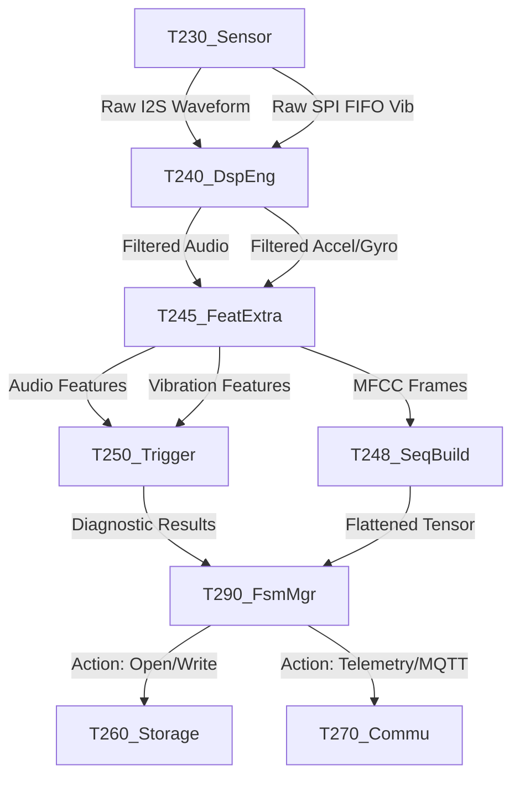

# [MSFM_T2_v250] 전체 시스템 기능 규격서 (Overall System Functional Specification)

본 문서는 **MSFM_T2_v250** 임베디드 펌웨어의 전체 시스템 기능 규격서입니다. 시스템 아키텍처, 전역 데이터 흐름(Data Flow), 태스크/코어 바인딩 모델 및 도메인 격리 원칙을 수립하여 개발자가 시스템 전체를 유기적으로 파악하고 개발할 수 있도록 돕습니다.

---

## 1. 4-Tier 시스템 아키텍처 개요

본 시스템은 높은 주파수의 소음(Audio) 데이터와 진동(IMU: Accel/Gyro) 데이터를 동시 처리하기 위해 **4-Tier 도메인 격리 모델**을 채택하고 있습니다.

```
+-----------------------------------------------------------------------+
|  Tier 4. AI & MLOps (추론 및 안전 차단 인터록)                           |
|  - PreemptiveSafetyInterlock / SafetyLifecycleManager / SequenceBuilder|
+-----------------------------------------------------------------------+
|  Tier 3. Feature Extraction & Storage (특징 추출 및 데이터 보존)        |
|  - FeatureExtractor / StorageManager / Calibrator                     |
+-----------------------------------------------------------------------+
|  Tier 2. Signal Processing (DSP 엔진 및 필터 계수 제어)                   |
|  - DspEngine / ConfigManager                                          |
+-----------------------------------------------------------------------+
|  Tier 1. Hardware Interface & Capture (센서 수집 및 드라이버)            |
|  - SensorEngine (SPI-BMI270, I2S-ICS43434) / Communicator              |
+-----------------------------------------------------------------------+
```

---

## 2. 통합 데이터 흐름 (Unified Data Flow)

시스템 내부에서 데이터가 수집되어 가공, 추출, 판정, 전송 및 저장되는 흐름입니다.



1.  **설정 및 타입 정의**: 시스템 부팅 직후 [T210_Def](../T210_Def_250.hpp)의 전역 상수(SSOT)와 [T215_Type](../T215_Type_250.hpp)의 데이터 규격을 기반으로 모든 파이프라인 버퍼가 정적 선언되며 런타임 설정 매칭이 수행됩니다.
2.  **수집 (Capture)**: [T230_Sensor](../T230_Sensor_250.hpp) 모듈이 Core 0에서 I2S DMA 인터럽트와 SPI FIFO 이벤트를 통해 데이터를 초고속 수집하고, 멀티코어 간 SPSC 락프리 중계 링버퍼인 [T216_RingBuf](../T216_RingBuf_250.hpp)에 데이터 유실 없이 순환 적재합니다.
3.  **전처리 (DSP)**: [T240_DspEng](../T240_DspEng_250.hpp)가 SIMD 및 FPU 명령어로 DC 제거, 노치 필터, 대역 필터(IIR/FIR), Hann 윈도잉을 수행합니다. (가속도는 힐버트 변환 포락선 및 2단계 메디안 필터링 적용)
4.  **추출 (Features)**: [T245_FeatExtra](../T245_FeatExtra_250.hpp)가 FFT 스펙트럼, RMS, 왜도, 첨도, 밴드 에너지, [MelFilterbankGenerator](../T246_MelGen_250.hpp)를 사용한 Mel-Filterbank 기반 MFCC(Static, Delta, Delta-Delta)를 생성합니다. (자이로는 ZCR을 폐기하고 1차 차분 RMS 에너지를 채용하며, 오디오는 Coherence/IPD 대신 1/3 옥타브 밴드 상대 에너지 비율 벡터인 Timbre 지표를 도입하여 MFCC와 융합합니다.)
5.  **조립 및 동기화**: [T248_SeqBuild](../T248_SeqBuild_250.hpp)의 `MultiRateTimeAligner`가 이종 주기(진동 1600Hz, 오디오 42000Hz) 데이터의 시간축 정렬(ZOH 폴백 포함) 및 Traits 정책 마스킹 규격(가속도/자이로 MFCC 연산 생략 및 0.0f 마스킹)이 적용된 신경망 입력 융합 텐서(`DynamicTensorBinder`)를 조립합니다.
6.  **판정 (Decision)**: [T250_Trigger](../T250_Trigger_250.hpp) 및 `SafetyLifecycleManager`가 특징량 임계치를 분석하여 결함 판정 및 릴레이 비상 차단을 수행합니다.
7.  **저장 및 송출**: 판정 결과에 기초하여 [T260_Storage](../T260_Storage_250.hpp)가 SD카드 비동기 지연 파일 쓰기(WAL 2-Phase Commit 포함)를 처리하고, [T270_Commu](../T270_Commu_250.hpp)가 WebSocket 및 MQTT로 상태를 실시간 송출합니다.

---

## 3. 멀티코어 및 멀티태스킹 아키텍처

ESP32-S3 Dual Core MCU 제약을 극복하고 실시간 수집 마진을 확보하기 위해 FreeRTOS 태스크를 다음과 같이 바인딩합니다.

| 태스크명 | 할당 코어 | 우선순위 | 주기 및 트리거 | 목적 및 설명 |
| :--- | :---: | :---: | :---: | :--- |
| `t2_imu_acq` | **Core 0** | 12 (최상위) | BMI270 FIFO Watermark ISR (약 25ms) | SPI 버스를 배타 점유하여 FIFO 원시 데이터를 고속 인출 및 내부 링버퍼 적재 |
| `t2_aud_proc` | **Core 1** | 6 | I2S DMA 수신 이벤트 (약 12.2ms) | 오디오 핑퐁 버퍼 수신 시 기동하여 DSP 필터링, 특징 추출, 켑스트럼 분석 수행 |
| `t2_vib_proc` | **Core 1** | 5 | 1024 샘플 수집 주기 (약 640ms) | 가속도/자이로 축별 누적 링버퍼 데이터를 가져와 FIR/IIR 처리 및 특징 연산 |
| `t2_storage` | **Core 1** | 2 (하위) | 비동기 스토리지 큐 메시지 수신 시 | SD 카드 파일 쓰기 및 용량/시간 한계 도달 시 파일 로테이션 관리 |

> [!IMPORTANT]
> **SPI Lock (뮤텍스) 제어 원칙**:
> `t2_imu_acq` 태스크와 메인 루프/기타 태스크(`T220_CfgMgr`, `T280_Calibrator` 등)가 SPI 버스에서 경합하지 않도록 `CL_T2_SensorEngine` 내부에 배치된 `_spiLock` Mutex Semaphore를 반드시 통과해야 합니다.

---

## 4. 도메인 격리 및 정렬 정책

1.  **메모리 정렬 (`alignas(16)`)**:
    *   ESP32-S3 FPU/SIMD 하드웨어의 벡터 연산 장치를 직접 사용하기 위해 오디오/진동 원시 버퍼 및 특징량 구조체는 반드시 `alignas(16)`를 유지합니다.
2.  **동적 할당(Dynamic Allocation) 배제**:
    *   실시간 감시 루프 내부에서 `malloc`, `new`, `std::vector` 확장을 사용하지 않습니다. 모든 링버퍼와 스크래치 버퍼는 부팅 시 정적으로 할당되거나 싱글톤 인스턴스 생성 시 힙 영역(PSRAM)에 컴파일 타임 크기(`FFT_SIZE_MAX` 등)로 고정 할당됩니다.
3.  **바이너리 패킷 팩킹**:
    *   네트워크 및 SD 카드 입출력 효율을 위해 원시 특징 패킷은 `#pragma pack(push, 1)` 매크로를 이용해 빈 공간 없이 1바이트 크기로 패킹되어 전송 및 저장됩니다.

---

## 5. 모듈별 기능 규격서 인덱스

| 대상 파일 | 기능 규격서 링크 | 주요 역할 |
| :--- | :--- | :--- |
| [T200_Main_250.h](../T200_Main_250.h) | [T200_Main_FuncSpec_250.md](./T200_Main_FuncSpec_250.md) | 4-Tier 시스템 부팅 시퀀스 제어 및 ISR 디바운싱 |
| [T210_Def_250.hpp](../T210_Def_250.hpp) | [T210_Def_FuncSpec_250.md](./T210_Def_FuncSpec_250.md) | 4-Tier 시스템 상수 정의 및 전역 파라미터 제어 SSOT |
| [T215_Type_250.hpp](../T215_Type_250.hpp) | [T215_Type_FuncSpec_250.md](./T215_Type_FuncSpec_250.md) | 4-Tier 데이터 타입 및 전송용 바이너리 패킷 규격 |
| [T216_RingBuf_250.hpp](../T216_RingBuf_250.hpp) | [T216_RingBuf_FuncSpec_250.md](./T216_RingBuf_FuncSpec_250.md) | 멀티코어 간 SPSC 락프리 순환 링 버퍼 중계 엔진 |
| [T220_CfgMgr_250.hpp](../T220_CfgMgr_250.hpp) | [T220_CfgMgr_FuncSpec_250.md](./T220_CfgMgr_FuncSpec_250.md) | JSON 파싱 및 RAM-Flash(SSOT) 설정 비동기 백업 |
| [T230_Sensor_250.hpp](../T230_Sensor_250.hpp) | [T230_Sensor_FuncSpec_250.md](./T230_Sensor_FuncSpec_250.md) | BMI270 SPI 링버퍼 적재 및 I2S 오디오 청크 수집 |
| [T240_DspEng_250.hpp](../T240_DspEng_250.hpp) | [T240_DspEng_FuncSpec_250.md](./T240_DspEng_FuncSpec_250.md) | SIMD 가속 DC 제거, 노치, IIR/FIR 필터 연산 |
| [T245_FeatExtra_250.hpp](../T245_FeatExtra_250.hpp) | [T245_FeatExtra_FuncSpec_250.md](./T245_FeatExtra_FuncSpec_250.md) | 파워 스펙트럼 및 MFCC / 델타-델타 계수 이력 연산 |
| [T246_MelGen_250.hpp](../T246_MelGen_250.hpp) | [T246_MelGen_FuncSpec_250.md](./T246_MelGen_FuncSpec_250.md) | 오디오/IMU 전용 Mel-Scale 삼각 필터 가중치 행렬 생성 |
| [T248_SeqBuild_250.hpp](../T248_SeqBuild_250.hpp) | [T248_SeqBuild_FuncSpec_250.md](./T248_SeqBuild_250.md) | 멀티레이트 시간 동기화(Aligner) 및 추론용 조립 텐서 관리 |
| [T250_Trigger_250.hpp](../T250_Trigger_250.hpp) | [T250_Trigger_FuncSpec_250.md](./T250_Trigger_250.md) | 다차원 RMS 및 STA/LTA 비율 판정 룰 엔진 |
| [T260_Storage_250.hpp](../T260_Storage_250.hpp) | [T260_Storage_FuncSpec_250.md](./T260_Storage_250.md) | PSRAM 링버퍼 비동기 입출력, 프리트리거, 파일 로테이션 |
| [T270_Commu_250.hpp](../T270_Commu_250.hpp) | [T270_Commu_FuncSpec_250.md](./T270_Commu_FuncSpec_250.md) | AsyncWebServer WebSocket 및 IDF Native MQTT 클라이언트 |
| [T280_Calibrator_250.hpp](../T280_Calibrator_250.hpp) | [T280_Calibrator_FuncSpec_250.md](./T280_Calibrator_250.md) | Welch's PSD 분석 기반 자동/수동 마이크 EQ 추출 |
| [T290_FsmMgr_250.hpp](../T290_FsmMgr_250.hpp) | [T290_FsmMgr_FuncSpec_250.md](./T290_FsmMgr_FuncSpec_250.md) | 시스템 상태 전이(FSM), 프리엠프티브 인터록, 수명주기 관리 |
