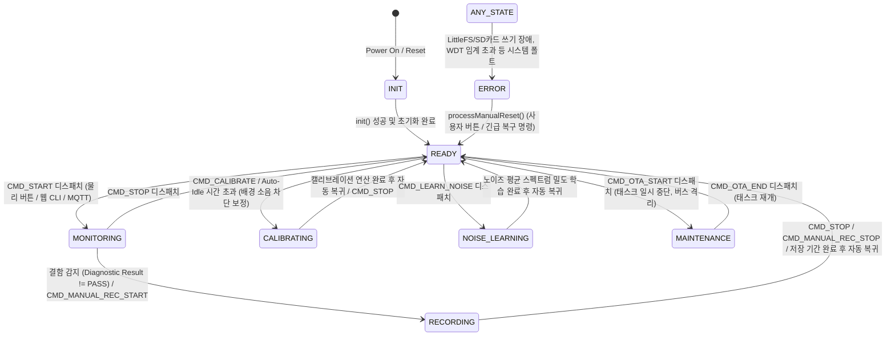
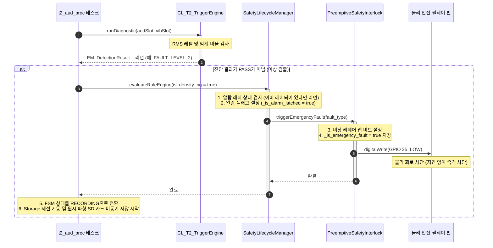
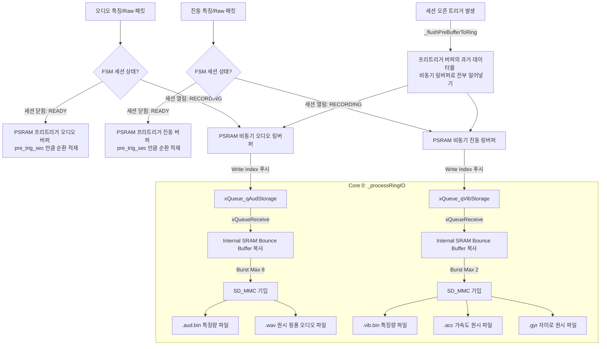

# [MSFM_T2_v250] 시스템 기능 상세 흐름도 (Detailed System Function Flowchart)

본 문서는 **MSFM_T2_v250** 임베디드 펌웨어의 핵심 동작 시퀀스, 코어/태스크 구성, 실시간 데이터 파이프라인, 비동기 스토리지 기입 모델, 프리엠프티브 인터록 메커니즘을 시각적 다이어그램(Mermaid) 및 단계별 설명으로 구체화한 개발 가이드라인 문서입니다.

---

## 1. 하드웨어 리소스 및 태스크 코어 바인딩 모델

ESP32-S3 Dual-Core MCU 제약을 극복하고, 고주파수 오디오 수집(42kHz) 및 진동 수집(1.6kHz) 환경에서 데이터 유실 없는 처리를 수행하기 위해 다음과 같이 코어 및 우선순위를 배타 배정합니다.

| 태스크명              | 실행 함수               |   할당 코어    |   우선순위   |              주기 및 트리거              | 목적 및 설명                                                   |
| :---------------- | :------------------ | :--------: | :------: | :--------------------------------: | :-------------------------------------------------------- |
| **`t2_imu_acq`**  | `_imuAcqTask`       | **Core 0** | 12 (최상위) | BMI270 FIFO Watermark ISR (약 25ms) | SPI 버스 점유, FIFO 원시 데이터 고속 인출 및 링버퍼 적재                     |
| **`t2_aud_proc`** | `_audioProcessTask` | **Core 1** |    6     |     I2S DMA 수신 이벤트 (약 24.3ms)      | 오디오 핑퐁 버퍼 수신 시 기동하여 DSP 필터링, 특징 추출, 켑스트럼 분석 및 융합 판정/저장 지시 |
| **`t2_vib_proc`** | `_vibProcessTask`   | **Core 1** |    5     |     1024 샘플 수집 완료 시 (약 640ms)      | 가속도/자이로 축별 누적 링버퍼 데이터를 가져와 FIR/IIR 처리, 특징 연산 및 비동기 저장 지시  |
| **`t2_storage`**  | `_storageTaskProc`  | **Core 0** |  2 (하위)  |        비동기 스토리지 큐 메시지 수신 시         | SD 카드 파일 쓰기 및 용량/시간 한계 도달 시 파일 로테이션 관리                    |

> [!IMPORTANT]
> **SPI Lock (뮤텍스) 제어 원칙**:
> `t2_imu_acq` 태스크와 메인 루프/기타 태스크(`T220_CfgMgr`, `T280_Calibrator` 등)가 SPI 버스에서 경합하지 않도록 `CL_T2_SensorEngine` 내부에 배치된 `_spiLock` Mutex Semaphore를 반드시 통과해야 합니다.

---

## 2. 시스템 초기화 및 부팅 흐름 (System Bootstrap)

시스템 전원이 켜진 후, 4-Tier 시스템 프레임워크가 구동되고 각 서브시스템과 태스크가 가동되는 흐름입니다.

```mermaid
sequenceDiagram
    autonumber
    participant Main as main.cpp (setup)
    participant T200 as T200_Main (T2_init)
    participant FsmMgr as CL_T2_FsmManager
    participant CfgMgr as CL_T2_ConfigManager
    participant Sensor as CL_T2_SensorEngine
    participant DspEng as CL_T2_DspEngine
    participant FeatExt as CL_T2_FeatureExtractor
    participant Storage as CL_T2_StorageManager
    participant Commu as CL_T2_Communicator

    Main->>T200: T2_init() 호출
    activate T200
    Note over T200: 1. Serial (115200) 및 물리 버튼 핀(GPIO 0) 설정<br/>2. T200_handleTriggerISR 인터럽트 바인딩
    T200->>FsmMgr: init() 호출
    activate FsmMgr
    
    FsmMgr->>CfgMgr: init() (JSON 설정 로드)
    FsmMgr->>Sensor: init() (SPI-BMI270, I2S-ICS43434 핀 & 클럭 맵핑)
    FsmMgr->>DspEng: init() (DC 컷, notch, IIR/FIR 필터 계수 설정)
    FsmMgr->>FeatExt: init() (FFT 버퍼 및 Mel-Filterbank 초기화)
    
    FsmMgr->>Storage: init() 호출
    activate Storage
    Note over Storage: PSRAM 프리트리거/비동기 링버퍼 할당<br/>SD 카드 마운트 및 LittleFS 인덱스 파일 복구
    Storage-->>FsmMgr: StorageTask 생성 (Core 0, Prio 2)
    deactivate Storage

    FsmMgr->>Commu: init() (WebSocket & MQTT 기동)
    
    Note over FsmMgr: 3. 공유 메모리 컨텍스트 (_sharedCtx) PSRAM 할당<br/>4. 세션 명령 큐 (_qSessionCmd) 생성
    
    FsmMgr-->>FsmMgr: ImuAcq Task 생성 (Core 0, Prio 12)
    FsmMgr-->>FsmMgr: AudProc Task 생성 (Core 1, Prio 6)
    FsmMgr-->>FsmMgr: VibProc Task 생성 (Core 1, Prio 5)
    
    FsmMgr->>FsmMgr: setState(READY) 전이
    Note over FsmMgr: LED -> 초록색 (Green) 변경<br/>DSP/Sequence/Trigger 카운터 리셋
    
    FsmMgr-->>T200: 부팅 완료 리턴
    deactivate FsmMgr
    deactivate T200
```



---

## 3. FSM 상태 전이 흐름 (System FSM State Transitions)

`CL_T2_FsmManager`가 주도하는 시스템의 8가지 상태와 상태별 전환 트리거 및 LED 인디케이터 맵핑입니다.



### 상태별 LED 색상 표
| 시스템 상태 (State) | LED 색상 (RGB) | 설명 |
| :--- | :---: | :--- |
| **`INIT`** | 노란색 (Yellow) | 부팅 및 하드웨어 준비 중 |
| **`READY`** | 초록색 (Green) | 구동 준비 완료, 명령 대기 상태 |
| **`MONITORING`** | 하늘색 (Cyan) | 실시간 센서 가공 및 진단 수행 중 |
| **`RECORDING`** | 빨간색 (Red) | 결함 트리거 발생에 따른 SD 카드 원시 파형 저장 중 |
| **`NOISE_LEARNING`** | 보라색 (Purple) | 배경 노이즈 스펙트럼 수집 및 학습 중 |
| **`CALIBRATING`** | 주황색 (Orange) | 마이크 EQ 보정 곡선 추출 실행 중 |
| **`MAINTENANCE`** | 흰색 (White) | OTA 펌웨어 업데이트 중 (파이프라인 일시중단) |
| **`ERROR`** | 빨간색 (Red-High) | 물리적 디바이스 / IO 장애 상태 |

---

## 4. 실시간 멀티태스킹 데이터 가공 파이프라인 (Real-time Pipeline)

실시간 데이터 파이프라인은 코어 0에서 고속 수집된 원시 데이터를 코어 1로 안전하게 넘기기 위해 **SPSC (Single-Producer Single-Consumer) 락프리 더블 버퍼링 구조**를 채택하고 있습니다. 

```mermaid
graph TD
    %% 코어 배정
    subgraph Core0 [Core 0 : 수집 및 물리 디스크 I/O]
        style Core0 fill:#f0f4f8,stroke:#3b5998,stroke-width:2px
        ISR_Vib[BMI270 Watermark ISR] -->|vTaskNotifyGive| Task_Acq[t2_imu_acq 태스크]
        Task_Acq -->|SPI DMA / Read| Sensor_Vib[BMI270 Sensor]
        Sensor_Vib -->|LSB to G/Dps 변환 및 캘리브레이션| Ring_Sensor[Sensor Circular Buffers]
        
        Task_Storage[t2_storage 태스크] -->|SD MMC Write| SD_Card[(SD Card)]
    end

    subgraph Core1 [Core 1 : DSP 처리 및 추론/판정 엔진]
        style Core1 fill:#f5f6eb,stroke:#8a9a86,stroke-width:2px
        Task_VibProc[t2_vib_proc 태스크]
        Task_AudProc[t2_aud_proc 태스크]
        
        %% 진동 가공 흐름
        Ring_Sensor -->|SPSC getAccumulatedAccel/Gyro| Task_VibProc
        Task_VibProc -->|processAccel/Gyro| DSP_Vib[DC 컷, 노치, IIR/FIR 필터]
        DSP_Vib -->|extractAccel/Gyro| Feat_Vib[진동 특징량 추출 <br/> RMS, 첨도, 16-band 에너지, MFCC]
        Feat_Vib -->|std::memory_order_release| Shared_Ctx[공유 메모리 Context _sharedCtx]

        %% 오디오 가공 흐름
        I2S_DMA[I2S DMA 수신 이벤트] -->|readAudioChunk| Task_AudProc
        Task_AudProc -->|processAudio| DSP_Aud[DC 컷, 노치, Hann Window]
        DSP_Aud -->|extractAudio| Feat_Aud[오디오 특징량 추출 <br/> FFT, 1/3 Octave Timbre, MFCC]
        
        %% 특징량 병합 및 Late-Sync
        Feat_Aud -->|std::memory_order_acquire 읽기| Shared_Ctx
        Shared_Ctx & Feat_Aud -->|Late-Sync 정렬| Tensor_Binder[Dynamic Tensor Binder]
        Tensor_Binder -->|MFCC (312차원) 조립| Seq_Builder[Sequence Builder]
        Seq_Builder -->|TinyML 입력 융합 텐서| TinyML[TinyML 추론 모델]

        %% 진단 및 트리거
        Shared_Ctx & Feat_Aud -->|runDiagnostic| Trig_Eng[Trigger Engine]
        Trig_Eng -->|Fault 감지 시 즉각 릴레이 컷| Safety_Interlock[Preemptive Safety Interlock]
        Safety_Interlock -->|GPIO 25 LOW| Relay[물리 안전 차단 릴레이]

        %% 웹 및 스토리지 중계
        Trig_Eng -->|Fault / Calib 데이터 푸시| Storage_Push[pushAudio / pushVib Frame]
        Storage_Push -->|xQueueSend| Q_Storage[Storage Queues]
        Q_Storage --> Task_Storage

        Feat_Aud & Shared_Ctx -->|broadcastStreams| WS_Commu[CL_T2_Communicator]
        WS_Commu -->|WebSocket Binary Broadcast| External[Web UI / Dashboard]
    end
```

### 상세 동작 시퀀스

### A. 진동(IMU) 수집 및 가공 흐름 (Core 0 ➔ Core 1)
1. **ISR 트리거**: BMI270 FIFO의 워터마크 비트가 설정되면 `PIN_INT1_WATERMARK_CONST` 핀이 RISING 엣지로 전환되어 `T245_bmi_watermark_isr` 인터럽트 루틴이 호출됩니다.
2. **스로틀링 및 노티파이**: ISR은 최소 호출 주기(0.5ms)를 검증하고 `vTaskNotifyGiveFromISR`을 통해 Core 0의 `t2_imu_acq` 태스크를 즉시 기동합니다.
3. **FIFO 수집**: `t2_imu_acq`는 SPI 버스를 획득하여 BMI270 FIFO 데이터를 긁어와 `_accumX/Y/Z` 링버퍼에 적재합니다.
4. **가공 및 특징 추출 (Core 1)**: `t2_vib_proc` 태스크가 약 640ms 주기(1024 샘플 완료 시점)로 링버퍼에서 데이터를 가져와 DC 제거, 노치 필터링, RMS 및 MFCC 특징량 연산을 수행합니다.
5. **공유 메모리 배포**: 가공 완료된 진동 특징 슬롯(`ST_FeatureSlot_Vib_t`)은 `_sharedCtx->vib_slots` 더블 버퍼 중 쓰기 버퍼에 저장된 후, `vib_idx`가 원자적으로 스왑(`std::memory_order_release`)되어 오디오 태스크로 공유됩니다.

### B. 오디오 수집, 가공 및 Late-Sync 센서 퓨전
1. **오디오 수집**: I2S DMA 버퍼 수신이 감지되면 Core 1의 `t2_aud_proc` 태스크가 깨어나 `readAudioChunk`를 호출해 1024개의 16비트 오디오 샘플을 wait-free로 가져옵니다.
2. **오디오 가공**: `processAudio` 및 `extractAudio`가 DC 제거, Notch, FFT 스펙트럼 및 MFCC 계수를 빠르게 연산합니다.
3. **Late-Sync 정렬 및 융합**: 
   - 오디오 태스크는 `_sharedCtx->vib_idx`를 원자적으로 획득(`std::memory_order_acquire`)하여 가장 최근에 연산된 진동 데이터 슬롯을 가져옵니다.
   - `MultiRateTimeAligner`가 진동(1600Hz)과 오디오(42000Hz) 간 시간차(Skew)를 검증하여 동기화합니다.
   - 융합 텐서 빌더(`DynamicTensorBinder`)는 오디오 MFCC(78)와 진동 MFCC(234)를 합쳐 312차원의 평탄화된 TinyML 추론 텐서를 최종 조립하고 `SequenceBuilder`에 밀어 넣습니다.

---

## 5. 트리거 및 실시간 안전 차단 인터록 흐름

특징량의 특정 한계치(RMS 및 STA/LTA 비율)가 무너졌을 때 CPU 점유 및 OS 지연을 우회하여 비상 정지를 수행하기 위한 안전 장치입니다.



### 알람 래치 복구 시퀀스
물리 안전 차단은 비상 상황 이후에도 래치(Latch)되어 풀리지 않습니다. 복구를 위해서는 사용자 명령어가 직접 유입되어야 합니다.
1. 사용자가 물리 버튼을 누르거나 웹 대시보드에서 **`CMD_RESET`** 또는 **`processManualReset`** 요청을 입력합니다.
2. `CL_T2_FsmManager::processManualReset()`이 기동됩니다.
3. `SafetyLifecycleManager::processManualReset()` 호출 ➔ `_is_alarm_latched = false`로 변경하고 멀티코어 메모리 배리어(`std::atomic_thread_fence`, `memw`)를 사용하여 모든 코어의 캐시 상태를 동기화합니다.
4. `PreemptiveSafetyInterlock::clearEmergencyLatch()` 호출 ➔ 결함 마스크 비트를 리셋하고 릴레이 제어 핀을 다시 **`HIGH`**로 변경하여 정상 전력을 복구합니다.
5. FSM 상태를 다시 **`READY`** 상태로 복귀시킵니다.

---

## 6. 비동기 이원화 저장소 파일 기입 흐름

SD 카드의 고질적인 물리 쓰기 지연(최대 수백 ms)으로 인해 실시간 데이터 수집 태스크가 영향을 받지 않도록, `t2_storage` 태스크가 비동기 링버퍼 및 대기 전용 프리트리거 메모리를 제어하여 병렬 기입을 처리합니다.



### 버스트 기입 제어 및 병목 차단 장치
* **Internal SRAM 바운스 버퍼 (`_bounceAudFeat` 등)**: 
  SD 카드 기입 속도를 높이고 DMA 버스트 시 캐시 미스 및 데이터 찢어짐(Data Tearing)을 차단하기 위해, 링버퍼 포인터를 직접 전달하지 않고 16바이트 정렬된 Internal SRAM의 단일 바운스 버퍼 공간으로 데이터를 딥 카피한 후 저장소 파일 기입 라이터 함수를 호출합니다.
* **오디오/진동 루프 비동기 저장 속도 밸런싱 (Burst Limit)**:
  `_processRingIO()`의 1회 기동당 오디오 처리는 최대 **8개(burst limit = 8)**, 진동 처리는 최대 **2개(burst limit = 2)**로 제한하여 특정 모달리티의 쓰기 점유율 독점으로 인한 태스크 병목 및 큐 오버플로우를 미연에 차단합니다.
