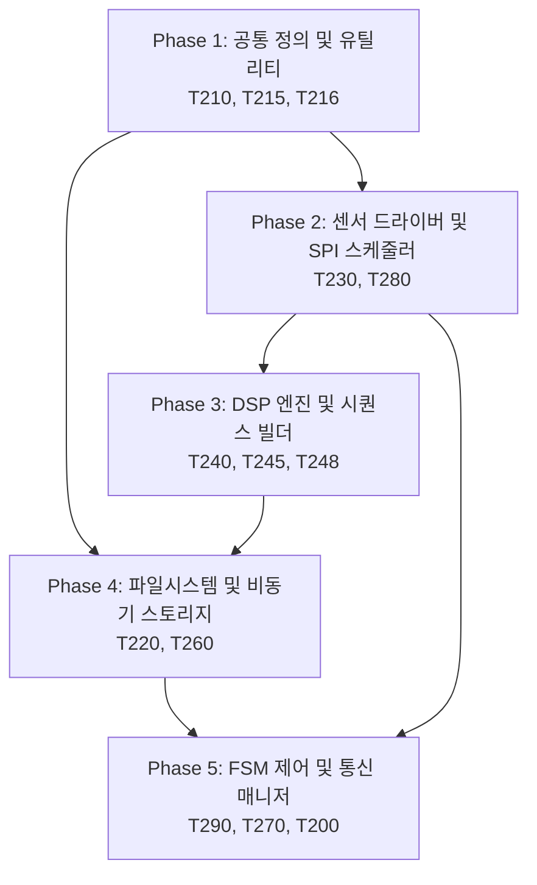

# MSFM-T250 정합성 및 개선방안 구현 계획서 (Implementation Plan)

본 문서는 `doc_req_250_02_30.구현설계서.md`에 정의된 클래스 설계, 함수 시그니처, 정합성 보완 구조를 바탕으로 실제 코드베이스에 적용하기 위한 **의존성(선후 관계), 모듈 간 관련성, 그리고 단계별 테스트 계획을 명시한 구현 계획**을 정의합니다.

---

## 1. 구현 로드맵 및 의존성 관계도

전체 구현은 하위 공통 데이터 구조 및 매크로 정의에서 시작하여 드라이버/수집부, 신호처리부, 파일 시스템/스토리지, 그리고 최종 FSM 및 통신 브릿지 순으로 진행됩니다.

---

## 2. 단계별 세부 구현 계획

### [Phase 1] 공통 타입 정의 및 락 프리 유틸리티 보강
*   **목표:** 하위 타입 정비 및 동시성 보호를 위한 유틸리티 구조체 수정.
*   **작업 대상 파일:**
    *   [T210_Def_250.hpp](file:///e:/241224_Sub/50_2540/Platformio7/ESP32_MSFM_250/src/T2_MSFM_250/T210_Def_250.hpp)
    *   [T215_Type_250.hpp](file:///e:/241224_Sub/50_2540/Platformio7/ESP32_MSFM_250/src/T2_MSFM_250/T215_Type_250.hpp)
    *   [T216_RingBuf_250.hpp](file:///e:/241224_Sub/50_2540/Platformio7/ESP32_MSFM_250/src/T2_MSFM_250/T216_RingBuf_250.hpp)
*   **세부 작업:**
    1.  `T210`에 `AccelPolicy`, `GyroPolicy`, `AudioPolicy` 메타프로그래밍 구조체 확장 반영 [4].
    2.  `T210`에 `I2S_DMA_CHUNK_SIZE` 컴파일 타임 수식 반영 [11].
    3.  `T215`에 `ST_TriggerReason_t` 및 확장된 `ST_FileHeader_t` 선언 [43].
    4.  `T215` 내 공유 상태 제어를 위한 `std::atomic<bool>` 형식 강제화 [19].
    5.  `T216` 락 프리 링버퍼의 `enqueue` 함수에 `std::memory_order_release` 메모리 배리어 배치 조정 [15].
    6.  단조 증가 시간용 `get_monotonic_timestamp_us()` 유틸리티 함수 구현 [18].

### [Phase 2] 센서 엔진 드라이버 및 SPI 비동기 스케줄러 구축
*   **목표:** 하드웨어 센서 제어용 SPI 트랜잭션 분리 및 버퍼 정합성 확보.
*   **작업 대상 파일:**
    *   [T230_Sensor_250.hpp](file:///e:/241224_Sub/50_2540/Platformio7/ESP32_MSFM_250/src/T2_MSFM_250/T230_Sensor_250.hpp) / [.cpp](file:///e:/241224_Sub/50_2540/Platformio7/ESP32_MSFM_250/src/T2_MSFM_250/T230_Sensor_250.cpp)
    *   [T280_Calibrator_250.hpp](file:///e:/241224_Sub/50_2540/Platformio7/ESP32_MSFM_250/src/T2_MSFM_250/T280_Calibrator_250.hpp) / [.cpp](file:///e:/241224_Sub/50_2540/Platformio7/ESP32_MSFM_250/src/T2_MSFM_250/T280_Calibrator_250.cpp)
*   **세부 작업:**
    1.  DMA 전송 전후의 CPU L1 캐시 무효화 및 동기화 매크로(`esp_cache_msync`) 탑재 [1].
    2.  `ST_SpiTransaction_t` 스케줄러 큐 및 백그라운드 구동 태스크 구현 (직접 SPI 쓰기 우회) [2].
    3.  모드 전환 시 하드웨어 버퍼 오염 차단을 위한 `flushHardwareFifo()` 함수 구현 [24].
    4.  딥슬립 진입 전 Any-Motion 레지스터 및 인터럽트 매핑 함수(`prepareDeepSleepWakeup`) 구현 [34].
    5.  딥슬립 웨이크업 복귀 이후 INT1 FIFO 워터마크 인터럽트 구조로 원복시키는 `restoreFromDeepSleepWakeup()` 인터페이스 신설 [보완-5].
    6.  대용량 FIFO 읽기(`IMU_FIFO_READ`)와 레지스터 수정 간 충돌 방지를 위한 SPI 트랜잭션 큐 배제 락 설계 반영 [보완-12].

### [Phase 3] DSP 엔진 고속 연산 무결성 및 시퀀스 빌더 구현
*   **목표:** 고하중 특징량 연산의 수학적 정합성 및 정렬 최적화 확보.
*   **작업 대상 파일:**
    *   [T240_DspEng_250.hpp](file:///e:/241224_Sub/50_2540/Platformio7/ESP32_MSFM_250/src/T2_MSFM_250/T240_DspEng_250.hpp) / [.cpp](file:///e:/241224_Sub/50_2540/Platformio7/ESP32_MSFM_250/src/T2_MSFM_250/T240_DspEng_250.cpp)
    *   [T248_SeqBuild_250.hpp](file:///e:/241224_Sub/50_2540/Platformio7/ESP32_MSFM_250/src/T2_MSFM_250/T248_SeqBuild_250.hpp) / [.cpp](file:///e:/241224_Sub/50_2540/Platformio7/ESP32_MSFM_250/src/T2_MSFM_250/T248_SeqBuild_250.cpp)
*   **세부 작업:**
    1.  자이로(Gyro) 전용 초경량 IIR 바이쿼드 메모리 구조로 대체 (고차 FIR 제거) [5].
    2.  필터 계수 Flash ROM 상주 고정 매크로(`SMEA_FLASH_RODATA`) 전역 적용 [8, 보완-1].
    3.  FFT 복소수 연산을 위한 짝수-실수, 홀수-0.0f 교차 배치 및 `2 * N` 버퍼 보정 [12].
    4.  SIMD 벡터 연산 효율화를 위해 `heap_caps_aligned_alloc(16)` 사용 텐서 아레나 할당 [14].
    5.  소멸자 또는 `deinit()` 단계에서 aligned 할당 버퍼 해제를 위해 `heap_caps_free()` 호출 명시 [보완-6].
    6.  시퀀스 빌더 재할당(`init`) 시 중복 할당에 따른 힙 누수를 방지하기 위한 사전 해제 가드 추가 [보완-14].
    7.  시간축 정렬(`MultiRateTimeAligner`) 내 `uint64_t` 감산 언더플로우 방어 가드 및 `alpha` 계수 클램핑 필터 구현 [22, 보완-15].
    8.  동적 필터 갱신 즉시 계수를 리빌드하는 `recalculateFilters()` 인터페이스 구현 [32].
    9.  FSM 매니저와 데이터 교환 시 값 복사(`memcpy`) 대신 락 프리 링버퍼 주소 포인터를 넘겨받는 Zero-Copy 참조 통제 [9].

### [Phase 4] 파일 시스템 안정성 확보 및 스토리지 I/O 디커플링
*   **목표:** 물리 파일 시스템 쓰기 지연에 따른 실시간 데이터 탈락 예방.
*   **작업 대상 파일:**
    *   [T220_CfgMgr_250.hpp](file:///e:/241224_Sub/50_2540/Platformio7/ESP32_MSFM_250/src/T2_MSFM_250/T220_CfgMgr_250.hpp) / [.cpp](file:///e:/241224_Sub/50_2540/Platformio7/ESP32_MSFM_250/src/T2_MSFM_250/T220_CfgMgr_250.cpp)
    *   [T260_Storage_250.hpp](file:///e:/241224_Sub/50_2540/Platformio7/ESP32_MSFM_250/src/T2_MSFM_250/T260_Storage_250.hpp) / [.cpp](file:///e:/241224_Sub/50_2540/Platformio7/ESP32_MSFM_250/src/T2_MSFM_250/T260_Storage_250.cpp)
*   **세부 작업:**
    1.  WAL 드라이버용 4KB 섹터 Append-Only 저널링 구조 및 백그라운드 LittleFS 이관 데몬 구현 [3, 10].
    2.  스토리지 쓰기 락 범위 축소(포인터 이동 시에만 획득) 및 백그라운드 태스크 쓰기 디커플링 [16].
    3.  `pushAudioFrame` 내에서 락 점유 중 `_asyncAudHead` 스냅샷 인덱스(`v_writtenIdx`) 복사 후 큐 전달 버그 교정 [보완-16].
    4.  세션 기동 시 사전 트리거(Pre-Trigger) 데이터를 파일에 순차 덤프하는 `dumpPreTriggerToSession()` 및 스냅샷 바운스 버퍼링 구현 [21, 보완-4].
    5.  세션 클로즈 시 링버퍼가 비워질 때까지 세마포어로 Graceful하게 대기 후 안전 폐쇄 [25, 보완-3].
    6.  LittleFS에 주파수 빈 스펙트럼 노이즈 프로필을 저장/로딩하는 `saveNoiseProfile` / `loadNoiseProfile` 구현 [29].
    7.  스토리지 세션 파일 생성 시 헤더에 `trigger_t0` 절대 마커와 `ST_TriggerReason_t` 메타데이터 바인딩 [31, 43, 보완-13].
    8.  SD 카드 쓰기 지연 차단을 위해 세션 오픈 시 예상 최대 영역(예: 10MB)을 선할당(`preallocateFileSpace`)하는 루틴 추가 [39].
    9.  LittleFS 동시 접근에 따른 VFS 충돌 방지를 위해 `_fsLock` 세마포어 도입 및 모든 Write/Erase/Noise Profile API 접근 동기화 [보완-11].
    10. WAL Raw 파티션 조작 시의 동시성 훼손 방지를 위해 전용 `_walLock` 뮤텍스 동기화 반영 [보완-17].

### [Phase 5] FSM 오케스트레이션 및 무선 통신 브릿지 통합
*   **목표:** 듀얼 코어 동시 구동 및 예외 상태 관리 오케스트레이션 완성.
*   **작업 대상 파일:**
    *   [T290_FsmMgr_250.hpp](file:///e:/241224_Sub/50_2540/Platformio7/ESP32_MSFM_250/src/T2_MSFM_250/T290_FsmMgr_250.hpp) / [.cpp](file:///e:/241224_Sub/50_2540/Platformio7/ESP32_MSFM_250/src/T2_MSFM_250/T290_FsmMgr_250.cpp)
    *   [T270_Commu_250.hpp](file:///e:/241224_Sub/50_2540/Platformio7/ESP32_MSFM_250/src/T2_MSFM_250/T270_Commu_250.hpp) / [.cpp](file:///e:/241224_Sub/50_2540/Platformio7/ESP32_MSFM_250/src/T2_MSFM_250/T270_Commu_250.cpp)
    *   [T200_Main_250.h](file:///e:/241224_Sub/50_2540/Platformio7/ESP32_MSFM_250/src/T2_MSFM_250/T200_Main_250.h)
*   **세부 작업:**
    1.  `CL_T2_ConfigManager` 및 `CL_T2_CommuManager` 전용 `StaticJsonDocument` 풀 및 동기화 `_commuLock` 개별 격리 구현 [17, 보완-18].
    2.  외부 ISR 내부에서 커널 패닉을 방지하기 위한 `dispatchCommandFromISR()` API 선언 및 적용 [13].
    3.  네트워크 핫스왑 변경을 감지하고 MQTT 인스턴스를 완전 재생성(`recreateMqttClient`) 및 리커넥트하는 프로세스 구현 [20, 보완-8, 보완-15].
    4.  스토리지 물리 에러를 감지하여 FSM을 `ERROR` 상태로 강제 전환하고 텔레메트리 1회 송출 및 Mute 하는 감시 체계 구현 [23, 보완-9].
    5.  캘리브레이션 튜닝 즉시 센서 오프셋을 런타임에 리로드하는 `CMD_RELOAD_CALIBRATION` 트리거 구현 [26].
    6.  부팅 초기화 시 `esp_reset_reason()`을 체크하여 콜드 부트일 때는 `g_CrashDiag`를 `0`으로 초기화하고, WDT/Panic 리셋 시에만 보존된 RTC 메모리 정보를 전송하도록 가드 처리 [27, 보완-7, 보완-16].
    7.  OTA 진행 시 DMA 및 인터럽트를 완벽 차단하는 `prepareForOta()`와 실패 시 Graceful 복구하는 `resumeFromOtaFailure()` 구현 [28, 보완-2].
    8.  16바이트 정렬 고속 패킷 조립 및 웹소켓 전송 브릿지(`broadcastTelemetryPayload`) 구현 [30].
    9.  FSM 감시 루프 내 Lazy Write 체크 틱(`checkLazyWrite()`) 1초 스케줄러 기동 [33].
    10. 캘리브레이션 분석 시 실시간 덤프 세션을 강제 종료하고 버스를 독점하는 FSM `State Lock` 구현 [35].
    11. 링버퍼 Full 발생 시 단일 오버라이트를 차단하고 1024 샘플 단위 드롭 및 위상 리셋 처리 [36].
    12. NTP 동기 완료(`timeinfo.tm_year > 120`) 시점까지 MQTT 보안 TLS 핸드셰이크 진입을 보류하는 블로킹 장치 추가 [37].
    13. 고주하 DSP 태스크는 Core 1에 고정 바인딩(`xTaskCreatePinnedToCore`)하고 수집/통신 태스크는 Core 0에 격리 [38].

---

## 3. 구현 단계별 검증 및 테스트 계획

| 단계 | 테스트 항목 | 검증 방법 및 성공 기준 |
| :--- | :--- | :--- |
| **Phase 1** | **타임스탬프 & 링버퍼 테스트** | - 단조 증가 타이머의 연속성 검증 (Time Jump 발생 시 복원 필터 동작 여부) - 링버퍼 가득 참 발생 시 덮어쓰기 완료 상태 배리어 정상 차단 테스트 |
| **Phase 2** | **SPI 비동기 드라이버 테스트** | - 대용량 가속도/자이로 FIFO 연속 읽기 시 SPI 버스 충돌 감출 테스트 (오류율 0% 성공) - 모드 전환 시 FIFO 플러시를 통한 특징량 오염 차단 여부 검증 |
| **Phase 3** | **DSP 수학적 정합성 테스트** | - 복소수 FFT 연산 시 2048 float 바운더리 체크 (힙 오버플로우 패닉 발생 무검출) - S3 FPU 연산 최적화를 위한 16바이트 정렬 메모리 덤프 검증 (Simd Load 확인) |
| **Phase 4** | **스토리지 뮤텍스 디커플링 테스트** | - SD 카드에 대량 쓰기(WAV/BIN) 수행 시 센서 취득 스케줄러의 실시간성 유지 여부 검증 - Pre-Trigger 덤프 기동 시 버퍼 락업 현상 해소 및 파일 선할당 속도 평탄화 측정 |
| **Phase 5** | **FSM 및 통신 통합 시나리오 테스트** | - OTA 모드로 임의 크래시 유발 시 `resumeFromOtaFailure` 파이프라인의 복구 성공률 검증 - Cold Boot 시 RTC 메모리 쓰레기값 소거 여부 검증 (esp_reset_reason 정상 분기) - NTP 미동기 상태에서 MQTTS TLS 연결 차단 예방 동작 확인 |

