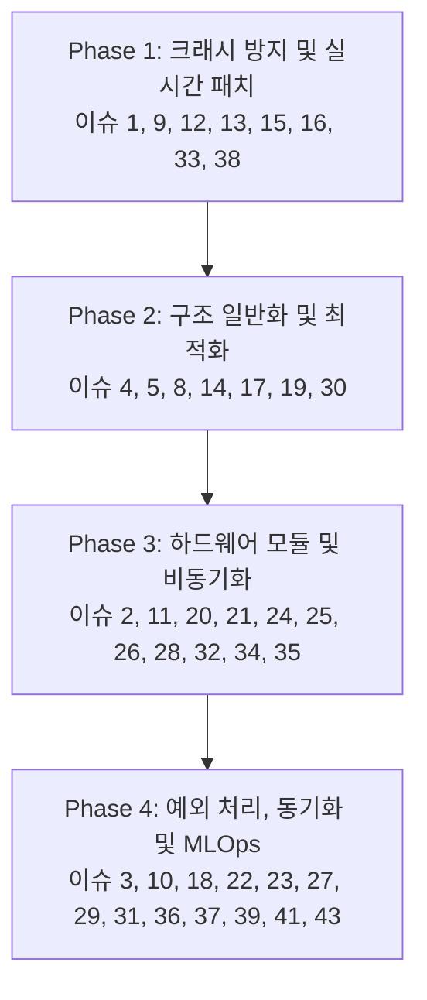

# MSFM_T2_250 이슈 및 개선 방안 검토 결과 (이슈 재정리)

본 문서는 `doc_req_250_02_10_이슈.md`에 제기된 총 40여 개의 시스템 이슈 및 개선 방안을 정밀 검토하고, **적용 필요 여부**, **우선순위**, **논리적 모순** 및 **보완 사항**을 재정리하여 리팩토링 단계(v2)에 유기적으로 반영하기 위한 보고서입니다.

---

## 1. 이슈 전체 요약 및 분류 표

각 이슈에 대해 즉시 해결해야 할 결함(필수), 설계 검토가 필요한 항목(선택/조정), 타당성 및 논리적 모순이 있는 항목으로 분류합니다.

| 이슈 번호 | 이슈 제목 | 적용 여부 (판정) | 우선순위 | 검토 의견 및 논리적/실무적 보완 사항 |
| :--- | :--- | :--- | :--- | :--- |
| **1** | GDMA 전송 및 L1 캐시 일관성 누락 | **필수 적용** | High | PSRAM/SRAM 간 데이터 교환 시 `esp_cache_msync()` 호출 누락은 데이터 오염 유발. 핑퐁 버퍼 구조체 선언과 함께 최우선 반영 필요. |
| **2** | SPI 트랜잭션 큐 비동기화 누락 | **필수 적용** | Medium | 현재 Blocking 방식의 슬라이싱은 태스크 스케줄링 성능을 저하시킴. SPI 비동기 큐 관리 구조 도입 필요. |
| **3** | WAL 드라이버 백그라운드 플러시 누락 | **필수 적용** | High | `flushToLittleFSAndEraseNext()` 함수 미구현으로 인해 쓰기 지연 회피 설계가 반쪽짜리로 머묾. |
| **4** | Policy Traits 메타프로그래밍 불완전 | **필수 적용** | Low | 컴파일 타임 Pruning을 위해 `T2_General` 네임스페이스 하단에 제어 상수들을 완전히 명시해야 함. |
| **5** | 자이로 전용 초경량 IIR 메모리 미반영 | **필수 적용** | Medium | 자이로에 불필요한 거대 FIR 상태 버퍼 제거를 통한 SRAM 절약 필수. |
| **8** | `SMEA_FLASH_RODATA` 매크로 누락 | **필수 적용** | High | 필터 계수가 런타임 구조체 내에 동적 할당되는 것을 막고, 플래시 ROM 직접 접근(XIP)으로 격리하여 SRAM 낭비 방지. |
| **9** | FSM 매니저 내 제로 카피 위배 (memcpy) | **필수 적용** | High | `_vibProcessTask` 내 memcpy를 제거하고, 락 프리 큐의 포인터만 넘기는 진정한 제로 카피 실현. |
| **10** | WAL 드라이버 플래시 수명 단축 | **검토 후 적용** | Medium | 4KB 단위의 통째 소거는 쓰기 증폭을 유발하나, **서브 섹터 저널링 구현 복잡도와 LittleFS 자체 웨어 레벨링 기능 간의 실효성을 비교**하여 적용 여부 판단 필요. |
| **11** | I2S DMA 디스크립터 경계 충돌 | **필수 적용** | High | FFT Size와 Overlap 비율에 의거하여 `I2S_DMA_CHUNK_SIZE`를 컴파일 타임에 도출하여 주입해야 함. |
| **12** | **[치명타]** FFT 복소수 버퍼 크기 불일치 | **즉시 해결 (Critical)** | Critical | 복소수 FFT 연산 버퍼 크기($2 \times N$) 불일치로 인한 Memory Corruption 발생 해결 필수. |
| **13** | **[치명타]** FreeRTOS ISR 컨텍스트 위반 | **즉시 해결 (Critical)** | Critical | 인터럽트 서비스 루틴(ISR) 내 블로킹 호출 해결을 위해 `dispatchCommandFromISR()` 신설 및 FromISR 계열 API 적용 필수. |
| **14** | TinyML 텐서 정렬 누락 (SIMD) | **필수 적용** | Medium | SIMD 가속을 위한 16바이트 정렬을 `heap_caps_aligned_alloc`을 통해 보장. |
| **15** | 락 프리 링버퍼 메모리 오더링 역전 | **필수 적용** | High | 덮어쓰기 시 `_tail` 포인터를 데이터 복사가 완료되기 전에 먼저 갱신하는 논리 모순 해결. |
| **16** | **[치명타]** 스토리지 I/O 뮤텍스 블로킹 | **즉시 해결 (Critical)** | Critical | SD_MMC 물리 계층 블로킹이 실시간 수집 태스크를 전염시키는 문제를 락 디커플링(Lock Decoupling)을 통해 차단. |
| **17** | JsonDocument 풀링 및 shrinkToFit 누락 | **필수 적용** | High | ArduinoJson V7 표준에 맞춰 JsonDocument의 반복적인 지역 변수 할당을 방지하고 멤버 변수/풀링 기법 도입. |
| **18** | **[논리 붕괴]** SNTP 시간 동기화 오염 | **즉시 해결 (Critical)** | High | 멀티레이트 정렬 시 RTC 시간을 쓰면 데드락 유발. Monotonic Time(`esp_timer_get_time()`)으로 전체 전환. |
| **19** | 비원자적 변수 메모리 배리어 무효화 | **필수 적용** | Medium | `_is_alarm_latched` 등을 `std::atomic<bool>` 또는 `volatile`로 선언하여 컴파일러 최적화 억제. |
| **20** | 핫스왑 설정 변경 후 데몬 동기화 누락 | **필수 적용** | Medium | SSID/IP/MQTT 브로커 정보 변경 시 네트워크 데몬을 Graceful하게 재시작하는 제어 트리거 구현. |
| **21** | Pre-Trigger 버퍼의 파일 덤프 누락 | **필수 적용** | High | 이벤트 시점 이전 X초 간의 데이터를 기록할 수 있도록 `dumpPreTriggerToSession()` 인터페이스 추가. |
| **22** | 이종 클럭 간 시간 편차(Clock Drift) 누적 | **필수 적용** | High | APLL(오디오)과 CPU Tick(진동) 간 누적 오차 해결을 위해 소프트웨어 PLL 보정 혹은 보간(Interpolation) 알고리즘 도입. |
| **23** | SD 카드 에러 시 FSM 예외 처리 누락 | **필수 적용** | Medium | SD 카드 물리 결함 상태를 FSM에 통지하고 ERROR 상태 전이 및 상태 LED 알람 링키지 구성. |
| **24** | 모드 전환 시 하드웨어 FIFO 잔여 오염 | **필수 적용** | Medium | 모드 전환 시 `flushHardwareFifo()`를 호출하여 이전 모드의 찌꺼기 데이터가 섞여 연산 정합성이 깨지는 것 방지. |
| **25** | 세션 종료 시 Pending 데이터 소실 | **필수 적용** | Medium | `closeSession()` 시 링버퍼가 완전히 비워지도록 Graceful Flush 및 대기 루틴 도입. |
| **26** | 캘리브레이션 프로파일 실시간 반영 누락 | **필수 적용** | Medium | T280 보정 계수 변경 시 FSM을 거쳐 T230 센서의 오프셋 변수에 실시간 반영되도록 링키지 연결. |
| **27** | MQTT LWT와 로컬 진단 결과의 동기화 결함 | **필수 적용** | Low | 크래시 발생 직전 RTC_DATA_ATTR 메모리에 마지막 진단 결과 및 크래시 원인을 저장하고 부팅 시 전송하도록 구성. |
| **28** | OTA 중 I2S/SPI 캐시 미스 크래시 | **즉시 해결 (Critical)** | High | OTA 플래시 기록 중 캐시 비활성화로 인한 크래시 방지를 위해 센서 DMA/SPI를 일시 중지(`Pause`)하고 OTA 진행. |
| **29** | 학습된 환경 노이즈 프로필의 휘발성 누락 | **필수 적용** | Medium | 배경 소음 프로필을 LittleFS 전용 파일(`noise_profile.bin`)에 자동 덤프 및 부팅 시 복구 처리. |
| **30** | Zero-Copy 바이너리 텔레메트리 브릿지 누락 | **필수 적용** | Medium | 특징 추출 결과물들을 `ST_PktTelemetry_t`로 병합하고 `broadcastBinary()`로 전달하는 오케스트레이팅 구현. |
| **31** | Pre-Trigger의 기준 시간축 T0 상실 | **필수 적용** | High | 덤프 파일 내 절대 타임스탬프 T0를 메타데이터 헤더로 삽입하여 MLOps 후처리 Slicing을 가능케 함. |
| **32** | 동적 필터 계수 업데이트 누락 | **필수 적용** | Medium | 노치 주파수/HPF 컷오프 변경 시 `recalculateFilters()` 인터페이스를 통해 런타임에 계수를 재계산/적용. |
| **33** | 지연 쓰기(Lazy Write) 데몬 틱 고아화 | **즉시 해결 (Critical)** | High | CfgMgr의 `checkLazyWrite()` 함수를 FSM 모니터링 루프 또는 메인 루프에 바인딩하여 무한 대기 문제 해결. |
| **34** | 딥슬립 진입 전 센서 PMU 제어 누락 | **필수 적용** | High | BMI270의 'Any-Motion Wake-up' 인터럽트 세팅을 딥슬립 진입 직전 처리하여 Wake-up 불능 상태 예방. |
| **35** | SD 카드 물리 파일 시스템 경합 | **필수 적용** | High | 캘리브레이션 대용량 파일 스캔과 실시간 녹화의 SD 카드 버스 경합 방지를 위해 FSM에서 상호 배타적 Lock 제어. |
| **36** | 링버퍼 오버라이트 시 스펙트럼 붕괴 | **필수 적용** | High | 단일 샘플 덮어쓰기 대신 **FFT 윈도우 단위의 프레임 전체 드롭**을 수행하고 필터 버퍼를 리셋하도록 개편. |
| **37** | NTP 지연과 MQTT TLS 핸드셰이크 데드락 | **필수 적용** | High | NTP 시간 동기화 완료 후 MQTTS 접속을 시작하도록 연결 스케줄링 시퀀스 교정. |
| **38** | 코어 마이그레이션과 Task WDT 기아 현상 | **필수 적용** | High | `xTaskCreatePinnedToCore`를 사용하여 Core 1에 DSP/ML을, Core 0에 수집/통신을 고정하고, 핫 루프 내 WDT 리셋 추가. |
| **39** | 플래시 가비지 컬렉션에 의한 조립 타임아웃 | **필수 적용** | High | SD 카드 I/O 지연을 방지하기 위해 파일 생성 시 예상 세션 크기만큼 미리 디스크 공간 선할당(`f_lseek` 등). |
| **41** | STA/LTA 콜드 스타트 초기화 오경보 폭주 | **필수 적용** | High | 부팅 직후 LTA가 차오를 때까지 트리거 판단을 유보하는 WARM_UP 상태 또는 유예 시간(예: 30초) 구현. |
| **43** | MLOps 데이터의 레이블 모호성 발생 | **필수 적용** | Medium | 트리거 원인(지표, 수치 등)이 담긴 `ST_TriggerReason`을 정의하여 파일 커스텀 헤더에 직렬화 기록. |

---

## 2. 주요 논리적 모순 및 핵심 지적 검토

### A. 실시간성 보장과 하드웨어 제약사항 충돌
1. **스토리지 I/O 블로킹 (이슈 16, 35, 39)**
   * **지적의 타당성:** SD 카드 물리적 동작 지연(100ms~500ms)이 뮤텍스로 인해 수집 스레드에 전파되는 것은 ESP32 RTOS 환경에서 아주 흔하고 치명적인 병목 현상입니다.
   * **논리적 모순/해결 설계:**
     * `_lock`을 쥐고 물리 I/O(`flush`)를 수행하는 것 대신, 수집 태스크는 데이터를 링버퍼에 집어넣는 시간만 보장받아야 합니다.
     * **보완 사항:** 캘리브레이션 대용량 파일 IO(이슈 35)와 실시간 스트림 기록이 동시에 발생하지 않도록 FSM 상태를 완전히 물리적으로 격리(`MAINTENANCE` 상태에서만 캘리브레이션 수행)하는 것이 타당합니다.
2. **NTP 지연과 MQTTS 핸드셰이크의 역전 현상 (이슈 37)**
   * **지적의 타당성:** 시간 동기화 이전에 TLS 접속을 시도하면 Handshake Fail(인증서 시간 불일치)로 연결이 영구 실패합니다. 
   * **보완 사항:** 부팅 시 시간 동기화 대기 루프를 구현하되, Wi-Fi 자체가 끊겼을 때의 타임아웃 예외를 두어 시간 미동기 상태에서도 로컬 센서 수집 및 파일 저장이 독립적으로 동작할 수 있도록 시퀀스를 세분화해야 합니다.

### B. DSP 및 신호 처리 무결성 붕괴 방지
1. **FFT 복소수 버퍼 크기 불일치 (이슈 12)**
   * **지적의 타당성:** esp-dsp의 Real-to-Complex FFT 함수는 결과물 혹은 내부 연산 처리를 위해 복소수 쌍($2 \times N$ 크기의 float)을 입력으로 요구합니다. 1024-point FFT를 위해 1024 크기의 실수형 버퍼를 그냥 넘겨주면, 내부 256비트 SIMD 연산기가 범위를 침범(Buffer Overflow)하여 힙을 손상시키게 됩니다. 
   * **즉시 수정사항:** FFT 입력 버퍼 크기를 $2 \times N$으로 확장하고, 짝수 인덱스에 입력 신호를 채우고 홀수 인덱스를 0으로 채우는 전처리(Interleaving) 처리가 완벽히 적용되어야 합니다.
2. **링버퍼 오버라이트와 위상 불연속성 (이슈 36)**
   * **지적의 타당성:** 단일 샘플의 Overwrite는 주파수 영역에서 Dirac-delta 형태의 고주파 스펙트럼 누설을 발생시켜 가속도 및 소음 특징량을 심각하게 훼손(거짓 알람 유발)합니다.
   * **논리적 모순/보완:** 
     * SPSC(Single Producer Single Consumer) 락프리 링버퍼 구조를 유지하면서 '프레임 드롭'을 처리하려면, 개별 샘플의 꼬리 포인터를 갱신하는 것이 아니라 **최소 FFT 윈도우 크기(1024/2048 샘플) 혹은 특정 청크 단위로만 큐에 데이터를 인입/폐기**하도록 버퍼 접근 계층을 캡슐화해야 합니다.

### C. 메모리 관리 및 마모 방지
1. **ArduinoJson V7 힙 단편화 누락 (이슈 17)**
   * **지적의 타당성:** ArduinoJson V7 아키텍처에서는 Stack-based 혹은 Static-based `JsonDocument`가 단일 풀 형태로 권장됩니다. 함수 콜백마다 동적으로 생성하는 구조는 ESP32의 힙 메모리를 단시간에 조각내어 장기 안정성을 무너뜨립니다.
   * **보완 사항:** `CL_T2_ConfigManager` 내부에 스레드 안전하게 공유할 수 있는 `JsonDocument` 풀을 멤버 변수로 선언하고, 파싱 작업 후 `shrinkToFit()` 및 `clear()`를 체계적으로 호출해야 합니다.
2. **WAL 드라이버 쓰기 증폭 문제 (이슈 10)**
   * **지적의 타당성:** 설정 구조체 크기가 작음에도 매 커밋마다 4KB 섹터를 통째로 소거하는 것은 플래시 물리적 수명을 극도로 단축합니다.
   * **보완 사항:** 4KB 섹터 내에 순차적으로 바인딩 기록을 추가하는 **Append-only 저널링**을 구축하되, 구현 복잡성을 낮추기 위해 헤더에 Sequence ID와 Config 크기를 포함하여 유효한 최신 슬롯의 포인터만 빠르게 스캔하도록 구현 경량화가 병행되어야 합니다.

---

## 3. 리팩토링 로드맵 및 액션 아이템

본 이슈 검토 보고서를 기준으로 삼아, 리팩토링 4단계 방법론(`doc_req2_250_03_1대상.md`)에 맞춰 전체 39개 이슈를 누락 없이 로드맵에 매핑합니다.

### 1. Phase 1: 크래시 방지 및 실시간성 패치 (최우선 반영)
* **이슈 1 (GDMA/L1 캐시 일관성):** `esp_cache_msync()` 명시적 동기화 구현.
* **이슈 9 (FSM 내 제로 카피 위배):** 락프리 큐 포인터 기반으로 전환 및 memcpy 완전 배제.
* **이슈 12 (FFT 복소수 버퍼 크기 불일치):** 1024-point FFT용 버퍼를 $2 \times N$ (2048 float) 크기로 확보하여 메모리 손상 예방.
* **이슈 13 (FreeRTOS ISR 컨텍스트 위반):** ISR 내부에서의 블로킹 API 사용을 배제하고 `FromISR` 및 `YIELD` 처리 구현.
* **이슈 15 (락프리 링버퍼 오더링 역전):** 데이터 복사 완료 후 `_tail` 포인터를 갱신하고 메모리 배리어 확보.
* **이슈 16 (스토리지 I/O 뮤텍스 블로킹):** 락 디커플링을 적용하여 SD 카드 Flush 지연이 수집 루프를 세우지 않도록 격리.
* **이슈 33 (지연 쓰기 데몬 틱 고아화):** `checkLazyWrite()` 함수를 메인 루프/FSM 감시 태스크에 바인딩하여 설정 유실 차단.
* **이슈 38 (코어 마이그레이션 및 WDT 기아):** `xTaskCreatePinnedToCore`로 Core 고정 및 핫 루프 내 `vTaskDelay` / `esp_task_wdt_reset()` 삽입.

### 2. Phase 2: 데이터 구조 일반화 및 최적화
* **이슈 4 (Policy Traits 불완전):** 컴파일 타임 가지치기용 상세 제어 상수(ENABLE_TIMBRE 등) `T2_General` 명시.
* **이슈 5 (자이로 초경량 IIR 미반영):** 자이로 구조체에서 불필요한 거대 FIR 상태 버퍼를 제거하고 초경량 구조로 환원.
* **이슈 8 (SMEA_FLASH_RODATA 실제 누락):** 불변 필터 계수들을 런타임 구조체에서 제외하고 플래시 ROM(XIP) 영역에 정적 상수로 상주.
* **이슈 14 (TinyML 텐서 정렬 누락):** SIMD 동작 가속을 위해 `heap_caps_aligned_alloc()`로 16바이트 정렬 보장.
* **이슈 17 (JsonDocument 풀링 누락):** V7 기준에 의거하여 함수 내부 지역 변수 생성을 금지하고 클래스 멤버 풀링 및 `shrinkToFit()` 적용.
* **이슈 19 (비원자적 변수 펜스 무효화):** 공유 상태 변수들을 `std::atomic<bool>` 또는 `volatile`로 선언.
* **이슈 30 (제로 카피 텔레메트리 브릿지 증발):** 오디오/진동 슬롯을 `ST_PktTelemetry_t` 규격으로 통합 패킹하는 브릿지 구현.

### 3. Phase 3: 하드웨어 모듈 및 비동기 파이프라인 연동
* **이슈 2 (SPI 트랜잭션 비동기화 누락):** Blocking 슬라이싱 구조를 FSM Fettle 태스크의 비동기 큐 구조로 전환.
* **이슈 11 (I2S DMA & 제로카피 스트라이드 충돌):** FFT 및 Overlap 사양과 I2S DMA 버퍼 사이즈의 컴파일 타임 바인딩 구현.
* **이슈 20 (핫스왑 설정 데몬 동기화 누락):** 설정 변경 감지 시 통신 클라이언트 및 WiFi를 Graceful 재구동하는 트리거 구축.
* **이슈 21 (Pre-Trigger 파일 덤프 누락):** 이벤트 이전 X초 버퍼 데이터를 신규 세션 파일 헤더 다음에 덤프하는 API 연동.
* **이슈 24 (모드 전환 시 FIFO 잔여 데이터 오염):** 모드 전환 시 하드웨어 FIFO를 강제 클리어하는 `flushHardwareFifo()` 연동.
* **이슈 25 (세션 닫기 전 Pending 데이터 소실):** 링버퍼가 빌 때까지 대기하거나 강제 동기 플러시를 수행하는 Graceful Shutdown 구현.
* **이슈 26 (캘리브레이션 프로파일 실시간 미반영):** 보정 계수 저장 후 FSM 트리거를 통해 T230 센서 보정 변수에 즉시 반영하는 루틴 구현.
* **이슈 28 (OTA 업데이트 중 캐시 미스 크래시):** OTA 중 플래시 캐시 차단에 대비해 센서 수집 및 DMA/SPI 인터럽트를 일시 중지(`Pause`).
* **이슈 32 (동적 필터 계수 업데이트 누락):** 런타임 설정 주파수 변경 시 `recalculateFilters()`를 통한 계수 재생성.
* **이슈 34 (딥슬립 진입 전 센서 PMU 제어 누락):** Deep Sleep 진입 전 BMI270의 모션 감지 인터럽트 핀 설정(Any-Motion Wake-up) 구현.
* **이슈 35 (SD_MMC 물리 파일 시스템 경합):** 캘리브레이터 대용량 읽기와 실시간 쓰기가 경합하지 않도록 FSM MAINTENANCE 상태에서만 구동되도록 제어.

### 4. Phase 4: 예외 처리, 시간 동기화 및 MLOps 메타데이터 강화
* **이슈 3 (WAL 백그라운드 플러시 미구현):** 유휴 사이클 시 LittleFS 플러시 및 다음 섹터 사전 소거(`flushToLittleFSAndEraseNext()`) 연동.
* **이슈 10 (WAL 플래시 수명 단축):** Append-only 서브 섹터 저널링을 도입하여 4KB 최소 소거에 따른 쓰기 증폭 억제.
* **이슈 18 (SNTP Time Jump 데이터 꼬임):** 시계열 분석 정합성이 필요한 모든 타임스탬프에 RTC 시간 대신 `esp_timer_get_time()` 적용.
* **이슈 22 (이종 클럭 간 Drift 누적):** APLL 오디오 기준 축으로 가속도/자이로 시간축 소프트웨어 PLL 보정 혹은 보간 알고리즘 추가.
* **이슈 23 (SD 카드 에러 FSM 예외 누락):** SD 결함 발생 시 FSM ERROR 상태로 진입하고 LED 알람 및 MQTT 장애 전송 구현.
* **이슈 27 (MQTT LWT와 로컬 로그 동기화 결함):** 시스템 크래시 시 최종 진단 상태를 RTC_DATA_ATTR에 유지하고 부팅 시 우선 전송.
* **이슈 29 (노이즈 프로필의 휘발성 누락):** 자가 학습된 노이즈 프로필을 `noise_profile.bin` 파일로 비휘발성 저장 및 부팅 시 자동 복구.
* **이슈 31 (Pre-Trigger 기준 시간축 T0 상실):** 세션 생성 파라미터에 절대 타임스탬프 T0를 주입하고 덤프 파일 메타헤더에 저장.
* **이슈 36 (오버라이트에 의한 스펙트럼 붕괴):** 단일 샘플 덮어쓰기 대신 FFT 윈도우 단위 프레임 전체를 드롭하고 필터 히스토리를 리셋.
* **이슈 37 (NTP 지연과 MQTT 데드락):** NTP 시간 동기화가 완료된 후 MQTTS 핸드셰이크를 개시하도록 실행 지연 처리 구현.
* **이슈 39 (가비지 컬렉션 쓰기 지연 차단):** 세션 파일 오픈 시 최대 필요 용량을 사전에 물리적 디스크 공간 할당(`f_lseek` 등).
* **이슈 41 (LTA 콜드 스타트 오경보 폭주):** 부팅 직후 LTA가 충분히 수렴할 때까지 트리거 판단을 보류하는 WARM_UP 시간(예: 30초) 구현.
* **이슈 43 (MLOps 데이터의 레이블 모호성):** 트리거 상세 정보(발생 축, 지표, 초과 값 등)가 담긴 `ST_TriggerReason`을 파일 커스텀 헤더에 수록.

