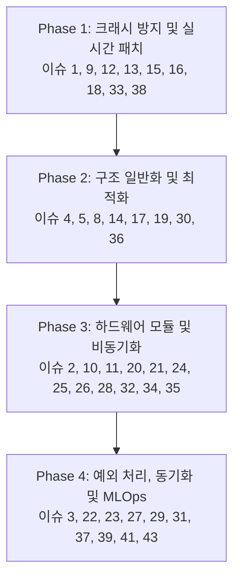

# MSFM_T2_250 이슈 및 개선 방안 검토 결과 (이슈 재정리)

본 문서는 `doc_req_250_02_10_이슈.md`에 제기된 총 40여 개의 시스템 이슈 및 개선 방안을 정밀 검토하고, **적용 필요 여부**, **우선순위**, **논리적 모순** 및 **보완 사항**을 재정리하여 리팩토링 단계(v2)에 유기적으로 반영하기 위한 보고`서입니다.

**참고:** 원본 요구사항 문건(`doc_req_250_01.md`)에서 이슈 번호 6, 7, 40, 42는 별도의 설계/기능 개선 대상으로 분류되어 본 재정리표에는 포함되지 않았습니다. 해당 번호는 본 문서 후반의 `설계 부채 항목 (Design Debt)`에서 별도 추적합니다.

---

## 1. 이슈 전체 요약 및 분류 표

각 이슈에 대해 즉시 해결해야 할 결함(필수), 설계 검토가 필요한 항목(선택/조정), 타당성 및 논리적 모순이 있는 항목으로 분류합니다.

| 이슈 번호 | 이슈 제목 | 적용 여부 (판정) | 우선순위 | 검토 의견 및 논리적/실무적 보완 사항 |
| :--- | :--- | :--- | :--- | :--- |
| **1** | GDMA 전송 및 L1 캐시 일관성 누락 | **필수 적용** | High | PSRAM/SRAM 간 데이터 교환 시 `esp_cache_msync()` 호출 누락은 데이터 오염 유발. 핑퐁 버퍼 구조체 선언과 함께 최우선 반영 필요. |
| **2** | SPI 트랜잭션 큐 비동기화 누락 | **필수 적용** | Medium | 현재 Blocking 방식의 슬라이싱은 태스크 스케줄링 성능을 저하시킴. SPI 비동기 큐 관리 구조 도입 필요. |
| **3** | WAL 드라이버 백그라운드 플러시 누락 | **필수 적용** | High | `flushToLittleFSAndEraseNext()` 함수 미구현으로 인해 쓰기 지연 회피 설계가 반쪽짜리로 머묾. |
| **4** | Policy Traits 메타프로그래밍 불완전 | **필수 적용** | Low | 컴파일 타임 Pruning을 위해 `T2_General` 네임스페이스 하단에 제어 상수들을 완전히 명시해야 함. |
| **5** | 자이로 전용 초경량 IIR 메모리 미반영 | **필수 적용** | Medium | 자이로에 불필요한 거대 FIR 상태 버퍼 제거를 통한 SRAM 절약 필수. |
| **8** | `SMEA_FLASH_RODATA` 매크로 누락 | **필수 적용** | High | 필터 계수가 런타임 구조체 내에 동적 할당되는 것을 막고, 플래시 ROM 직접 접근(XIP)으로 격리하여 SRAM 낭비 방지. |
| **9** | FSM 매니저 내 제로 카피 위배 (memcpy) | **필수 적용** | High | `_vibProcessTask` 내 memcpy를 제거하고, 락 프리 큐의 포인터만 넘기는 진정한 제로 카피 실현. |
| **10** | WAL 드라이버 플래시 수명 단축 | **검토 후 적용** | Medium | 4KB 단위의 통째 소거는 쓰기 증폭을 유발하나, **서브 섹터 저널링 구현 복잡도와 LittleFS 자체 웨어 레벨링 기능 간의 실효성을 비교**하여 적용 여부 판단 필요. |
| **11** | I2S DMA 디스크립터 경계 충돌 | **필수 적용** | High | FFT Size와 Overlap 비율에 의거하여 `I2S_DMA_CHUNK_SIZE`를 컴파일 타임에 도출하여 주입해야 함. |
| **12** | **[치명타]** FFT 복소수 버퍼 크기 불일치 | **즉시 해결 (Critical)** | Critical | 복소수 FFT 연산 버퍼 크기($2 \times N$) 불일치로 인한 Memory Corruption 발생 해결 필수. |
| **13** | **[치명타]** FreeRTOS ISR 컨텍스트 위반 | **즉시 해결 (Critical)** | Critical | 인터럽트 서비스 루틴(ISR) 내 블로킹 호출 해결을 위해 `dispatchCommandFromISR()` 신설 및 FromISR 계열 API 적용 필수. |
| **14** | TinyML 텐서 정렬 누락 (SIMD) | **필수 적용** | Medium | SIMD 가속을 위한 16바이트 정렬을 `heap_caps_aligned_alloc`을 통해 보장. |
| **15** | 락 프리 링버퍼 메모리 오더링 역전 | **필수 적용** | High | 덮어쓰기 시 `_tail` 포인터를 데이터 복사가 완료되기 전에 먼저 갱신하는 논리 모순 해결. |
| **16** | **[치명타]** 스토리지 I/O 뮤텍스 블로킹 | **즉시 해결 (Critical)** | Critical | SD_MMC 물리 계층 블로킹이 실시간 수집 태스크를 전염시키는 문제를 락 디커플링(Lock Decoupling)을 통해 차단. |
| **17** | JsonDocument 풀링 및 shrinkToFit 누락 | **필수 적용** | High | ArduinoJson V7 표준에 맞춰 JsonDocument의 반복적인 지역 변수 할당을 방지하고 멤버 변수/풀링 기법 도입. |
| **18** | **[논리 붕괴]** SNTP 시간 동기화 오염 | **즉시 해결 (Critical)** | High | 멀티레이트 정렬 시 RTC 시간을 쓰면 데드락 유발. Monotonic Time(`esp_timer_get_time()`)으로 전체 전환. |
| **19** | 비원자적 변수 메모리 배리어 무효화 | **필수 적용** | Medium | `_is_alarm_latched` 등을 `std::atomic<bool>` 또는 `volatile`로 선언하여 컴파일러 최적화 억제. |
| **20** | 핫스왑 설정 변경 후 데몬 동기화 누락 | **필수 적용** | Medium | SSID/IP/MQTT 브로커 정보 변경 시 네트워크 데몬을 Graceful하게 재시작하는 제어 트리거 구현. |
| **21** | Pre-Trigger 버퍼의 파일 덤프 누락 | **필수 적용** | High | 이벤트 시점 이전 X초 간의 데이터를 기록할 수 있도록 `dumpPreTriggerToSession()` 인터페이스 추가. |
| **22** | 이종 클럭 간 시간 편차(Clock Drift) 누적 | **필수 적용** | High | APLL(오디오)과 CPU Tick(진동) 간 누적 오차 해결을 위해 소프트웨어 PLL 보정 혹은 보간(Interpolation) 알고리즘 도입. |
| **23** | SD 카드 에러 시 FSM 예외 처리 누락 | **필수 적용** | Medium | SD 카드 물리 결함 상태를 FSM에 통지하고 ERROR 상태 전이 및 상태 LED 알람 링키지 구성. |
| **24** | 모드 전환 시 하드웨어 FIFO 잔여 오염 | **필수 적용** | Medium | 모드 전환 시 `flushHardwareFifo()`를 호출하여 이전 모드의 찌꺼기 데이터가 섞여 연산 정합성이 깨지는 것 방지. |
| **25** | 세션 종료 시 Pending 데이터 소실 | **필수 적용** | Medium | `closeSession()` 시 링버퍼가 완전히 비워지도록 Graceful Flush 및 대기 루틴 도입. |
| **26** | 캘리브레이션 프로파일 실시간 반영 누락 | **필수 적용** | Medium | T280 보정 계수 변경 시 FSM을 거쳐 T230 센서의 오프셋 변수에 실시간 반영되도록 링키지 연결. |
| **27** | MQTT LWT와 로컬 진단 결과의 동기화 결함 | **필수 적용** | Low | 크래시 발생 직전 RTC_DATA_ATTR 메모리에 마지막 진단 결과 및 크래시 원인을 저장하고 부팅 시 전송하도록 구성. |
| **28** | OTA 중 I2S/SPI 캐시 미스 크래시 | **즉시 해결 (Critical)** | High | OTA 플래시 기록 중 캐시 비활성화로 인한 크래시 방지를 위해 센서 DMA/SPI를 일시 중지(`Pause`)하고 OTA 진행. |
| **29** | 학습된 환경 노이즈 프로필의 휘발성 누락 | **필수 적용** | Medium | 배경 소음 프로필을 LittleFS 전용 파일(`noise_profile.bin`)에 자동 덤프 및 부팅 시 복구 처리. |
| **30** | Zero-Copy 바이너리 텔레메트리 브릿지 누락 | **필수 적용** | Medium | 특징 추출 결과물들을 `ST_PktTelemetry_t`로 병합하고 `broadcastBinary()`로 전달하는 오케스트레이팅 구현. |
| **31** | Pre-Trigger의 기준 시간축 T0 상실 | **필수 적용** | High | 덤프 파일 내 절대 타임스탬프 T0를 메타데이터 헤더로 삽입하여 MLOps 후처리 Slicing을 가능케 함. |
| **32** | 동적 필터 계수 업데이트 누락 | **필수 적용** | Medium | 노치 주파수/HPF 컷오프 변경 시 `recalculateFilters()` 인터페이스를 통해 런타임에 계수를 재계산/적용. |
| **33** | 지연 쓰기(Lazy Write) 데몬 틱 고아화 | **즉시 해결 (Critical)** | High | CfgMgr의 `checkLazyWrite()` 함수를 FSM 모니터링 루프 또는 메인 루프에 바인딩하여 무한 대기 문제 해결. |
| **34** | 딥슬립 진입 전 센서 PMU 제어 누락 | **필수 적용** | High | BMI270의 'Any-Motion Wake-up' 인터럽트 세팅을 딥슬립 진입 직전 처리하여 Wake-up 불능 상태 예방. |
| **35** | SD 카드 물리 파일 시스템 경합 | **필수 적용** | High | 캘리브레이션 대용량 파일 스캔과 실시간 녹화의 SD 카드 버스 경합 방지를 위해 FSM에서 상호 배타적 Lock 제어. |
| **36** | 링버퍼 오버라이트 시 스펙트럼 붕괴 | **필수 적용** | High | 단일 샘플 덮어쓰기 대신 **FFT 윈도우 단위의 프레임 전체 드롭**을 수행하고 필터 버퍼를 리셋하도록 개편. |
| **37** | NTP 지연과 MQTT TLS 핸드셰이크 데드락 | **필수 적용** | High | NTP 시간 동기화 완료 후 MQTTS 접속을 시작하도록 연결 스케줄링 시퀀스 교정. |
| **38** | 코어 마이그레이션과 Task WDT 기아 현상 | **필수 적용** | High | `xTaskCreatePinnedToCore`를 사용하여 Core 1에 DSP/ML을, Core 0에 수집/통신을 고정하고, 핫 루프 내 WDT 리셋 추가. |
| **39** | 플래시 가비지 컬렉션에 의한 조립 타임아웃 | **필수 적용** | High | SD 카드 I/O 지연을 방지하기 위해 파일 생성 시 예상 세션 크기만큼 미리 디스크 공간 선할당(`f_lseek` 등). |
| **41** | STA/LTA 콜드 스타트 초기화 오경보 폭주 | **필수 적용** | High | 부팅 직후 LTA가 차오를 때까지 트리거 판단을 유보하는 WARM_UP 상태 또는 유예 시간(예: 30초) 구현. |
| **43** | MLOps 데이터의 레이블 모호성 발생 | **필수 적용** | Medium | 트리거 원인(지표, 수치 등)이 담긴 `ST_TriggerReason`을 정의하여 파일 커스텀 헤더에 직렬화 기록. |

---

## 1.1 결번 이슈 및 설계 부채(Design Debt)

원본 요구사항 문건(`doc_req_250_01.md`)의 `제외 대상` 항목에서 이슈 번호 6, 7, 40, 42는 현재의 결함 재정리표와는 별도인 설계/기능 개선 제안으로 분류되었습니다. 이들 번호는 본 문서의 결함 중심 이슈 맵에 직접 포함하지 않으며, 아래와 같이 설계 부채로 따로 관리해야 합니다.

* **이슈 6**: 기계 RPM 기반 적응형 다운스케일링 로직 부재 — 메모리/연산 예산을 실시간으로 조정하는 기능. 설계 부채로 관리.
* **이슈 7**: STA/LTA 연산을 위한 장기 상태 버퍼 누락 — 트리거 판정의 정상/비정상 분리를 위한 상태 히스토리. 설계 부채로 관리.
* **이슈 40**: 가변 RPM 설비에 대한 정적 주파수 대역 추적 실패 — Order Tracking/주파수 대역 시프트 기능. 설계 부채로 관리.
* **이슈 42**: 결함 진행 생애주기를 무시한 1차원적 임계치 OR 연산 — 다변량 매트릭스 판정 로직. 설계 부채로 관리.

추가로, 본 재정리표의 이슈 분류 외에 `doc_req2_250_03_10.이슈1.md` 문서에서 도출된 **4단계 리팩토링 대상 항목(총 49개)**을 누락 없이 아래와 같이 '설계 및 구조 리팩토링 과제'로 병합하여 추적합니다.

### 1.2 이슈1 기반 4단계 리팩토링 세부 개선 과제 (총 49개)

#### 1단계: 데이터 모델 및 상태 규격화 (Data Model & Config Normalization)
1. **[대상 1] 도메인별 설정 구조체의 중복 (T215_Type)**
   * *현황/문제:* `ST_Accel_Config_t`, `ST_Gyro_Config_t`, `ST_Audio_Config_t` 내부에 통계 임계치, 대역 임계치 등이 중복 정의됨.
   * *개선방안:* 공통 설정 요소를 템플릿 구조체 `ST_CommonFeatureCfg_t<CH, BANDS>`로 추출하고 정적 합성(Composition) 적용.
2. **[대상 2] JSON 파싱 및 직렬화 로직의 거대화 (T220_CfgMgr)**
   * *현황/문제:* `_applyJson()` 및 `save()` 함수 하나에서 모든 변수 파싱 및 1D/2D 배열 매핑 코드가 센서별로 중복 반복됨.
   * *개선방안:* 제네릭 파서 헬퍼 `parseBandConfig<CH, BAND>`를 분리하고, 서브 구조체에 `deserialize()` 멤버 함수를 두어 파싱 책임 위임.
3. **[대상 3] 상수 정의(Def)와 타입(Type)의 결합도 이슈 (T210_Def)**
   * *현황/문제:* `T210_Def`에 Limit(메모리 상한)와 Policy(논리 설정값)가 혼재되어 채널/대역 변경 시 연쇄 수정 발생.
   * *개선방안:* 하드웨어 Limit 상수 네임스페이스와 공장 초기화 Default 네임스페이스를 분리하고, 타입을 템플릿화하여 Limit을 컴파일 타임 매개변수로 주입받도록 구성.
4. **[대상 4] 특징량 데이터 컨테이너(Slot)의 파편화 (T215_Type)**
   * *현황/문제:* `ST_Slot_Accel_t` 등 연산 결과를 담는 버퍼가 파편화되어 있으나 내부 변수 구성(RMS, 첨도 등)은 대동소이함.
   * *개선방안:* 연산 결과 데이터를 `ST_FeatureMetrics_t<CH, BANDS>` 템플릿 구조체로 통합하여 설정과 결과 타입 간 1:1 대칭성 확보.
5. **[대상 5] JSON 파싱과 도메인 유효성 검증(Validation)의 결합 (T220_CfgMgr)**
   * *현황/문제:* `_applyJson()` 내부에서 파싱과 동시에 임계치 제한, FFT Size 2의 거듭제곱 등 비즈니스 규칙 검증이 강결합되어 SRP 위반.
   * *개선방안:* CfgMgr는 파싱/바인딩만 수행하고, 파싱된 각 구조체 스스로 `validate()`를 통해 유효성을 자체 검증하도록 분리.
6. **[대상 6] 공장 초기화(resetToDefault) 로직의 비대화 및 휴먼 에러 위험**
   * *현황/문제:* 구조체 멤버 변수마다 초기 상수를 일일이 대입하는 거대한 하드코딩 함수가 존재하여 누락 실수 가능성 높음.
   * *개선방안:* C++11 Default Member Initializer(`= T2_Def::...`)를 도입하고, 초기화 시 임시 기본 객체를 대입하여 덮어쓰는 단순 대입으로 전환.
7. **[대상 7] 락프리 링버퍼(T216_RingBuf)의 대용량 값 복사 오버헤드**
   * *현황/문제:* `enqueue()`, `dequeue()`가 템플릿 타입을 값 복사(By-Value)로 처리하여 대형 데이터(예: 4KB) 복사 시 CPU 사이클 낭비.
   * *개선방안:* 생산자가 링버퍼로부터 빈 슬롯의 참조/포인터를 할당받아 직접 채우고 커밋하는 Zero-Copy 링버퍼 방식으로 변경.
8. **[대상 8] 텔레메트리 네트워크 패킷(ST_PktTelemetry_t)의 파편화 연쇄**
   * *현황/문제:* 특징량 패킷 구조체가 도메인별 크기에 맞게 개별 하드코딩되어 있어 센서 대역 추가 시 네트워크 패킷 구조도 수정 필요.
   * *개선방안:* 패킷 내부에 템플릿 `ST_FeatureMetrics_t`를 합성하거나, 스트리밍 단에서 Flat Tensor 구조(Memory View)를 활용해 추상화.
9. **[대상 9] WAL 드라이버와 CfgMgr의 강한 책임 결합**
   * *현황/문제:* CfgMgr 소스 내부에 물리 플래시 파티션을 지우고 쓰는 `CL_T2_WalDriver` 로직이 섞여 있어 SRP 위반.
   * *개선방안:* `CL_T2_WalDriver`를 독립적인 `T225_WalEngine`으로 분리하고, CfgMgr는 `IConfigStorage` 추상 인터페이스를 바라보도록 결합도 차단.
10. **[대상 10] 템플릿 도입에 따른 메모리 패딩(Padding) 자동화 문제**
    * *현황/문제:* SIMD 정렬을 위해 수동으로 패딩 바이트(`_pad_end`)를 삽입했으나, 구조체 템플릿화로 크기가 가변되면 수동 패딩 불가능.
    * *개선방안:* C++ 컴파일 타임 메타 프로그래밍을 적용해 `uint8_t _pad_end[(16 - (sizeof(Payload) % 16)) % 16];`으로 패딩 크기를 자동 계산하도록 설계.
11. **[대상 11] JSON 키(Key) 문자열 파편화 및 플래시 ROM 낭비**
    * *현황/문제:* 소스코드 곳곳에 JSON 키 문자열 리터럴이 하드코딩되어 휴먼 에러 발생 여지가 크고 `.rodata` 영역이 중복 낭비됨.
    * *개선방안:* `T210_Def` 내에 `JsonKey` 네임스페이스를 만들고 `constexpr const char*`로 통합 관리하여 외부 공유 및 재사용성 향상.
12. **[대상 12] 원시 파형 전송 패킷(ST_PktWaveform_t)의 중복**
    * *현황/문제:* 웹소켓으로 원시 파형을 쏘는 패킷 구조체가 오디오, 가속도, 자이로별로 이름만 다르고 동일하게 복사되어 3개 존재.
    * *개선방안:* `template <size_t MAX_SAMPLES> struct ST_PktWaveform_t` 단일 템플릿으로 통합하여 통신 모듈에서 단일 인터페이스로 처리.
13. **[대상 13] 플래시 WAL 바이너리 저장 방식의 OTA 하위 호환성 파괴**
    * *현황/문제:* 설정 구조체를 통째로 메모리 덤프해 플래시에 쓰는 방식이라, 펌웨어 버전 업으로 구조체 레이아웃 변경 시 데이터 미스얼라인먼트로 크래시 유발.
    * *개선방안:* `ST_WalHeader_t`에 스키마 버전을 부여하고, 버전 불일치 시 기본 JSON 설정 백업본에서 안전하게 마이그레이션(Upcasting)하는 로직 구현.
14. **[대상 14] 거대 설정 구조체(ST_DynamicConfig_t)의 멀티코어 Data Race와 RCU 부재**
    * *현황/문제:* Mutex Lock으로 설정 변경을 차단한 상태에서 JSON 파싱이 수행되면 실시간 DSP 태스크가 블로킹되거나 반만 업데이트된 설정을 참조할 우려 있음.
    * *개선방안:* RCU(Read-Copy-Update) 혹은 더블 버퍼링 기법을 적용하여 DSP 태스크는 읽기 전용 안정화 포인터를 참조하고, 파싱 완료 시 포인터만 원자적 스왑.
15. **[대상 15] Boolean 배열로 인한 캐시 라인 낭비 및 복사 오버헤드**
    * *현황/문제:* 참/거짓 설정값을 위해 1바이트 bool 배열을 대량 정의하여 패딩이 발생하고 캐시 효율이 하락하며 구조체 복사 비용 증대.
    * *개선방안:* 템플릿 일반화 시 bool 배열 대신 비트 필드(Bitfield) 또는 `std::bitset`으로 압축하여 메모리 크기 최소화 및 캐시 히트율 향상.

#### 2단계: 파이프라인 스테이지 추상화 (Pipeline Stage Abstraction)
16. **[대상 1] DSP 연산 루프의 하드코딩 및 채널/축 종속성 제거 (T240_DspEng)**
    * *현황/문제:* 오디오 2채널, 가속도/자이로 3축이 별도 함수에서 개별 변수로 하드코딩 처리되어 있어 필터 변경 시 중복 수정 필요.
    * *개선방안:* 축이나 물리 명칭을 배제하고, N개의 독립 1D 배열을 처리하는 범용 `_processSingleChannel()` 인터페이스를 선언하여 루프로 순회 처리.
17. **[대상 2] 통계 특징량(RMS, 첨도 등) 추출의 도메인 분리 (T245_FeatExtra)**
    * *현황/문제:* 오디오, 가속도, 자이로마다 RMS, 첨도, 왜도 등 연산 루프가 동일한 수학 공식에도 불구하고 분리 복사되어 있음.
    * *개선방안:* `MathUtil::calcStatisticalFeatures()`와 같은 순수 수학 함수 유틸리티로 격리하고, 내부에 ESP32-S3 SIMD(`esp_cache` 및 `esp_dsp`) 가속을 한 곳에 집중 구현.
18. **[대상 3] 켑스트럼(Mel-Filterbank) 생성 로직의 파라미터화 (T246_MelGen)**
    * *현황/문제:* 오디오용과 IMU용 멜 필터뱅크가 나뉘어 있으며, 가중치 연산식은 같으나 주파수 범위나 밴드 상수가 하드코딩됨.
    * *개선방안:* 도메인 구분을 없애고 `generateMelFilterbank(sample_rate, f_min, f_max, bands, fft_size)`로 완전 파라미터화.
19. **[대상 4] ESP32-S3 SIMD 가속 오버헤드 방어 (인라인 및 캐시 웜업)**
    * *현황/문제:* 함수를 쪼개어 추상화하면 루프 내 스택 오버헤드가 발생하여 실시간 DSP 처리 기동 주기(12ms)를 초과할 위험이 있음.
    * *개선방안:* 가상 함수(Virtual)를 배제하고 inline 또는 템플릿 기반 정적 다형성을 적용하며, 핵심 연산 함수는 `IRAM_ATTR`로 지정해 캐시 미스 방지.
20. **[대상 5] 추론 텐서 조립기(DynamicTensorBinder)의 하드코딩 모순 (T248_SeqBuild)**
    * *현황/문제:* 오디오와 진동의 특징량을 하나로 이을 때 오프셋 계산에 하드코딩 매크로 상수를 곱하여 사용함. 1단계의 가변 채널 추상화와 모순됨.
    * *개선방안:* 특징량 슬롯 스스로 데이터 크기와 오프셋 메타데이터를 설명하는 'Shape Descriptor'를 내장하고, 조립기는 이를 읽어 동적 메모리 조립을 수행하도록 분리.
21. **[대상 6] 필터 상태(History/State) 객체의 채널 종속성 (T240_DspEng)**
    * *현황/문제:* Notch, IIR 필터 등의 상태 배열이 2채널(L/R)에 맞춰 고정 차원 배열로 정의되어 가변 채널 확장이 어려움.
    * *개선방안:* 필터 계수와 상태 메모리를 묶어 `template <size_t CH> struct FilterState_t`와 같은 가변 채널 컨테이너로 분리.
22. **[대상 7] 우선순위 선점(Preemption)에 의한 FPU/Scratchpad 오염 위험 (T245, T40)**
    * *현황/문제:* 동일 코어(Core 1)에서 우선순위가 다른 오디오/진동 DSP 태스크 구동 시, 연산 함수 내부의 static 변수나 공유 FPU 레지스터가 선점 인터럽트에 의해 오염될 위험 존재.
    * *개선방안:* 모든 수학 함수에 static 변수 사용을 금지하여 재진입성(Reentrancy)을 100% 보장하고, FFT 작업 버퍼는 태스크별 독립 워크스페이스로 주입받도록 구성.
23. **[대상 8] 동적 메모리 할당(heap_caps_malloc)에 의한 힙 단편화 시한폭탄 (T245_FeatExtra)**
    * *현황/문제:* 초기화 시점에 FFT 버퍼, 멜 뱅크 버퍼 등을 힙 영역에서 동적 할당하여 설정 재설정 시 힙 단편화로 인한 OOM 유발 위험.
    * *개선방안:* 최대 요구 사양 크기로 부팅 시점에 '정적 DSP 메모리 아레나'를 선할당하고, 각 클래스는 이 영역을 포인터/Span(Placement New) 형태로 슬라이싱해 사용하도록 규제.
24. **[대상 9] MultiRateTimeAligner의 영구적 ZOH(Zero-Order Hold) 환각 현상 (T248_SeqBuild)**
    * *현황/문제:* 수집 모듈 에러로 진동 데이터 갱신이 멈추어도 시간 정렬기가 마지막 정상값을 ZOH로 계속 합성 공급하여 AI 모델이 설비 결함을 오판할 위험 발생.
    * *개선방안:* 데이터 신선도(Time-To-Live, TTL) 개념을 추상 로직에 도입하여, 일정 시간 내에 갱신되지 않으면 해당 값을 NaN/0.0f 처리하고 `is_valid = false` 플래그로 예외 제어.
25. **[대상 10] 윈도우 슬라이딩 및 델타 이력 버퍼의 memcpy 떡칠 제거 (T245_FeatExtra)**
    * *현황/문제:* 50% Overlap 및 델타 계수 윈도우 이동 시 수많은 memcpy와 하드코딩 인덱스 제어로 오류 가능성이 높고 가독성이 떨어짐.
    * *개선방안:* 이력 이동 및 윈도우를 캡슐화한 `SlidingWindowBuffer<T, WindowSize, HopSize>` 템플릿 유틸리티를 구현하여 수학 공식부와 분리.
26. **[대상 11] 윈도우 계수(Window Coefficients) 배열의 독립 할당에 따른 SRAM 낭비**
    * *현황/문제:* 채널마다 FFT 윈도우 창 함수 가중치 배열이 개별 할당되어 SRAM 공간이 채널 수 배수로 중복 낭비됨.
    * *개선방안:* 윈도우 곡선 데이터를 포인터 참조 형태로 주입하는 싱글톤 공유 메모리 혹은 `.rodata` 영역 상수로 변경하여 SRAM 점유 최소화.
27. **[대상 12] 재귀 필터 지연선(Delay Line)의 상태 찌꺼기(Artifact) 잔류 및 발산 위험**
    * *현황/문제:* FSM 상태 전이 시 필터 지연선 상태에 과거의 큰 충격값 찌꺼기가 남아있어 필터 출력이 발산(NaN)하거나 불필요한 링잉 발생.
    * *개선방안:* 필터 상태 관리 구조에 `flushFilterStates()` 인터페이스를 구현하고, 수집 재시작 시 강제로 0 원자적 리셋 처리.
28. **[대상 13] 노이즈 프로필 차감 시 수학적 예외(NaN/Inf) 발생 사각지대**
    * *현황/문제:* 배경 소음 스펙트럼 차감(Spectral Subtraction) 시 전력이 음수(-)로 유입되면 후속 Log 연산 중 SIMD 레벨 예외 발생.
    * *개선방안:* 차감 직후 음수 값을 차단하고 하한치를 규정하는 Spectral Floor 마스킹 로직을 연산 유틸에 캡슐화 적용.

#### 3단계: 모듈별 책임 분리 및 인터페이스 명확화 (Responsibility & Decoupling)
29. **[대상 1] 스토리지 엔진(T260_Storage)의 도메인 종속성 제거**
   * *현황/문제:* 스토리지 내부에 `pushAudioFrame` 등 도메인 종속적 함수와 센서용 파일 객체가 하드코딩되어 센서 변경 시 전면 수정 불가피.
   * *개선방안:* 센서를 구분하지 않는 범용 '가상 스트림 채널' 아키텍처를 도입하여 `pushFrame(channel_id, payload, size)` 형태로 I/O 인터페이스 단일화.
30. **[대상 2] FSM 오케스트레이터(T290_FsmMgr)의 거대화(God Object) 방지**
   * *현황/문제:* FSM 매니저가 논리 상태 관리 외에 개별 태스크의 세부 파형 스트림 방출 함수를 직접 지시 호출하는 등 높은 결합도 보유.
   * *개선방안:* 이벤트 버스(Event Bus) 또는 Pub-Sub 구조를 도입하여 FSM은 상태 변경 브로드캐스트만 쏘고, 하위 모듈이 제어 역전(IoC)에 의해 자체 판단 구동하게 변경.
31. **[대상 3] 판정 엔진(T250_Trigger)의 룰(Rule) 검사 하드코딩 해소**
   * *현황/문제:* `_checkAccelRules` 등 도메인별 판단 분기문이 하드코딩되고 설정 필드명에 직접 의존함.
   * *개선방안:* `ST_FeatureMetrics_t` 템플릿에 맞춘 단일 룰 평가기(Rule Evaluator) 클래스를 구현하여 도메인별 룰 판정 분기를 단일 연산 루프로 통합.
32. **[대상 4] 비상 차단 인터록(Safety Interlock)의 호출 결합도 절연**
   * *현황/문제:* 오디오 연산 태스크가 이상 감지 시 하드웨어 릴레이를 제어하는 `SafetyLifecycleManager`를 직접 지인(SRP 위반).
   * *개선방안:* Trigger는 결과 판정만 내리고, 이상 판정 시 부팅 단계에서 주입된 '비상 차단 콜백(Emergency Callback)' 포인터를 동적으로 실행하여 물리 하드웨어 제어부와 연산부를 완전 절연.
33. **[대상 5] 스토리지 로테이션(File Rotation) 시 I/O 블로킹 및 큐 오버플로우 위험 (T260_Storage)**
   * *현황/문제:* 파일 로테이션 시 수행되는 파일 닫기/만들기 물리 동작 지연(수백 ms)으로 저장 큐가 넘쳐 실시간 데이터 드롭 발생.
   * *개선방안:* 파일 용량 95% 도달 시 백그라운드에서 다음 저장 파일을 사전 할당(Pre-allocation)하고, 로테이션 수행 시 버퍼 스풀러(Spooler)로 블로킹 구간 보호.
34. **[대상 6] AI/MLOps 추론 엔진 확장을 배제한 판정 로직 구조 (T250_Trigger)**
   * *현황/문제:* 현재 판정 엔진은 룰 기반 임계치 검사 코드에 묶여 있어 향후 TinyML 모델 등 머신러닝 엔진 추가 시 거대한 if 분기 지저분화 예상.
   * *개선방안:* 판정 알고리즘을 `IDiagnosticStrategy` 인터페이스로 가상화하고, 룰 기반 전략과 ML 기반 전략을 런타임 조건에 따라 전략 패턴(Strategy Pattern)으로 교체/주입 가능하도록 설계.
35. **[대상 7] 논리적 상태 머신과 RTOS 태스크 생명주기의 강한 결합 (T290_FsmMgr)**
   * *현황/문제:* FSM 매니저가 스레드 생성/서스펜드 FreeRTOS API를 직속으로 호출하여 예외 발생 시 개별 스레드 복구가 불가능함.
   * *개선방안:* 스레드 스케줄링 및 워치독 모니터링만 전담하는 `SystemTaskCoordinator`를 분리하고, FSM은 순수 논리 전이 이벤트 송출에만 관여하도록 아키텍처 분리.
36. **[대상 8] 커맨드 디스패처(Command Dispatcher)의 스레드 안전성 및 ISR 컨텍스트 충돌 (T290_FsmMgr)**
   * *현황/문제:* 물리 버튼 ISR, 네트워크 콜백 등 멀티 컨텍스트에서 `dispatchCommand()`를 동시 호출하여 락 없이 전이 상태 변수가 변경되는 Race Condition 위험.
   * *개선방안:* 스레드 안전한 비동기 Command Queue(`xQueueSendFromISR` 호환)를 도입하여 모든 요청을 직렬화하고, FSM 메인 루프에서 순차 팝(Pop) 처리하여 동기화.
37. **[대상 9] 네트워크 브로드캐스팅 I/O에 의한 실시간 FSM 루프 블로킹 (T270_Commu)**
   * *현황/문제:* FSM 매니저가 데이터 융합 즉시 웹소켓 바이너리 송출을 지시하여 WiFi 핑 튐이나 접속 지연 발생 시 실시간 연산 핫 루프가 멈춤.
   * *개선방안:* 통신 모듈 내에 전송 전용 락프리 링버퍼를 분리 구축하고, 실제 TCP I/O는 낮은 우선순위의 백그라운드 네트워크 태스크가 비동기로 소화하도록 변경.
38. **[대상 10] 파일 시스템(FS) 동시 접근 경합 및 우선순위 역전 (T260_Storage, T280_Calibrator)**
   * *현황/문제:* 캘리브레이터가 설정/보정 데이터 파일 접근 시, 실시간 쓰기를 보장해야 하는 스토리지 엔진과 단일 물리 락(`_fsLock`)을 두고 경합하여 데이터 유실 유발.
   * *개선방안:* 파일 시스템 접근을 단일 'I/O 브로커 태스크'로 직렬화하고, 실시간 파형 저장(High)과 캘리브레이션(Low) 간의 스케줄링 우선순위를 내부 통제하여 충돌 차단.
39. **[대상 11] 판정 엔진(T250_Trigger)의 원인 추적(Root Cause Analysis) 메타데이터 상실**
   * *현황/문제:* 진단 판정 결과가 단순 Enum(`RULE_VIB_NG` 등)으로만 반환되어 "몇 번 채널의 어떤 주파수가 임계치를 얼마나 초과했는지"의 핵심 정보가 유실됨.
   * *개선방안:* 타겟 채널, 위반 지표, 초과치, 타임스탬프를 상세 수록한 `ST_DiagnosticReport_t` 구조체를 도입하고 블랙박스 세션 헤더에 영속 기록.
40. **[대상 12] 판정 엔진(T250_Trigger)의 상태 보존(Statefulness)에 따른 제어권 침범**
   * *현황/문제:* 판정 엔진 내에 `_trialCounter` 등 과거 상태가 남아 있어, 판정 모듈이 흐름 제어(미니 FSM)까지 맡게 되어 SRP 위반.
   * *개선방안:* 판정 엔진을 완벽한 무상태(Stateless) 순수 함수 형태로 전환하고, 카운터 누적 및 판단 지연 시간 추적은 FSM 진단 코디네이터가 전담하도록 이관.
41. **[대상 13] 비동기 스토리지(T260_Storage)의 프리트리거 덤프 시 파이프라인 락업(Lock-up)**
   * *현황/문제:* 이벤트 발생 시 최대 10초의 대용량 버퍼를 한 번에 파일 덤프하면서 물리 SD 버스 병목으로 전체 수집 루프가 일시 정지(Hang)되는 현상 발생.
   * *개선방안:* 대용량 쓰기를 분할하여 유휴 구간에 기록하는 Non-blocking '점진적 청크 스트리밍' 구조로 재설계.
42. **[대상 14] 캘리브레이터(T280_Calibrator)와 FSM 간 제어권 역전(Control Inversion) 현상**
   * *현황/문제:* T280 보정 완료 후 오케스트레이터의 전역 커맨드 함수를 직접 강제 호출하여 FSM을 강제 전이시킴으로써 상하 관계가 모순되고 결합도 상승.
   * *개선방안:* 캘리브레이터의 전역 제어 호출 권한을 박탈하고, 작업 완료 이벤트를 이벤트 버스에 발행하는 단방향 흐름으로 정렬.

#### 4단계: 성능 및 무결성 교차 검증 (Performance & Logical Integrity Check)
43. **[대상 1] PSRAM 캐시 일관성(Cache Coherence) 및 버스 대역폭 포화 검증**
   * *현황/문제:* 1단계 Zero-Copy 도입 시, Core 0이 기록한 PSRAM 영역을 Core 1이 읽을 때 캐시 일관성 불일치로 데이터가 찢어지는 현상 발생 가능.
   * *개선방안:* PSRAM 링버퍼 접근 구간 앞뒤에 `Cache_WriteBack_Addr()` 및 `Cache_Invalidate_Addr()` 매크로를 명시하여 메모리 일치성을 강제하고 스토리지 트래픽 셰이핑 적용.
44. **[대상 2] 비상 차단 인터록(Interlock)의 제어 지연(Latency) 모순 검증**
   * *현황/문제:* 추상화를 위해 이상 검출 이벤트를 큐를 거쳐 전송하면 RTOS 틱 지연이 겹쳐, 긴급 GPIO LOW 전송이 나노초 급 응답 스펙을 맞추지 못하게 됨.
   * *개선방안:* 이벤트 큐 구조를 완전 우회하는 Fast-Path를 구성하여, 판정 엔진(T250) 내부에서 직접 GPIO 레지스터(`GPIO.out_w1tc`)를 즉각 쓰도록 처리 보장.
45. **[대상 3] 범용 연산 루프 병합에 따른 Task WDT 기아 상태 검증**
   * *현황/문제:* 오디오/진동 DSP 파이프라인을 루프로 병합하면서 다채널 연산 핫 루프 실행이 길어져 Core 1의 WDT 패닉이 발생할 수 있음.
   * *개선방안:* `_processSingleChannel()` 순회 루프 단위 사이에 `taskYIELD()` 또는 짧은 `vTaskDelay` 블로킹을 주어 스케줄러가 타 태스크를 처리할 시간 확보(WDT Feeding).
46. **[대상 4] Mutex 우선순위 역전(Priority Inversion) 데드락 검증**
   * *현황/문제:* 설정, 스토리지, 보정 간 락이 얽혀 낮은 우선순위 태스크가 락을 잡은 상태에서 선점되어 높은 우선순위 FSM 태스크가 영원히 대기하는 데드락 가능성.
   * *개선방안:* 공유 자원 락에 FreeRTOS 우선순위 상속(Priority Inheritance) 메커니즘이 포함된 Mutex를 필수 적용하고 RAII `std::lock_guard` 클래스 도입.
47. **[대상 5] 부동소수점 예외(NaN/Inf) 페이로드 오염 및 파서 붕괴 검증**
   * *현황/문제:* FFT 및 통계 연산 중 분모 0이나 음수 Log 등으로 NaN/Inf 예외가 유입되면 네트워크 패킷이 훼손되고 클라이언트 대시보드가 크래시됨.
   * *개선방안:* 시퀀스 빌더(T248) 데이터 패킹 직전에 `std::isnan()`, `std::isinf()` 검열 계층을 추가해 비정상값은 즉각 0.0f로 클램핑 처리.
48. **[대상 6] OTA 업데이트와 고속 스토리지 I/O 간의 버스 경합(Bus Contention) 검증**
   * *현황/문제:* OTA 진행 중 장비 이상 덤프가 시작되어 플래시 기입과 SD 카드 대용량 쓰기가 동시 구동 시 SPI 버스 대역폭 포화로 펌웨어 브릭 현상 가능성.
   * *개선방안:* OTA 진입 즉시 FSM 제어를 통해 스토리지 기입 태스크를 Graceful Suspend로 강제 전환하고 두 동작이 겹치지 않도록 상호 배제 처리.
49. **[대상 7] 장기 운용 시스템 힙 파편화(Heap Fragmentation) 및 OOM(Out of Memory) 검증**
   * *현황/문제:* 장기간 구동 시 JSON 파싱(CfgMgr) 및 네트워크 MQTT 토픽 생성으로 힙 메모리가 누적 조각나 결국 OOM 크래시 초래.
   * *개선방안:* 모든 JSON 메모리는 ArduinoJson V7 Static 풀로 제약하고, 런타임 String 객체를 배제하여 고정 크기 `char` 배열과 `snprintf`로 변경 적용.

---

## 2. 주요 논리적 모순 및 핵심 지적 검토

### A. 실시간성 보장과 하드웨어 제약사항 충돌
1. **스토리지 I/O 블로킹 (이슈 16, 35, 39)**
   * **지적의 타당성:** SD 카드 물리적 동작 지연(100ms~500ms)이 뮤텍스로 인해 수집 스레드에 전파되는 것은 ESP32 RTOS 환경에서 아주 흔하고 치명적인 병목 현상입니다.
   * **논리적 모순/해결 설계:**
     * `_lock`을 쥐고 물리 I/O(`flush`)를 수행하는 것 대신, 수집 태스크는 데이터를 링버퍼에 집어넣는 시간만 보장받아야 합니다.
     * **보완 사항:** 캘리브레이션 대용량 파일 IO(이슈 35)와 실시간 스트림 기록이 동시에 발생하지 않도록 FSM 상태를 완전히 물리적으로 격리(`MAINTENANCE` 상태에서만 캘리브레이션 수행)하는 것이 타당합니다.
2. **NTP 지연과 MQTTS 핸드셰이크의 역전 현상 (이슈 37)**
   * **지적의 타당성:** 시간 동기화 이전에 TLS 접속을 시도하면 Handshake Fail(인증서 시간 불일치)로 연결이 영구 실패합니다. 
   * **보완 사항:** 부팅 시 시간 동기화 대기 루프를 구현하되, Wi-Fi 자체가 끊겼을 때의 타임아웃 예외를 두어 시간 미동기 상태에서도 로컬 센서 수집 및 파일 저장이 독립적으로 동작할 수 있도록 시퀀스를 세분화해야 합니다.

### B. DSP 및 신호 처리 무결성 붕괴 방지
1. **FFT 복소수 버퍼 크기 불일치 (이슈 12)**
   * **지적의 타당성:** esp-dsp의 Real-to-Complex FFT 함수는 결과물 혹은 내부 연산 처리를 위해 복소수 쌍($2 \times N$ 크기의 float)을 입력으로 요구합니다. 1024-point FFT를 위해 1024 크기의 실수형 버퍼를 그냥 넘겨주면, 내부 256비트 SIMD 연산기가 범위를 침범(Buffer Overflow)하여 힙을 손상시키게 됩니다. 
   * **즉시 수정사항:** FFT 입력 버퍼 크기를 $2 \times N$으로 확장하고, 짝수 인덱스에 입력 신호를 채우고 홀수 인덱스를 0으로 채우는 전처리(Interleaving) 처리가 완벽히 적용되어야 합니다.
2. **링버퍼 오버라이트와 위상 불연속성 (이슈 36)**
   * **지적의 타당성:** 단일 샘플의 Overwrite는 주파수 영역에서 Dirac-delta 형태의 고주파 스펙트럼 누설을 발생시켜 가속도 및 소음 특징량을 심각하게 훼손(거짓 알람 유발)합니다.
   * **논리적 모순/보완:** 
     * SPSC(Single Producer Single Consumer) 락프리 링버퍼 구조를 유지하면서 '프레임 드롭'을 처리하려면, 개별 샘플의 꼬리 포인터를 갱신하는 것이 아니라 **최소 FFT 윈도우 크기(1024/2048 샘플) 혹은 특정 청크 단위로만 큐에 데이터를 인입/폐기**하도록 버퍼 접근 계층을 캡슐화해야 합니다.

### C. 메모리 관리 및 마모 방지
1. **ArduinoJson V7 힙 단편화 누락 (이슈 17)**
   * **지적의 타당성:** ArduinoJson V7 아키텍처에서는 Stack-based 혹은 Static-based `JsonDocument`가 단일 풀 형태로 권장됩니다. 함수 콜백마다 동적으로 생성하는 구조는 ESP32의 힙 메모리를 단시간에 조각내어 장기 안정성을 무너뜨립니다.
   * **보완 사항:** `CL_T2_ConfigManager` 내부에 스레드 안전하게 공유할 수 있는 `JsonDocument` 풀을 멤버 변수로 선언하고, 파싱 작업 후 `shrinkToFit()` 및 `clear()`를 체계적으로 호출해야 합니다.
2. **WAL 드라이버 쓰기 증폭 문제 (이슈 10)**
   * **지적의 타당성:** 설정 구조체 크기가 작음에도 매 커밋마다 4KB 섹터를 통째로 소거하는 것은 플래시 물리적 수명을 극도로 단축합니다.
   * **보완 사항:** 4KB 섹터 내에 순차적으로 바인딩 기록을 추가하는 **Append-only 저널링**을 구축하되, 구현 복잡성을 낮추기 위해 헤더에 Sequence ID와 Config 크기를 포함하여 유효한 최신 슬롯의 포인터만 빠르게 스캔하도록 구현 경량화가 병행되어야 합니다.

---

## 3. 리팩토링 로드맵 및 액션 아이템

본 이슈 검토 보고서를 기준으로 삼아, 리팩토링 4단계 방법론(`doc_req2_250_03_10.이슈1.md`) 및 원본 결함 이슈를 통합하여 개발 단계별(Phase 1 ~ Phase 4)로 로드맵을 구성하고 액션 아이템을 매핑합니다.

### 1. Phase 1: 크래시 방지 및 실시간성 패치 (최우선 반영)
시스템의 오작동, 메모리 크래시 및 실시간성 보장을 위한 핫픽스성 결함 수정과 저수준 병목 개선을 최우선으로 진행합니다.

* **결함 해결 과제:**
  * **이슈 1 (GDMA/L1 캐시 일관성):** `esp_cache_msync()` 명시적 동기화 구현.
  * **이슈 9 (FSM 내 제로 카피 위배):** 락프리 큐 포인터 기반으로 전환 및 memcpy 완전 배제.
  * **이슈 12 (FFT 복소수 버퍼 크기 불일치):** 1024-point FFT용 버퍼를 $2 \times N$ (2048 float) 크기로 확보하여 메모리 손상 예방.
  * **이슈 13 (FreeRTOS ISR 컨텍스트 위반):** ISR 내부에서의 블로킹 API 사용을 배제하고 `FromISR` 및 `YIELD` 처리 구현.
  * **이슈 15 (락프리 링버퍼 오더링 역전):** 데이터 복사 완료 후 `_tail` 포인터를 갱신하고 메모리 배리어 확보.
  * **이슈 16 (스토리지 I/O 뮤텍스 블로킹):** 락 디커플링을 적용하여 SD 카드 Flush 지연이 수집 루프를 세우지 않도록 격리.
  * **이슈 33 (지연 쓰기 데몬 틱 고아화):** `checkLazyWrite()` 함수를 메인 루프/FSM 감시 태스크에 바인딩하여 설정 유실 차단.
  * **이슈 38 (코어 마이그레이션 및 WDT 기아):** `xTaskCreatePinnedToCore`로 Core 고정 및 핫 루프 내 `vTaskDelay` / `esp_task_wdt_reset()` 삽입.
* **연계 리팩토링 과제:**
  * **[1단계-대상 7] 락프리 링버퍼 복사 오버헤드:** By-Value 복사 제거 및 Zero-Copy 참조 방식으로 변경.
  * **[1단계-대상 14] 거대 설정의 RCU/더블버퍼링 도입:** UI/웹 파싱 블로킹에 의한 실시간 DSP 기동 지연 및 데이터 레이스 방지.
  * **[2단계-대상 4] SIMD 가속 오버헤드 방어:** 정적 다형성(Template/Inline) 채택 및 핵심 DSP 연산 `IRAM_ATTR` 강제 지정.
  * **[2단계-대상 7] FPU/Scratchpad 오염 방지:** static 변수 제거로 완전한 재진입성 확보 및 독립 FFT 작업 버퍼 분리 주입.
  * **[2단계-대상 8] DSP 전용 정적 메모리 아레나:** heap_caps_malloc을 금지하고 정적 DSP Arena 배치로 힙 단편화 예방.
  * **[3단계-대상 5] 스토리지 로테이션 I/O 블로킹 방어:** 백그라운드 사전 할당(Pre-allocation) 및 버퍼 스풀러 구조 적용.
  * **[3단계-대상 8] ISR-safe 비동기 커맨드 큐:** dispatchCommand의 스레드 경합 해소를 위해 xQueue 기반 Command Queue 도입.
  * **[3단계-대상 9] 네트워크 브로드캐스트 분리:** 통신 모듈 내 전송 전용 락프리 링버퍼 배치 및 백그라운드 비동기 송출.
  * **[3단계-대상 13] 프리트리거 덤프 락업 방어:** 대용량 파일 덤프 작업을 점진적 청크 스트리밍 논블로킹 방식으로 전환.
  * **[4단계-대상 1] PSRAM 캐시 동기화:** PSRAM 링버퍼 접근구간 앞뒤 캐시 동기화 매크로 명시 및 Storage 트래픽 셰이핑 적용.
  * **[4단계-대상 2] 비상 차단 인터록 지연 우회:** 이벤트 큐를 우회하고 T250 내부에서 즉시 GPIO 레지스터 직접 제어로 Fast-Path 보장.
  * **[4단계-대상 3] Task WDT 기아 방어:** 채널 순회 루프 단위 사이에 `taskYIELD()` 삽입으로 WDT Feeding 보장.
  * **[4단계-대상 4] Mutex 우선순위 역전 해소:** 일반 세마포어를 xSemaphoreCreateMutex()로 전면 대체하고 RAII std::lock_guard 도입.
  * **[4단계-대상 5] 부동소수점 예외 페이로드 차단:** 텐서 조립 전 std::isnan()/isinf() 기반 0.0f 클램핑 필터 강제화.

### 2. Phase 2: 데이터 구조 일반화 및 최적화
* **이슈 4 (Policy Traits 불완전):** 컴파일 타임 가지치기용 상세 제어 상수(ENABLE_TIMBRE 등) `T2_General` 명시.
* **이슈 5 (자이로 초경량 IIR 미반영):** 자이로 구조체에서 불필요한 거대 FIR 상태 버퍼를 제거하고 초경량 구조로 환원.
* **이슈 8 (SMEA_FLASH_RODATA 실제 누락):** 불변 필터 계수들을 런타임 구조체에서 제외하고 플래시 ROM(XIP) 영역에 정적 상수로 상주.
* **이슈 14 (TinyML 텐서 정렬 누락):** SIMD 동작 가속을 위해 `heap_caps_aligned_alloc()`로 16바이트 정렬 보장.
* **이슈 17 (JsonDocument 풀링 누락):** V7 기준에 의거하여 함수 내부 지역 변수 생성을 금지하고 클래스 멤버 풀링 및 `shrinkToFit()` 적용.
* **이슈 19 (비원자적 변수 펜스 무효화):** 공유 상태 변수들을 `std::atomic<bool>` 또는 `volatile`로 선언.
* **이슈 30 (제로 카피 텔레메트리 브릿지 증발):** 오디오/진동 슬롯을 `ST_PktTelemetry_t` 규격으로 통합 패킹하는 브릿지 구현.
* **연계 리팩토링 과제:**
  * **[1단계-대상 1] 도메인별 설정 구조체의 중복 제거:** `ST_CommonFeatureCfg_t<CH, BANDS>` 템플릿 기반 정적 합성 도입.
  * **[1단계-대상 3] Def와 Type의 결합도 해소:** Limit 상수와 초기 Default 분리 및 컴파일 타임 매개변수로 Limit 상수를 주입받도록 설계.
  * **[1단계-대상 4] 특징량 컨테이너(Slot) 통합:** `ST_FeatureMetrics_t<CH, BANDS>` 템플릿 통합으로 설정과 결과 간 1:1 대칭성 확보.
  * **[1단계-대상 6] 공장 초기화 로직 단순화:** C++11 Default Member Initializer 도입 및 대입 생성자 초기화로 전환.
  * **[1단계-대상 10] 메모리 패딩 자동화:** 컴파일 타임 16바이트 패딩 자동 계산 템플릿 메타 프로그래밍 적용.
  * **[1단계-대상 15] Boolean 배열 메모리 압축:** bool 배열 대신 비트 필드(Bitfield) 또는 `std::bitset`으로 압축하여 L1 캐시 히트율 극대화.
  * **[2단계-대상 1] DSP 연산 루프 일반화:** 독립 N채널 배열 순회 `_processSingleChannel()` 인터페이스 설계 및 중복 연산 루프 제거.
  * **[2단계-대상 2] 통계 특징량 추출 도메인 분리:** `MathUtil` 순수 함수 분리 및 ESP32-S3 SIMD 가속 통합.
  * **[2단계-대상 6] 필터 상태 채널 독립성 확보:** `template <size_t CH> struct FilterState_t` 범용 컨테이너 분리.
  * **[2단계-대상 10] 윈도우 슬라이딩 memcpy 제거:** `SlidingWindowBuffer<T, WindowSize, HopSize>` 템플릿 유틸리티 구현.
  * **[2단계-대상 11] 윈도우 계수 중복 할당 방지:** 싱글톤 공유 메모리 혹은 `.rodata` 영역 상수로 윈도우 가중치 계수 일원화.
  * **[2단계-대상 12] 필터 지연선 상태 찌꺼기 리셋:** `flushFilterStates()` 인터페이스 구현으로 파이프라인 재시작 시 0 리셋 보장.
  * **[3단계-대상 3] 판정 엔진 룰 검사 일반화:** `ST_FeatureMetrics_t`에 대응하는 단일 룰 평가기(Rule Evaluator) 도입으로 중복 분기문 제거.

### 3. Phase 3: 하드웨어 모듈 및 비동기 파이프라인 연동
* **이슈 2 (SPI 트랜잭션 비동기화 누락):** Blocking 슬라이싱 구조를 FSM Fettle 태스크의 비동기 큐 구조로 전환.
* **이슈 11 (I2S DMA & 제로카피 스트라이드 충돌):** FFT 및 Overlap 사양과 I2S DMA 버퍼 사이즈의 컴파일 타임 바인딩 구현.
* **이슈 20 (핫스왑 설정 데몬 동기화 누락):** 설정 변경 감지 시 통신 클라이언트 및 WiFi를 Graceful 재구동하는 트리거 구축.
* **이슈 21 (Pre-Trigger 파일 덤프 누락):** 이벤트 이전 X초 버퍼 데이터를 신규 세션 파일 헤더 다음에 덤프하는 API 연동.
* **이슈 24 (모드 전환 시 FIFO 잔여 데이터 오염):** 모드 전환 시 하드웨어 FIFO를 강제 클리어하는 `flushHardwareFifo()` 연동.
* **이슈 25 (세션 닫기 전 Pending 데이터 소실):** 링버퍼가 빌 때까지 대기하거나 강제 동기 플러시를 수행하는 Graceful Shutdown 구현.
* **이슈 26 (캘리브레이션 프로파일 실시간 미반영):** 보정 계수 저장 후 FSM 트리거를 통해 T230 센서 보정 변수에 즉시 반영하는 루틴 구현.
* **이슈 28 (OTA 업데이트 중 캐시 미스 크래시):** OTA 중 플래시 캐시 차단에 대비해 센서 수집 및 DMA/SPI 인터럽트를 일시 중지(`Pause`).
* **이슈 32 (동적 필터 계수 업데이트 누락):** 런타임 설정 주파수 변경 시 `recalculateFilters()`를 통한 계수 재생성.
* **이슈 34 (딥슬립 진입 전 센서 PMU 제어 누락):** Deep Sleep 진입 전 BMI270의 모션 감지 인터럽트 핀 설정(Any-Motion Wake-up) 구현.
* **이슈 35 (SD_MMC 물리 파일 시스템 경합):** 캘리브레이터 대용량 읽기와 실시간 쓰기가 경합하지 않도록 FSM MAINTENANCE 상태에서만 구동되도록 제어.
* **연계 리팩토링 과제:**
  * **[1단계-대상 2] JSON 파싱/직렬화 헬퍼 추출:** parseBandConfig 헬퍼 구현 및 구조체에 deserialize 책임을 위임하여 CfgMgr 결합도 해제.
  * **[1단계-대상 8] 텔레메트리 패킷 일반화:** 템플릿 합성 혹은 Flat Tensor 방식 Memory View 추상화로 네트워크단 종속성 제거.
  * **[1단계-대상 9] WAL 드라이버 분리:** CfgMgr에서 WAL 저장 매체 물리 제어를 `T225_WalEngine`으로 완전히 분리 및 IConfigStorage 추상화.
  * **[1단계-대상 11] JSON 키 문자열 상수화:** JsonKey 네임스페이스 정의 및 constexpr 활용을 통한 메모리 절약과 오타 에러 예방.
  * **[1단계-대상 12] 원시 파형 전송 패킷 중복 제거:** `ST_PktWaveform_t<MAX_SAMPLES>` 단일 템플릿으로 오디오/IMU 파형 패킷 통합.
  * **[2단계-대상 3] 켑스트럼 생성 파라미터화:** 멜 필터뱅크 연산을 sample_rate, f_min/max, bands 인수로 완전 범용화.
  * **[2단계-대상 5] 추론 텐서 조립기 동적 바인딩:** 메타데이터인 Shape Descriptor를 활용하여 결합도 해제 및 동적 조립 구현.
  * **[2단계-대상 9] ZOH 데이터 신선도(TTL) 검증:** 수집 장애 시 환각 판단 방지를 위해 수명 기반 강제 NaN/Invalid 마스킹 도입.
  * **[3단계-대상 1] 스토리지 도메인 종속 제거:** 센서용 파일 구분을 제거하고 스트림 채널 ID 기반의 범용 `pushFrame` I/O 아키텍처로 개편.
  * **[3단계-대상 2] FSM God Object화 방지:** 이벤트 버스(Event Bus)를 활용한 상태 브로드캐스트 기반 Pub-Sub 제어 역전(IoC) 패턴 구현.
  * **[3단계-대상 4] 비상 차단 인터록 결합 분리:** Trigger 엔진에 비상 차단 콜백 함수 포인터 주입(DI)으로 하드웨어 독립성 확보.
  * **[3단계-대상 6] AI/MLOps 추론 전략 패턴 도입:** `IDiagnosticStrategy` 인터페이스를 구현하고 런타임에 RuleBased 및 TinyML 전략 주입 가능화.
  * **[3단계-대상 7] RTOS 태스크 생명주기 제어 분리:** 스레드 스케줄링 및 모니터링을 전담하는 `SystemTaskCoordinator` 분할 설계.
  * **[3단계-대상 10] FS 동시 접근 경합의 단일 I/O 브로커 직렬화:** FS 접근 작업을 단일 전담 브로커 태스크로 직렬화하여 충돌 차단.
  * **[3단계-대상 12] 판정 엔진 무상태(Stateless) 전환:** FSM 진단 코디네이터로 trial 누적 카운팅 책임을 넘겨 판정 엔진을 무상태 순수 함수로 고립.
  * **[3단계-대상 14] 캘리브레이터 단방향 이벤트 전환:** 캘리브레이터의 FSM 직접 제어 전이를 금지하고 완료 이벤트 발행 구조로 수정.

### 4. Phase 4: 예외 처리, 시간 동기화 및 MLOps 메타데이터 강화
* **이슈 3 (WAL 백그라운드 플러시 미구현):** 유휴 사이클 시 LittleFS 플러시 및 다음 섹터 사전 소거(`flushToLittleFSAndEraseNext()`) 연동.
* **이슈 10 (WAL 플래시 수명 단축):** Append-only 서브 섹터 저널링을 도입하여 4KB 최소 소거에 따른 쓰기 증폭 억제.
* **이슈 18 (SNTP Time Jump 데이터 꼬임):** 시계열 분석 정합성이 필요한 모든 타임스탬프에 RTC 시간 대신 `esp_timer_get_time()` 적용.
* **이슈 22 (이종 클럭 간 Drift 누적):** APLL 오디오 기준 축으로 가속도/자이로 시간축 소프트웨어 PLL 보정 혹은 보간 알고리즘 추가.
* **이슈 23 (SD 카드 에러 FSM 예외 누락):** SD 결함 발생 시 FSM ERROR 상태로 진입하고 LED 알람 및 MQTT 장애 전송 구현.
* **이슈 27 (MQTT LWT와 로컬 로그 동기화 결함):** 시스템 크래시 시 최종 진단 상태를 RTC_DATA_ATTR에 유지하고 부팅 시 우선 전송.
* **이슈 29 (노이즈 프로필의 휘발성 누락):** 자가 학습된 노이즈 프로필을 `noise_profile.bin` 파일로 비휘발성 저장 및 부팅 시 자동 복구.
* **이슈 31 (Pre-Trigger 기준 시간축 T0 상실):** 세션 생성 파라미터에 절대 타임스탬프 T0를 주입하고 덤프 파일 메타헤더에 저장.
* **이슈 36 (오버라이트에 의한 스펙트럼 붕괴):** 단일 샘플 덮어쓰기 대신 FFT 윈도우 단위 프레임 전체를 드롭하고 필터 히스토리를 리셋.
* **이슈 37 (NTP 지연과 MQTT 데드락):** NTP 시간 동기화가 완료된 후 MQTTS 핸드셰이크를 개시하도록 실행 지연 처리 구현.
* **이슈 39 (가비지 컬렉션 쓰기 지연 차단):** 세션 파일 오픈 시 최대 필요 용량을 사전에 물리적 디스크 공간 할당(`f_lseek` 등).
* **이슈 41 (LTA 콜드 스타트 오경보 폭주):** 부팅 직후 LTA가 충분히 수렴할 때까지 트리거 판단을 보류하는 WARM_UP 시간(예: 30초) 구현.
* **이슈 43 (MLOps 데이터의 레이블 모호성):** 트리거 상세 정보(발생 축, 지표, 초과 값 등)가 담긴 `ST_TriggerReason`을 파일 커스텀 헤더에 수록.
* **연계 리팩토링 과제:**
  * **[1단계-대상 13] WAL 바이너리의 OTA 하위 호환성 확보:** 헤더 내 데이터 스키마 버전 추가 및 설정 백업본(JSON)을 통한 자동 마이그레이션 적용.
  * **[2단계-대상 13] 노이즈 차감 시 부동소수점 예외 차단:** 음수 스펙트럼의 Log 연산 진입을 막기 위해 Spectral Floor 하한 마스킹 로직 추가.
  * **[3단계-대상 11] 진단 리포트 메타데이터 확장:** 진단 결과를 단순 boolean/enum이 아닌 위반 지표 정보가 담긴 `ST_DiagnosticReport_t` 구조체로 확장해 블랙박스에 영속화.
  * **[4단계-대상 6] OTA와 스토리지 I/O 간의 상호 배제:** OTA 진행 시 스토리지 기입 작업을 Graceful Suspend하여 SPI 버스 경합 예방.
  * **[4단계-대상 7] 장기 운용 힙 메모리 파편화 및 OOM 검증:** JSON 파싱 시 ArduinoJson V7 Static 풀 제약 및 런타임 String 객체를 배제하여 고정 크기 char 배열 전환.

