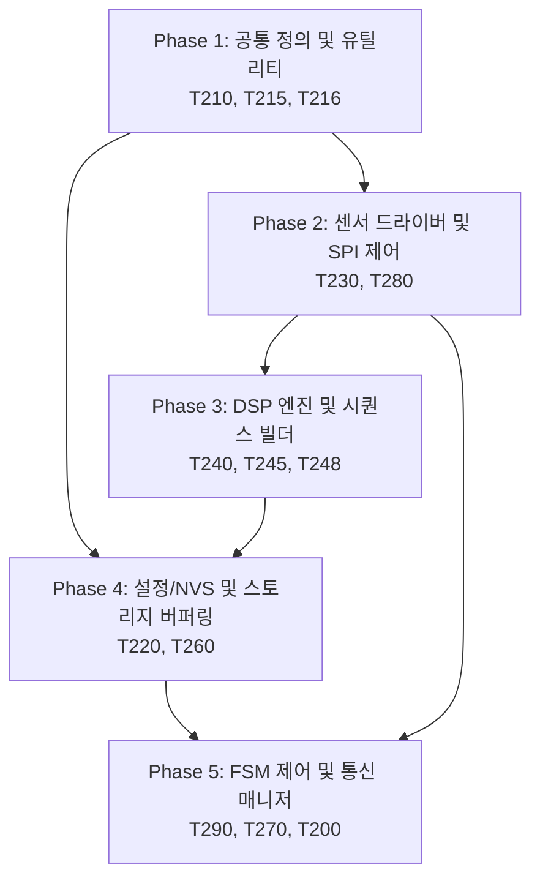

# MSFM-T250 정합성, 최적화 및 단순화 구현 계획서 (Implementation Plan)

본 문서는 `doc_req2_250_03_30.구현설계서.md`에 정의된 클래스 설계, 함수 시그니처, 정합성 보완 구조 및 11개 항목의 오버엔지니어링 단순화 설계를 바탕으로 실제 코드베이스에 적용하기 위한 **의존성(선후 관계), 모듈 간 관련성, 그리고 단계별 테스트 계획을 명시한 구현 계획**을 정의합니다.

---

## 1. 구현 로드맵 및 의존성 관계도

전체 구현은 하위 공통 데이터 구조 및 매크로 정의에서 시작하여 드라이버/수집부, 신호처리부, 파일 시스템/스토리지, 그리고 최종 FSM 및 통신 브릿지 순으로 진행됩니다.

---

## 2. 단계별 세부 구현 계획

### [Phase 1] 공통 타입 정의 및 표준 링버퍼 유틸리티 정비
*   **목표:** 하위 타입 정비 및 동시성 보호를 위한 유틸리티 구조체 수정 및 표준화.
*   **작업 대상 파일:**
    *   [T210_Def_250.hpp](file:///e:/241224_Sub/50_2540/Platformio7/ESP32_MSFM_250/src/T2_MSFM_250/T210_Def_250.hpp)
    *   [T215_Type_250.hpp](file:///e:/241224_Sub/50_2540/Platformio7/ESP32_MSFM_250/src/T2_MSFM_250/T215_Type_250.hpp)
    *   [T216_RingBuf_250.hpp](file:///e:/241224_Sub/50_2540/Platformio7/ESP32_MSFM_250/src/T2_MSFM_250/T216_RingBuf_250.hpp)
*   **세부 작업:**
    1.  `T210`에 Traits 메타프로그래밍 구조체(`AccelPolicy` 등)를 폐기하고, 런타임 동적 제어가 가능한 C-Style 설정 구조체 `ST_DynamicConfig_t` 정의 [보완-47].
    2.  `T210`에 `I2S_DMA_CHUNK_SIZE` 컴파일 타임 수식 반영 [11].
    3.  `T215`에 `ST_TriggerReason_t` 및 확장된 `ST_FileHeader_t` 선언 [43].
    4.  `T215` 내 공유 상태 제어를 위한 `std::atomic<bool>` 형식 강제화 [19].
    5.  `T216` 내 수동 원자적 펜스를 사용하는 커스텀 링버퍼 대신 ESP-IDF 표준 Ringbuf API(`freertos/ringbuf.h`) 연동 래퍼 설계 [보완-49].
    6.  표준 Ringbuf 외에, 동시성 보장을 위해 tail 갱신 전 데이터 복사가 완전히 끝나도록 release/acquire 오더링 장벽(`std::atomic_thread_fence`)을 가하는 락프리 링버퍼 메모리 정합성 설계 적용 [설계서-15].
    7.  `T216` 공유 링버퍼의 개별 데이터 슬롯마다 점유 해제 플래그 세마포어(`release_sem`)를 구성하여, 소비자가 SD 카드 쓰기를 끝마칠 때까지 생산자가 슬롯을 덮어쓰지 못하도록 엄격히 제어 펜스(Fence) 보증 [설계서-37].
    8.  단조 증가 시간용 `get_monotonic_timestamp_us()` 유틸리티 함수 구현 [18].
    9.  듀얼코어 L1 캐시 False Sharing을 원천 예방하기 위해 핵심 공유 상태 변수들에 `alignas(32)` 지시어 강제 지정 [38].

### [Phase 2] 센서 엔진 드라이버 및 물리 외란 보정 구축
*   **목표:** 하드웨어 센서 제어용 SPI 동시 접근 보호 단순화 및 다차원 센서 물리 정합성 보정.
*   **작업 대상 파일:**
    *   [T230_Sensor_250.hpp](file:///e:/241224_Sub/50_2540/Platformio7/ESP32_MSFM_250/src/T2_MSFM_250/T230_Sensor_250.hpp) / [.cpp](file:///e:/241224_Sub/50_2540/Platformio7/ESP32_MSFM_250/src/T2_MSFM_250/T230_Sensor_250.cpp)
    *   [T280_Calibrator_250.hpp](file:///e:/241224_Sub/50_2540/Platformio7/ESP32_MSFM_250/src/T2_MSFM_250/T280_Calibrator_250.hpp) / [.cpp](file:///e:/241224_Sub/50_2540/Platformio7/ESP32_MSFM_250/src/T2_MSFM_250/T280_Calibrator_250.cpp)
*   **세부 작업:**
    1.  ESP32-S3 캐시와 외부 DMA 버퍼 간의 불일치를 막기 위해 DMA 전송 시작 전/후에 캐시 무효화(`esp_cache_msync`)를 유도하는 `sync_cache_before_dma_read` 및 `sync_cache_after_dma_write` 탑재 [1].
    2.  실시간 센서 수집 및 DMA 데이터 링버퍼를 하드웨어 버스 제약에 맞춰 반드시 내부 SRAM(`MALLOC_CAP_INTERNAL | MALLOC_CAP_DMA`) 영역에 강제 할당하도록 이원화 [설계서-35].
    3.  I2S DMA 오디오 수집 설정 시, 청크 크기와 디스크립터 프레임 크기를 `I2S_DMA_CHUNK_SIZE`에 결합해 DMA 경계와 스트라이드를 일치시키는 초기화 루틴 구현 [11].
    4.  복잡한 비동기 SPI 트랜잭션 큐 태스크를 폐기하고, FreeRTOS Mutex(`_spiMutex`) 기반 동기식 단일 버스 락 보호로 단순화 [보완-48].
    5.  모드 전환 시 하드웨어 버퍼 오염 차단을 위한 `flushHardwareFifo()` 함수 구현 [24].
    6.  딥슬립 진입 전 Any-Motion 레지스터 및 인터럽트 매핑 함수(`prepareDeepSleepWakeup`) 구현 [34].
    7.  딥슬립 웨이크업 복귀 이후 INT1 FIFO 워터마크 인터럽트 구조로 원복시키는 `restoreFromDeepSleepWakeup()` 인터페이스 신설 [보완-5].
    8.  대용량 FIFO 읽기와 레지스터 수정 간 충돌 방지를 위해 `_spiMutex` 뮤텍스를 SPI 트랜잭션 진입점에 바인딩 [보완-12].
    9.  RF 송신 전류 서지에 의한 센서 VDD 드롭 감지 시 SPI 버스 드라이버 및 센서 칩 소프트 리셋을 자동으로 수행하는 `verifySensorIntegrity()` 엔진 구현 [40].
    10. 자이로 각속도 기반 자세각 적분을 수행하여 가속도 측정치에서 중력 가속도($g$-벡터) 성분을 제거하고, 장착 반경 $r$에 따른 원심력 오프셋($r\omega^2$)을 동적 감산하는 `CL_T2_SensorCompensator` 알고리즘 탑재 [설계서-25].
    11. 센서 내장 온도계 변화($T_c$)에 대응해 다항식 온도-오프셋 커브 $Offset(T)$를 실시간 연산 적용하여 ZRO(Zero-g Offset)의 동적 드리프트를 보정하는 `compensateThermalDrift` 설계 반영 [설계서-23].
    12. 자이로와 가속도 센서 셀의 장착 각도 틀어짐에 의한 교차축 성분 투영을 3x3 보정 매트릭스로 수학적 직교 교정하는 `CL_T2_OrthogonalAligner` 적용 [설계서-34].
    13. 센서와 기계 장착 하우징 무게중심 간 이격에 따른 Lever Arm 편차를 자이로 각가속도와 연계하여 제거 보정하는 `CL_T2_LeverArmCompensator` 구현 [설계서-32].
    14. LittleFS 파일 쓰기 명령 수행 직전에 하드웨어 센서(`BMI270`)의 FIFO Watermark 임계치를 임시로 상향(`setFifoWatermarkFlexible`)하여 플래시 캐시 차단 시점의 버퍼 여유 마진을 확보하는 FIFO 임계 백오프 제어 루틴 탑재 [설계서-36].

### [Phase 3] DSP 엔진 및 시퀀스 빌더 물리 보정 최적화
*   **목표:** 고하중 특징량 연산의 정적 정렬 및 도메인별 진단 물리 알고리즘 강화.
*   **작업 대상 파일:**
    *   [T240_DspEng_250.hpp](file:///e:/241224_Sub/50_2540/Platformio7/ESP32_MSFM_250/src/T2_MSFM_250/T240_DspEng_250.hpp) / [.cpp](file:///e:/241224_Sub/50_2540/Platformio7/ESP32_MSFM_250/src/T2_MSFM_250/T240_DspEng_250.cpp)
    *   [T245_FeatExtra_250.hpp](file:///e:/241224_Sub/50_2540/Platformio7/ESP32_MSFM_250/src/T2_MSFM_250/T245_FeatExtra_250.hpp) / [.cpp](file:///e:/241224_Sub/50_2540/Platformio7/ESP32_MSFM_250/src/T2_MSFM_250/T245_FeatExtra_250.cpp)
    *   [T248_SeqBuild_250.hpp](file:///e:/241224_Sub/50_2540/Platformio7/ESP32_MSFM_250/src/T2_MSFM_250/T248_SeqBuild_250.hpp) / [.cpp](file:///e:/241224_Sub/50_2540/Platformio7/ESP32_MSFM_250/src/T2_MSFM_250/T248_SeqBuild_250.cpp)
*   **세부 작업:**
    1.  자이로(Gyro) 전용 초경량 IIR 바이쿼드 메모리 구조로 대체 (고차 FIR 제거) [5].
    2.  필터 계수 Flash ROM 상주 고정 매크로(`SMEA_FLASH_RODATA`) 전역 적용 [8, 보완-1].
    3.  FFT 복소수 연산을 위한 짝수-실수, 홀수-0.0f 교차 배치 및 `2 * N` 버퍼 보정 [12].
    4.  가변 힙 aligned 할당 로직(`heap_caps_aligned_alloc`)을 완전히 폐기하고, 클래스 멤버 영역에 최대 크기의 정적 정렬 멤버 배열 `_dataFlat alignas(16)`를 선언하여 힙 누수 및 단편화 차단 [보완-55].
    5.  시간축 정렬(`MultiRateTimeAligner`) 내 `uint64_t` 감산 언더플로우 방어 가드 및 `alpha` 계수 클램핑 필터 구현 [22, 보완-15].
    6.  클럭 동기화 시 데이터 자체의 FPU 소수점 보간 대신 타임스탬프 헤더만 오디오 마스터 시각 기준으로 대치하는 소프트 매핑(Soft Timestamp Mapping)으로 가볍게 처리 [보완-53].
    7.  매질 전파 거리별 지연 편차 보정을 위해 동적 온도 계수를 가미한 `CL_T2_ThermalPropagationAligner` 기반 물리 전파 지연 오프셋 자동 계산 루틴 반영 [설계서-21, 설계서-33].
    8.  동적 필터 갱신 즉시 계수를 리빌드하는 `recalculateFilters()` 인터페이스를 독립 비대칭 튜닝(가속도는 HPF/Notch 중심, 자이로는 LPF 중심) 구조로 탑재 [32, 설계서-17].
    9.  장착 강성에 의한 주파수 왜곡을 역 보상하기 위해 부착 모드(`EM_MountingType_t`) 정보 기반의 Peaking 이퀄라이저인 `CL_T2_DspEqualizer` 필터를 구현하여 진동 대역폭 복원 [설계서-27].
    10. 켑스트럼 특징 추출 전 공장 매질 내의 다중 경로 반사 지연을 억제하기 위해 지수 감쇄 모델 기반의 오디오 공간 잔향 제거 필터 `applyReverbMasking` 구성 [설계서-24].
    11. 오디오 공간 내 반사파 위상 상쇄에 대응해 에너지 시계열 변화율을 산출하여 불감대를 우회 방어하는 `calculate_spectral_flux` 알고리즘 탑재 [설계서-26].
    12. 가속도 $1.5g$ RMS 초과 시 자이로 채널의 HPF 차단 계수를 동적으로 상향 조정하여 정류 포화 드리프트를 차단하는 `CL_T2_GyroDriftMitigator` 구현 [설계서-30].
    13. 저주파 기계식 고장 진단을 위한 가속도-진동 속도($mm/s$ RMS) 적분기 모듈 및 충격파 감지를 위한 30ms 단기 Peak-Hold/크레스트 팩터 분석기인 `CL_T2_TransientAnalyzer` 탑재 [설계서-22, 설계서-31].
    14. 오디오 홉 위상 단절에 따른 스펙트럼 노이즈 유발을 방지하기 위해 링버퍼 Full 드롭 감지 영역에 크로스페이딩(Cross-fading) 가드 및 델타-델타 평활화 이력 전이 장치 구성 [설계서-18].
    15. FSM 매니저와 데이터 교환 시 값 복사(`memcpy`) 대신 락 프리 링버퍼 주소 포인터를 넘겨받는 Zero-Copy 참조 통제 [9].

### [Phase 4] 설정 매니저(NVS) 및 스토리지 입출력 동기화 단순화
*   **목표:** 물리 파일 시스템 쓰기 지연 완화 및 설정 저장 안전성 확보.
*   **작업 대상 파일:**
    *   [T220_CfgMgr_250.hpp](file:///e:/241224_Sub/50_2540/Platformio7/ESP32_MSFM_250/src/T2_MSFM_250/T220_CfgMgr_250.hpp) / [.cpp](file:///e:/241224_Sub/50_2540/Platformio7/ESP32_MSFM_250/src/T2_MSFM_250/T220_CfgMgr_250.cpp)
    *   [T260_Storage_250.hpp](file:///e:/241224_Sub/50_2540/Platformio7/ESP32_MSFM_250/src/T2_MSFM_250/T260_Storage_250.hpp) / [.cpp](file:///e:/241224_Sub/50_2540/Platformio7/ESP32_MSFM_250/src/T2_MSFM_250/T260_Storage_250.cpp)
*   **세부 작업:**
    1.  복잡한 2중 WAL 저널링 드라이버 및 이관 데몬을 전면 철폐하고, 하드웨어 마모 평활화가 기본 내장된 ESP32 공식 NVS Flash 라이브러리(`nvs_flash.h`)를 직결 호출하도록 개정 [보완-56].
    2.  비동기 `StorageTask` 및 인덱스 동기화 큐를 삭제하고, 내부 SRAM에 더블 버퍼(Double Buffer)를 구축하여 버퍼가 꽉 찼을 때만 SD_MMC/FATFS 드라이버 고유 섹터 단위 캐시 시스템으로 동기 `write` 호출을 직선화 [보완-50].
    3.  물리 파일 오픈 시 병목을 일으키는 10MB 크기 선할당(`f_lseek` + dummy write) 기능을 전면 폐기하고 드라이버 고유 클러스터 할당을 신뢰하되, 링버퍼 깊이를 500ms 이상으로 확장 매핑 [보완-54].
    4.  스토리지 파일 쓰기 버퍼 및 SD 카드 기록 구조는 PSRAM(`MALLOC_CAP_SPIRAM`)에 바인딩하여 수집용 내부 SRAM 영역과 분리 구현 [설계서-35].
    5.  세션 기동 시 사전 트리거(Pre-Trigger) 데이터를 파일에 순차 덤프하는 `dumpPreTriggerToSession()` 구현 [21, 보완-4].
    6.  세션 클로즈 시 버퍼가 완전히 빌 때까지 뮤텍스를 통해 Graceful하게 대기한 뒤 폐쇄 [25, 보완-3].
    7.  LittleFS에 주파수 빈 스펙트럼 노이즈 프로필을 저장/로딩하는 `saveNoiseProfile` / `loadNoiseProfile` 구현 [29].
    8.  스토리지 세션 파일 생성 시 헤더에 `trigger_t0` 절대 마커와 `ST_TriggerReason_t` 메타데이터 바인딩 [31, 43, 보완-13].
    9.  NVS 및 LittleFS 동시 접근에 따른 VFS 충돌 방지를 위해 모든 파일 및 설정 API 진입점에 동기화 `_fsLock` 세마포어 적용 [보완-11].
    10. 설비 고장 진단 도메인의 영속성 무결성을 위해 가속도 물리 파형 외에 자이로 원시 파형(`ST_Raw_Gyro_t`)도 유실 없이 파일에 기록되도록 전용 `_preGyrBuf` 링버퍼 및 `_gyrBinFile` 핸들러 설계 [설계서-14].

### [Phase 5] FSM 오케스트레이션 및 무선 통신 브릿지 통합
*   **목표:** 듀얼 코어 동시 구동 최적화 및 상태 제어 가이드 간소화.
*   **작업 대상 파일:**
    *   [T290_FsmMgr_250.hpp](file:///e:/241224_Sub/50_2540/Platformio7/ESP32_MSFM_250/src/T2_MSFM_250/T290_FsmMgr_250.hpp) / [.cpp](file:///e:/241224_Sub/50_2540/Platformio7/ESP32_MSFM_250/src/T2_MSFM_250/T290_FsmMgr_250.cpp)
    *   [T270_Commu_250.hpp](file:///e:/241224_Sub/50_2540/Platformio7/ESP32_MSFM_250/src/T2_MSFM_250/T270_Commu_250.hpp) / [.cpp](file:///e:/241224_Sub/50_2540/Platformio7/ESP32_MSFM_250/src/T2_MSFM_250/T270_Commu_250.cpp)
    *   [T200_Main_250.h](file:///e:/241224_Sub/50_2540/Platformio7/ESP32_MSFM_250/src/T2_MSFM_250/T200_Main_250.h)
*   **세부 작업:**
    1.  `CL_T2_CommuManager` 전용 `StaticJsonDocument` 풀 및 동기화 `_commuLock` 개별 격리 구현 [17, 보완-18].
    2.  `JsonDocument` 풀 관리 시, 복잡하고 파편화를 초래하는 `shrinkToFit()` 강제 수동 호출을 폐기하고 내부 메모리 슬롯을 무부하 재사용하는 `clear()` 호출로 단순화 [보완-52].
    3.  외부 ISR 내부에서 커널 패닉을 방지하기 위해 락이나 세마포어 대기 없이 단일 원자적 비트 필드를 사용하는 `dispatchCommandFromISR()` API 구현 [43].
    4.  네트워크 핫스왑 변경을 감지하고 MQTT 인스턴스를 완전 재생성(`recreateMqttClient`) 및 리커넥트하는 프로세스 구현 [20, 보완-8, 보완-15].
    5.  스토리지 물리 에러를 감지하여 FSM을 `ERROR` 상태로 강제 전환하고 텔레메트리 1회 송출 및 Mute 하는 감시 체계 구현 [23, 보완-9].
    6.  WDT/Panic 리셋 발생 시 듀얼코어 레이스 컨디션 우려가 없으므로 원자적 장벽(`asm volatile("memw")` 등)을 완전 철폐하고 일반 C-Style 직접 대입으로 `g_CrashDiag` 구조를 단순 기입 [보완-57].
    7.  딥슬립 진입 전 RTC SRAM 영역의 데이터 오염을 막기 위해 원자적 배리어 플래그(`lock_flag`)를 세팅하고 CPU 전원 상태를 교차 검증하는 메커니즘 반영 [설계서-42].
    8.  FSM 전용 `WARM_UP` 노드 추가를 배제하고 기동 상태(READY)를 유지하되, 트리거 판정 시 `millis() < 30000` 필터를 추가해 30초 런타임 임시 가드로 단순 기동 분기 처리 [보완-51].
    9.  OTA 진행 시 DMA 및 인터럽트를 완벽 차단하는 `prepareForOta()`와 실패 시 Graceful 복구하는 `resumeFromOtaFailure()` 구현 [28, 보완-2].
    10. 16바이트 정렬 고속 패킷 조립 및 웹소켓 전송 브릿지(`broadcastTelemetryPayload`) 구현 [30].
    11. FSM 감시 루프 내 Lazy Write 체크 틱(`checkLazyWrite()`) 1초 스케줄러 기동 [33].
    12. 캘리브레이션 분석 시 실시간 덤프 세션을 강제 종료하고 버스를 독점하는 FSM `State Lock` 구현 [35].
    13. 링버퍼 Full 발생 시 단일 오버라이트를 차단하고 1024 샘플 단위 드롭 및 위상 리셋 처리 [36].
    14. NTP 동기 완료 시점까지 MQTT 보안 TLS 핸드셰이크 진입을 보류하는 블로킹 장치 추가 [37].
    15. 고주하 DSP 태스크는 Core 1에 고정 바인딩(`xTaskCreatePinnedToCore`)하고 수집/통신 태스크는 Core 0에 격리 [38].
    16. 진동($g$), 자이로($dps$), 오디오(dB) 간의 무차원 스케일 비교를 위해 Fold-Change 또는 SNR로 데이터를 정규화하여 가중합하는 다중 센서 융합 판정기 `CL_T2_TriggerEngine` 구현 및 물리원인별 동적 스위칭 탑재 [설계서-19, 설계서-28].

---

## 3. 구현 단계별 검증 및 테스트 계획

| 단계 | 테스트 항목 | 검증 방법 및 성공 기준 |
| :--- | :--- | :--- |
| **Phase 1** | **타임스탬프 & 링버퍼 테스트** | - 단조 증가 타이머의 연속성 검증 (Time Jump 발생 시 복원 필터 동작 여부) - 표준 Ringbuf API 연동 래퍼 및 release_sem 세마포어 펜스의 슬롯 오버라이트 차단 테스트 - 듀얼코어 링버퍼 enqueue 시 std::atomic_thread_fence 펜스의 데이터 일치 안전성 점검 |
| **Phase 2** | **물리 외란 보정 및 버스 제어 테스트** | - 동적 자세 변경에 의한 $g$-벡터, 원심력 보정 및 Lever Arm 보정 전후 진폭 스큐 오차 테스트 - 온도 드리프트 보정식 보간에 따른 센서 고온 분위기 ZRO 오프셋 변화율 확인 - LittleFS 백플러시 동작 직전 IMU FIFO 워터마크가 유연하게 상향 조정되는지 검증 - I2S DMA 디스크립터 크기가 I2S_DMA_CHUNK_SIZE에 완벽하게 일치/동기화되는지 덤프 검증 |
| **Phase 3** | **DSP 물리 알고리즘 및 수학적 정합성 테스트** | - 자석 부착 상태에서 Peaking EQ 적용 시 고주파 응답 복원율 측정 - 노이즈 잔향 마스킹에 의한 가짜 알람 억제 여부 및 Spectral Flux/Crest Factor 연산 신뢰성 확보 - 오디오 드롭 구간 크로스페이드 처리 전후의 위상 파열 왜곡율 비교 |
| **Phase 4** | **NVS 및 스토리지 캐시 테스트** | - DMA 버퍼는 내부 SRAM, 대용량 파일 버퍼는 SPIRAM 영역으로 이원화 배치 확인 - NVS를 통한 설정 핫스왑 동적 반영 성공률 및 LittleFS 쓰기 오버헤드 완화 여부 검증 - 더블 버퍼링 임계 시점에 수행되는 SD 동기 쓰기 가동 시 데이터 유실 여부 검증 |
| **Phase 5** | **FSM 및 통신 통합 시나리오 테스트** | - 딥슬립 진입 전 RTC SRAM lock_flag 원자적 펜스 및 ULP 복귀 정합성 테스트 - 30초 런타임 millis 가드를 통한 기동 초기 임계 오경보 유실 필터 기능 테스트 - WDT Panic 인위 발생 시 원자적 장벽 없이 RTC 메모리에 `g_CrashDiag`이 오염 없이 적재되는지 검증 |
