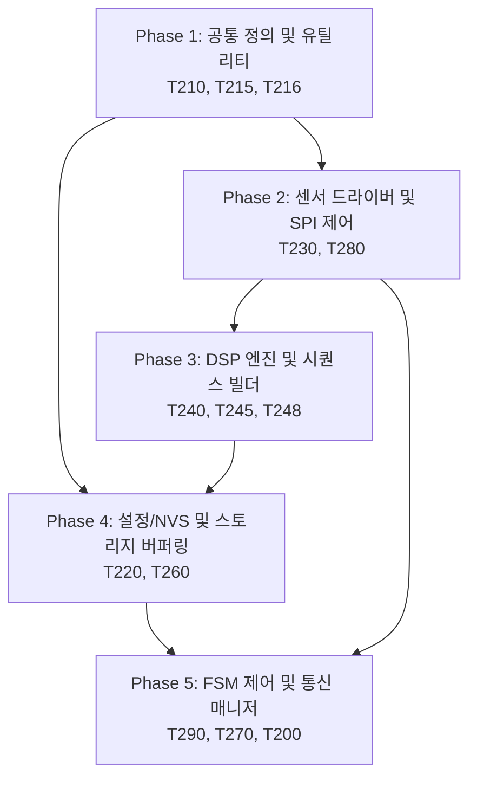

# MSFM-T250 정합성, 최적화 및 단순화 구현 계획서 (Implementation Plan)

본 문서는 `doc_req2_250_03_30.구현설계서.md`에 정의된 클래스 설계, 함수 시그니처, 정합성 보완 구조 및 11개 항목의 오버엔지니어링 단순화 설계를 바탕으로 실제 코드베이스에 적용하기 위한 **의존성(선후 관계), 모듈 간 관련성, 그리고 단계별 테스트 계획을 명시한 구현 계획**을 정의합니다.

---

## 1. 구현 로드맵 및 의존성 관계도

전체 구현은 하위 공통 데이터 구조 및 매크로 정의에서 시작하여 드라이버/수집부, 신호처리부, 파일 시스템/스토리지, 그리고 최종 FSM 및 통신 브릿지 순으로 진행됩니다.

---

## 2. 단계별 세부 구현 계획

### [Phase 1] 공통 타입 정의 및 표준 링버퍼 유틸리티 정비
*   **목표:** 하위 타입 정비 및 동시성 보호를 위한 유틸리티 구조체 수정 및 표준화.
*   **작업 대상 파일:**
    *   [T210_Def_250.hpp](file:///e:/241224_Sub/50_2540/Platformio7/ESP32_MSFM_250/src/T2_MSFM_250/T210_Def_250.hpp)
    *   [T215_Type_250.hpp](file:///e:/241224_Sub/50_2540/Platformio7/ESP32_MSFM_250/src/T2_MSFM_250/T215_Type_250.hpp)
    *   [T216_RingBuf_250.hpp](file:///e:/241224_Sub/50_2540/Platformio7/ESP32_MSFM_250/src/T2_MSFM_250/T216_RingBuf_250.hpp)
*   **세부 작업:**
    1.  `T210`에 Traits 메타프로그래밍 구조체(`AccelPolicy` 등)를 폐기하고, 런타임 동적 제어가 가능한 C-Style 설정 구조체 `ST_DynamicConfig_t` 정의 및 고유 `revision` 카운터를 탑재하여 스레드 진입 시 버전 대조 계획 수립 [이슈-19, 이슈-32, 보완-47].
    2.  `T210`에 `I2S_DMA_CHUNK_SIZE` 컴파일 타임 수식 반영 [11].
    3.  `T215`에 `ST_TriggerReason_t` 및 확장된 `ST_FileHeader_t` 선언 [43].
    4.  `T215` 내 공유 상태 제어를 위한 `std::atomic<bool>` 형식 강제화 [19].
    5.  `T216` 내 수동 원자적 펜스를 사용하는 커스텀 링버퍼 대신 ESP-IDF 표준 Ringbuf API(`freertos/ringbuf.h`) 연동 래퍼 설계 [보완-49].
    6.  표준 Ringbuf 외에, 동시성 보장을 위해 tail 갱신 전 데이터 복사가 완전히 끝나도록 release/acquire 오더링 장벽(`std::atomic_thread_fence`)을 가하는 락프리 링버퍼 메모리 정합성 설계 적용 [설계서-15].
    7.  `T216` 내 슬롯별 수동 세마포어(`release_sem`)는 컨텍스트 스위치 오버헤드가 크므로 폐기하고, 표준 Ringbuf의 `RINGBUF_TYPE_NOSPLIT` 모드 및 최대 파형 크기 고정을 통해 소비 완료 전 생산자 덮어쓰기가 원천 차단되도록 락프리 제어 펜스(Fence) 보증 [설계서-37, 1차-2.2].
    8.  단조 증가 시간용 `get_monotonic_timestamp_us()` 유틸리티 함수를 구현하고, 장기 운용 시 RTC 온도 표류를 보정하기 위해 1시간 주기로 HW 타이머 증가율과 대조해 오프셋 보정 계수를 보정하는 소프트웨어 PLL 브릿지 구성 [18, 이슈-33].
    9.  듀얼코어 L1 캐시 False Sharing을 원천 예방하기 위해 핵심 공유 상태 변수들에 `alignas(32)` 지시어 강제 지정 [38].
    10. 구조체 패킹 및 정렬 시 `#pragma pack` 대신 `__attribute__((packed, aligned(16)))` 지시어로 통일하고 static_assert 패딩 크기 검증 코드 배치 [리팩토링-10].
    11. 밴드 활성화 플래그의 8비트 배열 패딩 손실을 비트 압축(`std::bitset`)을 적용하여 1바이트로 최적화 [리팩토링-15].
    12. 파일 헤더, 환경 설정, 노이즈 프로필 로딩 시 하드웨어 가속 API(`esp_rom_crc32_le`)를 사용한 꼬리부 CRC32 자가 검증 및 무결성 진단 계획 수립 [이슈-12].

### [Phase 2] 센서 엔진 드라이버 및 물리 외란 보정 구축
*   **목표:** 하드웨어 센서 제어용 SPI 동시 접근 보호 단순화 및 다차원 센서 물리 정합성 보정.
*   **작업 대상 파일:**
    *   [T230_Sensor_250.hpp](file:///e:/241224_Sub/50_2540/Platformio7/ESP32_MSFM_250/src/T2_MSFM_250/T230_Sensor_250.hpp) / [.cpp](file:///e:/241224_Sub/50_2540/Platformio7/ESP32_MSFM_250/src/T2_MSFM_250/T230_Sensor_250.cpp)
    *   [T280_Calibrator_250.hpp](file:///e:/241224_Sub/50_2540/Platformio7/ESP32_MSFM_250/src/T2_MSFM_250/T280_Calibrator_250.hpp) / [.cpp](file:///e:/241224_Sub/50_2540/Platformio7/ESP32_MSFM_250/src/T2_MSFM_250/T280_Calibrator_250.cpp)
*   **세부 작업:**
    1.  ESP32-S3 캐시와 외부 DMA 버퍼 간의 불일치를 막기 위해 DMA 전송 시작 전/후에 캐시 무효화(`esp_cache_msync`)를 유도하는 `sync_cache_before_dma_read` 및 `sync_cache_after_dma_write` 탑재 [1].
    2.  실시간 센서 수집 및 DMA 데이터 링버퍼를 하드웨어 버스 제약에 맞춰 반드시 내부 SRAM(`MALLOC_CAP_INTERNAL | MALLOC_CAP_DMA`) 영역에 강제 할당하도록 이원화 [설계서-35].
    3.  I2S DMA 오디오 수집 설정 시, 청크 크기와 디스크립터 프레임 크기를 `I2S_DMA_CHUNK_SIZE`에 결합해 DMA 경계와 스트라이드를 일치시키며, 단일 디스크립터 바이트 한계(4092B)를 초과할 경우를 대비하여 `dma_desc_count = (dma_buffer_size + 4091) / 4092` 수식을 I2S 초기화 부에 명시적으로 반영 [11, 보완-10].
    4.  복잡한 비동기 SPI 트랜잭션 큐 태스크를 폐기하고, FreeRTOS Mutex(`_spiMutex`) 기반 동기식 단일 버스 락 보호로 단순화 [보완-48].
    5.  모드 전환 시 하드웨어 버퍼 오염 차단을 위한 `flushHardwareFifo()` 함수 구현 [24].
    6.  딥슬립 진입 전 Any-Motion 레지스터 및 인터럽트 매핑 함수(`prepareDeepSleepWakeup`) 구현 [34].
    7.  딥슬립 웨이크업 복귀 이후 INT1 FIFO 워터마크 인터럽트 구조로 원복시키는 `restoreFromDeepSleepWakeup()` 인터페이스를 신설하고, 딥슬립 복귀 부팅 시 NVS/NTP 무선 링킹 등의 저속 루프를 생략하는 `fastResume` 헬퍼 모듈을 메인 기동 루틴에 탑재 [보완-5, 이슈-22].
    8.  대용량 FIFO 읽기 시 Mutex 대기 시간 0 Skip 및 센서 FIFO 의존 지연 회피 계획 추가하고, 일반 SPI 레지스터 수정 간 충돌 방지를 위해 `_spiMutex` 뮤텍스를 SPI 트랜잭션 진입점에 바인딩 [보완-12, 이슈-23].
    9.  RF 송신 전류 서지에 의한 센서 VDD 드롭 감지 시 SPI 버스 드라이버 및 센서 칩 소프트 리셋을 자동으로 수행하는 `verifySensorIntegrity()` 엔진 구현하되, SD 카드 쓰기 활성 시점의 가짜 Sag 리셋 임계 카운트 완화 가드 적용 [40, 이슈-14].
    10. 자이로 각속도 기반 자세각 적분을 수행하여 가속도 측정치에서 중력 가속도($g$-벡터) 성분을 제거하고, 장착 반경 $r$에 따른 원심력 오프셋($r\omega^2$)을 동적 감산하는 `CL_T2_SensorCompensator` 알고리즘 탑재 [설계서-25].
    11. 센서 내장 온도계 변화($T_c$)에 대응해 다항식 온도-오프셋 커브 $Offset(T)$를 실시간 연산 적용하여 ZRO(Zero-g Offset)의 동적 드리프트를 보정하되, 온도 센서 고장(범위 -40°C ~ 85°C 이탈) 감지 시 보정을 강제 생략하고 이전 오프셋 상태를 유지하는 안전 예외 루틴 포함 [설계서-23, 이슈-4].
    12. 자이로와 가속도 센서 셀의 장착 각도 틀어짐에 의한 교차축 성분 투영을 3x3 보정 매트릭스로 수학적 직교 교정하는 `CL_T2_OrthogonalAligner` 적용 [설계서-34].
    13. 센서와 기계 장착 하우징 무게중심 간 이격에 따른 Lever Arm 편차를 자이로 각가속도와 연계하여 제거 보정하는 `CL_T2_LeverArmCompensator` 구현 [설계서-32].
    14. LittleFS 파일 쓰기 명령 수행 직전에 하드웨어 센서(`BMI270`)의 FIFO Watermark 임계치를 임시로 상향(`setFifoWatermarkFlexible`)하여 플래시 캐시 차단 시점의 버퍼 여유 마진을 확보하는 FIFO 임계 백오프 제어 루틴 탑재 [설계서-36].
    15. SD_MMC 4-bit 고속 모드 구동 시 GPIO39~42 핀과 센서 SPI 통신 핀 충돌을 컴파일 타임에 차단하는 `static_assert` 핀 맵 매트릭스 검증을 구현하고, 공장 자동화 테스트 감지 핀도 non-strapping 핀인 GPIO 2로 유효성을 강제 검증 [이슈 2, 이슈 10, 보완-46, 이슈-49].
    16. 캘리브레이터가 내부에서 FSM 전역 제어를 호출하지 않고 `_isCompleted` 아토믹 플래그를 설정하여 FSM 자율 제어 전이를 유도하는 역전(IoC) 패턴 적용 [리팩토링-42].
    17. SPI 통신 3회 연속 CRC 오류 발생 및 I2S 데이터가 풀스케일 95% 이상으로 유입될 시, 전자기 간섭 감지 플래그(`_emiNoisePending`)를 활성화하여 FSM 경보 상태 전이를 유도하는 EMI 감시 엔진 구현 [이슈-47].
    18. Wi-Fi 송수신 동작 전 현재 BLE 액티브 커넥션이 유지되는 경우 `esp_wifi_set_max_tx_power(40)`를 호출해 WiFi 최대 송출 전력을 10dBm 상한(기본값의 50%)으로 동적 제한하여 상호 RF 전송 간섭 및 패킷 유실을 방지하는 Low-throughput mode 제어 루틴 탑재 [이슈-11].
    19. 센서 모듈 자체에 탑재된 I2C EEPROM 영역에 캘리브레이션 오프셋과 온도 계수를 이중화하여 저장 및 로딩하되, 양산 시 EEPROM 미장착 보드에서의 부팅 I2C 스캔 지연 오버헤드를 원천 차단하기 위해 `BOARD_HAS_EXTERNAL_EEPROM` 매크로 가드로 조건부 컴파일 구현 [이슈-50].

### [Phase 3] DSP 엔진 및 시퀀스 빌더 물리 보정 최적화
*   **목표:** 고하중 특징량 연산의 정적 정렬 및 도메인별 진단 물리 알고리즘 강화.
*   **작업 대상 파일:**
    *   [T240_DspEng_250.hpp](file:///e:/241224_Sub/50_2540/Platformio7/ESP32_MSFM_250/src/T2_MSFM_250/T240_DspEng_250.hpp) / [.cpp](file:///e:/241224_Sub/50_2540/Platformio7/ESP32_MSFM_250/src/T2_MSFM_250/T240_DspEng_250.cpp)
    *   [T245_FeatExtra_250.hpp](file:///e:/241224_Sub/50_2540/Platformio7/ESP32_MSFM_250/src/T2_MSFM_250/T245_FeatExtra_250.hpp) / [.cpp](file:///e:/241224_Sub/50_2540/Platformio7/ESP32_MSFM_250/src/T2_MSFM_250/T245_FeatExtra_250.cpp)
    *   [T248_SeqBuild_250.hpp](file:///e:/241224_Sub/50_2540/Platformio7/ESP32_MSFM_250/src/T2_MSFM_250/T248_SeqBuild_250.hpp) / [.cpp](file:///e:/241224_Sub/50_2540/Platformio7/ESP32_MSFM_250/src/T2_MSFM_250/T248_SeqBuild_250.cpp)
*   **세부 작업:**
    1.  자이로(Gyro) 전용 초경량 IIR 바이쿼드 메모리 구조로 대체 (고차 FIR 제거) [5].
    2.  필터 계수 Flash ROM 상주 고정 매크로(`SMEA_FLASH_RODATA`)를 전역 적용하되, 런타임에 동적으로 변경되는 노치 필터 계수 `_notch_coeffs`는 상주 매크로 적용 대상에서 제외하고 RAM에 상주시켜 주파수 변경 시 플래시 예외(Exception)를 방지하는 격리 설계 탑재 [8, 보완-1].
    3.  FFT 복소수 연산을 위한 짝수-실수, 홀수-0.0f 교차 배치 및 `2 * N` 버퍼 보정 [12].
    4.  가변 힙 aligned 할당 로직(`heap_caps_aligned_alloc`)을 완전히 폐기하고, 클래스 멤버 영역에 최대 크기의 정적 정렬 멤버 배열 `_dataFlat alignas(16)`를 선언하여 힙 누수 및 단편화 차단하며, 텐서 크기 상한(MAX_TENSOR_SIZE) 초과 시 디폴트 폴백 적용 [보완-55, 이슈-10].
    5.  시간축 정렬(`MultiRateTimeAligner`) 내 `uint64_t` 감산 언더플로우 방어 가드 및 `alpha` 계수 클램핑 필터를 구현하고, 데이터 정렬 시 물리적 신호 해상도 손실 및 위상 왜곡을 방지하기 위해 오디오 마스터 클럭에 맞추어 저속 진동(1.6kHz) 데이터를 선형 보간(Up-sampling) 방식으로 동적 정렬하도록 방향성을 규정하며, 딥슬립 복귀 시 단조 증가 시계의 0 리셋으로 인한 시간 역전 방지를 위해 타임스탬프를 초기화하고 5초(250틱) 동안 보간 연산을 유예하는 `resetOnDeepSleepResume()` 탑재 [22, 보완-15, 이슈-5.12, 설계서-16].
    6.  가속도 내부 RC 발진기와 오디오 APLL 간의 누적 편차를 비례 보간(Rescaling)하기 위해 초기 10회 평균으로 drift_factor를 연산하여 실시간 부동소수점 오버헤드를 낮추는 DPLL 동기화 보정 필터(`CL_T2_DpllTimeSync`) 설계 반영 [보완-41].
    7.  매질 전파 거리별 지연 편차 보정을 위해 동적 온도 계수를 가미한 `CL_T2_ThermalPropagationAligner` 기반 물리 전파 지연 오프셋 자동 계산 루틴 반영 [설계서-21, 설계서-33].
    8.  동적 필터 갱신 즉시 계수를 리빌드하는 `recalculateFilters()` 인터페이스를 독립 비대칭 튜닝(가속도는 HPF/Notch 중심, 자이로는 LPF 중심) 구조로 탑재하고, 필터 변경 발생 시 500ms 알람 판정 강제 유예(suppressAlarm) 적용 [32, 설계서-17, 이슈-3].
    9.  장착 강성에 의한 주파수 왜곡을 역 보상하기 위해 부착 모드(`EM_MountingType_t`) 정보 기반의 Peaking 이퀄라이저인 `CL_T2_DspEqualizer` 필터를 구현하여 진동 대역폭 복원 [설계서-27].
    10. 켑스트럼 특징 추출 전 공장 매질 내의 다중 경로 반사 지연을 억제하기 위해 지수 감쇄 모델 기반의 오디오 공간 잔향 제거 필터 `applyReverbMasking`을 구성하고 밴드별 반사 감쇄 계수 자가 학습 및 NVS 보존 기능 적용 [설계서-24, 이슈-6].
    11. 오디오 공간 내 반사파 위상 상쇄에 대응해 에너지 시계열 변화율을 산출하여 불감대를 우회 방어하는 `calculate_spectral_flux` 알고리즘 탑재 [설계서-26].
    12. 가속도 $1.5g$ RMS 초과 시 자이로 채널의 HPF 차단 계수를 동적으로 상향 조정하여 정류 포화 드리프트를 차단하는 `CL_T2_GyroDriftMitigator` 구현 [설계서-30].
    13. 저주파 기계식 고장 진단을 위한 가속도-진동 속도($mm/s$ RMS) 적분기 모듈 및 충격파 감지를 위한 30ms 단기 Peak-Hold/크레스트 팩터 분석기인 `CL_T2_TransientAnalyzer` 탑재하고, 진동 속도 RMS 데이터의 트리거 룰 판정 연동 구현 [설계서-22, 설계서-31, 이슈-5].
    14. 오디오 홉 위상 단절에 따른 스펙트럼 노이즈 유발을 방지하기 위해 링버퍼 Full 드롭 감지 영역에 크로스페이딩(Cross-fading) 가드 및 델타-델타 평활화 이력 전이 장치 구성 [설계서-18].
    15. FSM 매니저와 데이터 교환 시 값 복사(`memcpy`) 대신 락 프리 링버퍼 주소 포인터를 넘겨받는 Zero-Copy 참조 통제 [9].
    16. 1.6kHz 고속 루프의 CPU 예산 초과 방지를 위해 온도 드리프트, 속도 적분기, 레버 암 보상 등 다중 물리 보정 모듈을 `enable_advanced_physics_compensation` 설정 플래그(기본값: false)로 일괄 제어 [보완-물리].
    17. DSP 핵심 루프에서 X/Y/Z 및 L/R 개별 채널 종속성을 완전히 제거하고 1D 루프로 일반화하는 템플릿 제네릭 파이프라인 구현 [리팩토링-16, 21].
    18. 실시간 태스크 선점 시 FPU 레지스터 및 Scratchpad 오염을 방지하기 위해 정적(static) 버퍼 사용을 배제하고 로컬 스택 또는 태스크 힙 영역만 사용하여 100% 재진입성(Reentrant) 설계 관철 [리팩토링-22].
    19. 런타임 `heap_caps_malloc` 동적 할당을 금지하고 Placement New로 자원을 임시 재분배하는 아레나 메모리 관리자 기동 [리팩토링-23].
    20. 50% 중첩 데이터 이송 시의 `memcpy` 연산 오버헤드를 인덱스 연산 기반 원형 Sliding Window 템플릿(`CL_T2_SlidingWindow`)으로 대체 [리팩토링-25].
    21. PSRAM 상의 비선형 스트라이드 참조 시 발생하는 L1/L2 캐시 미스 및 오디오 홉 누락을 차단하기 위해, 내부 SRAM에 고속 임시 1D 버퍼(SRAM Local Cache Scratchpad)를 할당하여 복사 및 정렬을 수동 최적화하는 `prepareModelInputSram` 구현 [보완-44].
    22. 특징량 연산 가변 부하 시 Task WDT 리셋을 방지하기 위해 런타임 알고리즘 복잡도를 계산하고, 연산 부하가 임계치를 초과할 것으로 예측 시 루프 중간에서 `esp_task_wdt_reset()`을 수행하는 적응형 WDT 피딩 스케줄러 구현 [보완-39].
    23. AI 추론의 연산 지연이 실시간 특징 가공을 방해하지 않도록 Core 1에 `InferenceTask`(우선순위 7)를 격리 이원화하고, 지연 누적 시 AI 판정을 1회 패스시키는 `skipInference` 가드를 탑재 [이슈-15, 이슈-17].
    24. Sensor 통신 및 클럭 동기화 왜곡으로 3회 이상 연속 프레임 드롭 감지 시 버퍼 초기화 및 FSM 지연 알림 감지용 `_clearSequencePending` 플래그 세팅을 동반하는 마스터 클럭 Monotonic 스위칭 제어와 마지막 수집값의 ZOH 보간 방지를 위해 1초 TTL 초과 시 NaN 마스킹하는 가상 보간 필터 적용 [이슈-9, 이슈-16, 리팩토링-24].
    25. 파워 스펙트럼 노이즈 차감 시 음수로 떨어짐으로써 생기는 Log 연산 NaN 붕괴를 방어하기 위해 하한 임계치(1e-5f)를 적용하는 `applySpectralFloor` 구현 계획 추가 [리팩토링-28].
    26. DSP Biquad 필터 또는 FFT 출력단에서 부동소수점 예외(NaN/Inf) 발견 즉시 0.0f로 강제 클램핑하고 예외 발생 플래그를 설정하는 `scanAndCleanNaN` 루틴 구현 [리팩토링-47, 이슈-46].
    27. 기계 이상에 따른 수 kHz 영역의 초고주파 과도 충격파(Shock Pulse)와 나이퀴스트 한계(가속도 ODR 1.6kHz에 따른 800Hz Limit)에 대응하기 위해, 800Hz 이하는 가속도의 포락선 변조 신호로 분석(복소 포락선 복조 Envelope Demodulation DSP 계층 독립 가동)하고, 800Hz 초과는 오디오 켑스트럼 분석단에서 분할 담당하도록 센서 대역을 분리하는 상호 대역 보완망 구축 [설계서-20, 설계서-29].
    28. 주변 환경 소음에 노출되는 오디오 모달리티에만 백인 노이즈 프로필 학습 및 스펙트럼 차감(Spectral Subtraction)을 가동하고, 주변 소음에 영향을 받지 않는 구조물 접착식 가속도 도메인은 노이즈 차감을 차단하는 대신 장기 평균(LTA)을 통한 동적 임계치 갱신(Threshold Adaptation)만을 독자 가동하도록 신호처리 파이프라인을 도메인별로 국소화 [설계서-15].

### [Phase 4] 설정 매니저(NVS) 및 스토리지 입출력 동기화 단순화
*   **목표:** 물리 파일 시스템 쓰기 지연 완화 및 설정 저장 안전성 확보.
*   **작업 대상 파일:**
    *   [T220_CfgMgr_250.hpp](file:///e:/241224_Sub/50_2540/Platformio7/ESP32_MSFM_250/src/T2_MSFM_250/T220_CfgMgr_250.hpp) / [.cpp](file:///e:/241224_Sub/50_2540/Platformio7/ESP32_MSFM_250/src/T2_MSFM_250/T220_CfgMgr_250.cpp)
    *   [T260_Storage_250.hpp](file:///e:/241224_Sub/50_2540/Platformio7/ESP32_MSFM_250/src/T2_MSFM_250/T260_Storage_250.hpp) / [.cpp](file:///e:/241224_Sub/50_2540/Platformio7/ESP32_MSFM_250/src/T2_MSFM_250/T260_Storage_250.cpp)
*   **세부 작업:**
    1.  복잡한 2중 WAL 저널링 드라이버 및 이관 데몬을 전면 철폐하고 하드웨어 마모 평활화가 기본 내장된 ESP32 공식 NVS Flash 라이브러리(`nvs_flash.h`)를 직결 호출하되, 빌드 시 WAL 파티션의 미존재를 컴파일 타임에 강제 검증하여 마이그레이션 모순을 차단하도록 `CONFIG_PARTITION_TABLE_HAS_WAL` 매크로 정의 시 빌드 오류(#error)를 유발하는 가드 배치하며, NVS 쓰기 폭주 제어를 위해 10초 주기 캐시 버퍼를 경유해 커밋을 차단하는 RAM 캐싱 필터 도입 [보완-56, 이슈-18, 설계서-2.3].
    2.  비동기 `StorageTask` 및 인덱스 동기화 큐를 삭제하고, 내부 SRAM에 더블 버퍼(Double Buffer)를 구축하여 버퍼가 꽉 찼을 때만 SD_MMC/FATFS 드라이버 고유 섹터 단위 캐시 시스템으로 동기 `write` 호출을 직선화하되, 버퍼가 가득 차면 f_write 물리 동기 블로킹을 강제하고 30s f_sync 및 FAT 자가 진단 f_check 자동 실행 [보완-50, 이슈-7, 이슈-24].
    3.  물리 파일 오픈 시 병목을 일으키는 10MB 크기 선할당(`f_lseek` + dummy write) 기능을 전면 폐기하고 드라이버 고유 클러스터 할당을 신뢰하되, 링버퍼 깊이를 500ms 이상으로 확장 매핑 [보완-54].
    4.  스토리지 파일 쓰기 버퍼 및 SD 카드 기록 구조는 PSRAM(`MALLOC_CAP_SPIRAM`)에 바인딩하여 수집용 내부 SRAM 영역과 분리 구현 [설계서-35].
    5.  세션 기동 시 사전 트리거(Pre-Trigger) 데이터를 파일에 순차 덤프하는 `dumpPreTriggerToSession()` 구현 [21, 보완-4].
    6.  FSM의 블로킹을 방지하기 위해 `closeSession()` 기동 시 비동기 `StorageTask` 내에서 플러시를 완료한 뒤, 세마포어/이벤트 그룹으로 FSM에 완료 시그널을 던져 비동기 종료하는 설계 보완 [25, 보완-3].
    7.  LittleFS에 주파수 빈 스펙트럼 노이즈 프로필을 저장/로딩하는 `saveNoiseProfile` / `loadNoiseProfile` 구현 [29].
    8.  스토리지 세션 파일 생성 시 헤더에 `trigger_t0` 절대 마커와 `ST_TriggerReason_t` 메타데이터 바인딩하고, AI 추론 예측값 및 정확도를 직렬화하여 기록 [31, 43, 보완-13, 이슈-26].
    9.  NVS 및 LittleFS 동시 접근에 따른 VFS 충돌 방지를 위해 모든 파일 및 설정 API 진입점에 동기화 `_fsLock` 세마포어 적용 [보완-11].
    10. 설비 고장 진단 도메인의 영속성 무결성을 위해 가속도 물리 파형 외에 자이로 원시 파형(`ST_Raw_Gyro_t`)도 유실 없이 파일에 기록되도록 전용 `_preGyrBuf` 링버퍼 및 `_gyrBinFile` 핸들러 설계 [설계서-14].
    11. 마운트 실패로 파일 시스템 손상 발생 시 즉시 포맷하지 않고 MQTT로 스토리지 에러 경고를 선 발행한 뒤, 설정 내 `enable_auto_format`이 활성화된 경우에만 `f_mkfs` 자동 포맷을 진행하고 그렇지 않으면 FSM을 `SD_CARD_FORMAT_REQUIRED` 상태로 보존하는 복구 시퀀스 구현 [29, 보완-포맷].
    12. CfgMgr와 NVS 물리 플래시 API 간 강결합을 해소하여 유연성을 높이기 위한 `IConfigStorage` 의존성 주입(DI) 인터페이스를 구현하고, 설정 데이터 직렬화 메타에 `config_version` 필드를 수록하여 로딩 시 불일치 발견 시 기존 NVS를 안전하게 리셋(`resetToDefault`)하고 덮어쓰기 크래시를 방지하며, 실시간 핫스왑 동적 반영 계획 적용 [리팩토링-9, 이슈-44].
    13. 파일 세션 로테이션(File Rotation) 시 I/O 지연을 방지하기 위해 백그라운드에서 다음 쓰기 파일을 비동기로 선점 오픈해두는 `_preallocatedFile` 핸들 Swap 설계 적용 [리팩토링-33].
    14. 사전 트리거 덤프 시 수백 ms의 버스 차단을 방지하기 위해, 한 번에 다 쓰지 않고 매 주기마다 가용한 청크 단위로 분할하여 순차 Write하는 `streamPreTriggerChunks` 구현 [리팩토링-41].
    15. SD 카드 Detect GPIO 핀 상태 변동 인터럽트를 감시하여 디바운싱 후 무단 탈거 확정 시, 파일 핸들 강제 종료뿐만 아니라 호스트 드라이버 `sdmmc_card_deinit()` 및 `sdmmc_host_deinit()`을 호출해 Lock-up을 차단하고, 시스템 패닉 발생 시 Flash coredump 이미지를 SD 카드로 백업하는 안전 기전 구현 [이슈-29, 이슈-39].
    16. MTDI Strapping 핀 간섭을 피해 GPIO 21을 공장 초기화 물리 핀으로 지정하고 `static_assert` 검증하며, 10초 이상 누를 시 LittleFS 및 NVS 영역을 전면 포맷 복구하는 `FactoryResetTask` 계획 수록 [이슈-30].
    17. 개인정보 보호 관련 법규 준수를 위해 오디오 원시 파형 저장 활성화 여부(`enable_raw_audio_saving`) 설정을 제공하고 기본값을 비활성화(Disable) 처리하여, 설정 오프 시 켑스트럼 특징량(`MFCC`) 데이터만 수집되도록 정보 정합성을 차단 [이슈-51].
    18. SD 카드 가용 공간 90% 이상 도달 시 FSM 경고를 발생하고, 최저 날짜 세션부터 파일 삭제 API(`f_unlink`)를 동작시켜 가용 공간을 동적으로 자동 환원하는 공간 복구 시퀀스 구현 [이슈-28].

### [Phase 5] FSM 오케스트레이션 및 무선 통신 브릿지 통합
*   **목표:** 듀얼 코어 동시 구동 최적화 및 상태 제어 가이드 간소화.
*   **작업 대상 파일:**
    *   [T290_FsmMgr_250.hpp](file:///e:/241224_Sub/50_2540/Platformio7/ESP32_MSFM_250/src/T2_MSFM_250/T290_FsmMgr_250.hpp) / [.cpp](file:///e:/241224_Sub/50_2540/Platformio7/ESP32_MSFM_250/src/T2_MSFM_250/T290_FsmMgr_250.cpp)
    *   [T270_Commu_250.hpp](file:///e:/241224_Sub/50_2540/Platformio7/ESP32_MSFM_250/src/T2_MSFM_250/T270_Commu_250.hpp) / [.cpp](file:///e:/241224_Sub/50_2540/Platformio7/ESP32_MSFM_250/src/T2_MSFM_250/T270_Commu_250.cpp)
    *   [T200_Main_250.h](file:///e:/241224_Sub/50_2540/Platformio7/ESP32_MSFM_250/src/T2_MSFM_250/T200_Main_250.h)
*   **세부 작업:**
    1.  `CL_T2_CommuManager` 전용 `StaticJsonDocument` 풀 및 동기화 `_commuLock` 개별 격리 구현 [17, 보완-18].
    2.  `JsonDocument` 풀 관리 시, 복잡하고 파편화를 초래하는 `shrinkToFit()` 강제 수동 호출을 폐기하고 내부 메모리 슬롯을 무부하 재사용하는 `clear()` 호출로 단순화 [보완-52].
    3.  외부 ISR 내부에서 커널 패닉을 방지하기 위해 락이나 세마포어 대기 없이 단일 원자적 비트 필드를 사용하는 `dispatchCommandFromISR()` API 구현 [43].
    4.  네트워크 핫스왑 변경을 감지하고 MQTT 인스턴스를 완전 재생성(`recreateMqttClient`) 및 리커넥트하는 프로세스 구현 [20, 보완-8, 보완-15].
    5.  스토리지 에러 플래그, EMI 노이즈 플래그, DSP NaN 검출 플래그 등을 FSM `runMaintenance`에서 직접 폴링(확인)하여 ERROR 또는 경고 상태로 안전하게 전환하고 텔레메트리 1회 송출 및 Mute하는 폴링 기반 감시 체계를 구현하며, 실시간 가공 루프 WDT 리셋 및 오디오 프레임 드롭 방지를 위해 스택 스캔(`uxTaskGetStackHighWaterMark`)을 10초 주기로 철저히 제한하고 가용 스택이 512바이트 미만 시 디바운싱 통지 및 NVS 경고 기록 계획 수록 [23, 보완-9, 30, 이슈-5.11, 이슈-35].
    6.  WDT/Panic 리셋 발생 시 듀얼코어 레이스 컨디션 우려가 없으므로 원자적 장벽을 완전 철폐하고 일반 C-Style 직접 대입으로 `g_CrashDiag` 구조를 단순 기입하되, 구조체 내부에 매직 넘버(0x43524153, 'CRAS')를 적용하여 콜드 스타트 시 쓰레기값 혼입을 방지하고 `esp_reset_reason()` 판정 결과 예외 리셋이 아닐 경우 0으로 자동 소거 및 매직 넘버를 재작성하는 안전 기전을 도입 [보완-57, 보완-7].
    7.  딥슬립 진입 전 RTC SRAM 영역의 데이터 오염을 막기 위해 원자적 배리어 플래그(`lock_flag`)를 세팅하고 CPU 전원 상태를 교차 검증하는 메커니즘 반영 [설계서-42].
    8.  FSM 전용 `WARM_UP` 노드 추가를 배제하고 기동 상태(READY)를 유지하되, 트리거 판정 시 `millis() < 30000` 필터를 추가해 30초 런타임 임시 가드로 단순 기동 분기 처리 [보완-51].
    9.  OTA 진행 시 DMA 및 인터럽트를 완벽 차단하는 `prepareForOta()`와 실패 시 Graceful 복구하는 `resumeFromOtaFailure()` 구현 [28, 보완-2].
    10. 16바이트 정렬 고속 패킷 조립 및 웹소켓 전송 브릿지(`broadcastTelemetryPayload`) 구현 [30].
    11. FSM 감시 루프 내 Lazy Write 체크 틱(`checkLazyWrite()`) 1초 스케줄러 기동 [33].
    12. 캘리브레이션 분석 시 실시간 덤프 세션을 강제 종료하고 버스를 독점하는 FSM `State Lock` 구현 [35].
    13. 링버퍼 Full 발생 시 단일 오버라이트를 차단하고 1024 샘플 단위 드롭 및 위상 리셋 처리 [36].
    14. NTP 동기 완료 시점까지 MQTT 보안 TLS 핸드셰이크 진입을 보류하는 블로킹 장치 추가하되, 30초 내에 미동기 시 skip_cert_common_name_check를 활성화해 우회 접속을 보장하고, 7일 이상 지속 미동기 시 SYS_STATE_TIME_WARNING 경보 상태 전이 계획 적용 [37, 이슈-40].
    15. 고주하 DSP 태스크는 Core 1에 고정 바인딩하고 수집/통신 태스크는 Core 0에 격리하며, 스케줄러 데드락 방지를 위해 우선순위를 `VibProcTask(22) == AudProcTask(22) > SensorAcqTask(20) > FsmManager(6) > StorageTask(5) > CommuTask(4)`로 체계화하고 `SensorAcqTask`는 WDT 감시를 해제 [38, 이슈-13].
    16. 진동($g$), 자이로($dps$), 오디오(dB) 간의 무차원 스케일 비교를 위해 Fold-Change 또는 SNR로 데이터를 정규화하여 가중합하는 다중 센서 융합 판정기 `CL_T2_TriggerEngine` 구현 및 물리원인별 동적 스위칭 탑재 [설계서-19, 설계서-28].
    17. JTAG/부팅 간섭을 방지하기 위해 공장 자동화 테스트 감지 핀을 GPIO 15 대신 non-strapping 핀인 GPIO 2로 설정하고 static_assert 검증 구현 [49].
    18. WiFi/BLE 통신 시 수동으로 BLE 광고를 중지/재개하는 Coexistence Orchestrator 소프트웨어 모듈 설계를 제거하고, 하드웨어 Coexist 기능(`CONFIG_ESP_WIFI_SW_COEXIST_ENABLE`)에 전적으로 위임 [11, 45].
    19. 실시간 DSP 연산 중 Lock 없이 설정을 변경할 수 있도록 설정 버퍼를 RCU 기법을 적용한 3중 버퍼링(Triple Buffering) 구조로 구현 [리팩토링-14].
    20. 릴레이 하드웨어 비상 차단 인터록 시 틱 지연을 겪지 않고 GPIO 레지스터를 직접 타격하는 Fast-Path 콜백 및 락 프리 SPSC 링버퍼 연동 구현 [리팩토링-32, 44].
    21. 통신 지연이 FSM 루프를 방해하지 않도록 비동기 웹소켓 전송 링버퍼와 백그라운드 CommuTask를 분리하고, 통신 단선 시 바이너리 텔레메트리 드롭 및 중요 알람을 로컬 LittleFS에 임시 적재 후 전송하는 구조 구현 [리팩토링-37, 이슈-34].
    22. FSM이 직접 `vTaskSuspend`를 호출하여 태스크 수명을 흔들지 않고, 스레드 제어 수명 관리를 전담하는 `CL_T2_TaskCoordinator`를 이원화 구성 [리팩토링-35].
    23. 스피커 오디오 방송 개시 시 I2S 수집 DMA를 일시정지 처리하고, 해당 차단 프레임 영역을 묵음(0.0f)으로 링버퍼에 메워 위상 파열 알람 오동작을 억제하는 상호 배제 제어 구현 [이슈-21].
    24. LED 점멸에 따른 물리적 `vTaskDelay()` 지연이 실시간 가공 루프를 블로킹하지 않도록, 독립 데몬 태스크(우선순위 1)와 비차단 큐를 갖는 `CL_T2_LedIndicator`를 구현하여 FSM 상태 전이와 연동 [이슈-31].
    25. FSM 스레드가 갱신하는 하트비트 타임스탬프를 쿼리하여, 5초 동안 갱신이 멈출 시 내부 소프트웨어 리셋(`esp_restart()`)을 트리거하는 독립 `watchdogMonitorTask` 기동 [이슈-54].
    26. ADC 채널을 통해 공급 VDD 전압을 모니터링하여 임계 전압 미만으로 전력 Sag 발생 시, 파일 시스템의 모든 쓰기 핸들을 Graceful하게 닫고 즉각 딥슬립으로 안전 진입하는 공급 전압 감시 제어 구현 [이슈-48].
    27. 오진단 알람 채터링을 차단하도록 듀얼 임계값 구조(ON 1.5g, OFF 1.2g) 및 최소 지속 100ms 시간 필터를 `CL_T2_TriggerEngine`에 탑재하는 계획 구현 [이슈-45].
    28.  Flash 다량 저장 및 OTA 버스트 전송 진입 시 Interrupt Watchdog(IWDT)의 한계치를 300ms에서 2000ms로 동적으로 조율하여 패닉 리셋을 예방하는 안전 조율 장치를 탑재 [이슈-25].
    29.  설정 변경 인터페이스와 연동해 로그 등급을 변경하는 API(`esp_log_level_set`)를 노출하고, 발생한 에러/경고 로그들을 순환 큐에 버퍼링한 뒤 1시간마다 LittleFS에 플러시하여 영속화하는 로깅 관리 데몬 탑재 [이슈-37].
    30.  장기 연속 신뢰성 확보를 위해 매일 자정(Midnight) 틱에 맞추어 Free heap 메모리, PSRAM 잔여량, 최소 스레드 스택 하이워터마크를 텔레메트리 로그로 수집하여 MQTT로 송출하는 자정 리소스 모니터링 데몬 기동 [이슈-53].
    31.  자격 증명 및 키의 안전한 보존을 위해 NVS 암호화 파티션 `/nvs_key`를 활성화하고, 초기화 시 `nvs_flash_secure_init_partition()`을 사용해 마운트하도록 설계 [이슈-27].

---

## 3. 구현 단계별 검증 및 테스트 계획

| 단계 | 테스트 항목 | 검증 방법 및 성공 기준 |
| :--- | :--- | :--- |
| **Phase 1** | **타임스탬프 & 링버퍼 테스트** | - 단조 증가 타이머의 연속성 검증 (Time Jump 발생 시 복원 필터 동작 여부) - 표준 Ringbuf API 연동 래퍼 및 release_sem 세마포어 펜스의 슬롯 오버라이트 차단 테스트 - 듀얼코어 링버퍼 enqueue 시 std::atomic_thread_fence 펜스의 데이터 일치 안전성 점검 - 1시간 주기 HW 타이머 대조 시 단조 타이머 오프셋 보정 필터의 장기 RTC 드리프트 보정 정확도 검증 - 파일 헤더, 환경 설정, 노이즈 프로필 로딩 시 하드웨어 가속 API(esp_rom_crc32_le)를 사용한 꼬리부 CRC32 자가 검증 및 훼손 데이터 탐지 신뢰성 테스트 |
| **Phase 2** | **물리 외란 보정 및 버스 제어 테스트** | - 동적 자세 변경에 의한 $g$-벡터, 원심력 보정 및 Lever Arm 보정 전후 진폭 스큐 오차 테스트 - 온도 드리프트 보정식 보간에 따른 센서 고온 분위기 ZRO 오프셋 변화율 확인 - LittleFS 백플러시 동작 직전 IMU FIFO 워터마크가 유연하게 상향 조정되는지 검증 - I2S DMA 디스크립터 크기가 I2S_DMA_CHUNK_SIZE에 완벽하게 일치/동기화되는지 덤프 검증 - 딥슬립 복귀 시 NVS/NTP 루프 생략에 따른 `fastResume` 기동 속도(수백 ms 단축) 및 복구 정합성 검증 - SPI CRC 에러 유발 및 I2S 95% 초과 입력 시 `_emiNoisePending` 플래그 활성화 및 FSM 경보 전이 검증 - 온도 센서 고장 범위(-40°C 미만, 85°C 초과) 강제 인가 시 compensateThermalDrift 보정 자동 생략 및 이전 오프셋 보존 여부 확인 - BLE 커넥션 활성 시 Wi-Fi STA 시작 전 esp_wifi_set_max_tx_power(40) 작동 및 WiFi 송출 파워 10dBm 상한 동적 조율 확인 - 센서 모듈 보드 I2C EEPROM 장착/미장착 시 캘리브레이션 핫스왑 복구 및 부팅 I2C 스캔 지연 오버헤드 방지(BOARD_HAS_EXTERNAL_EEPROM 매크로 가드 분기) 정상 동작 검증 |
| **Phase 3** | **DSP 물리 알고리즘 및 수학적 정합성 테스트** | - 자석 부착 상태에서 Peaking EQ 적용 시 고주파 응답 복원율 측정 - 노이즈 잔향 마스킹에 의한 가짜 알람 억제 여부 및 Spectral Flux/Crest Factor 연산 신뢰성 확보 - 오디오 드롭 구간 크로스페이드 처리 전후의 위상 파열 왜곡율 비교 - `InferenceTask` 격리 이원화에 따른 오디오 가공 프레임(Hop) 드롭율 0% 유지 및 연산 지연 시 `skipInference` 스킵 가드의 정상 기동 여부 검증 - 딥슬립 복귀 시 `resetOnDeepSleepResume()`에 의한 타임스탬프 리셋 및 5초(250틱) 웜업 적용을 통한 시간축 정렬(Software PLL) 언더플로우/시간 역전 방지 검증 - `MultiRateTimeAligner` 내 1초 TTL 유효성 판단 통과 실패 시 ZOH 강제 중단 및 NaN 마스킹 정합성 테스트 - 파워 스펙트럼 노이즈 차감 감산 시 `applySpectralFloor`에 의해 에너지가 음수로 떨어지지 않고 하한 임계치(1e-5f)로 클램핑되어 Log NaN을 원천 방지하는지 검증 - DSP Biquad 및 FFT 연산 시 NaN/Inf 인위 주입 후 `scanAndCleanNaN`에 의해 0.0f로 클램핑 및 예외 감지 플래그가 정상 작동하는지 검증 - Notch 필터 계수 변경 시 RAM 상주 포인터 갱신 오류 및 플래시 XIP Exception(SMEA_FLASH_RODATA 배제 영역) 방지 정합성 확인 - 시간축 정렬(MultiRateTimeAligner) 시 고속 오디오 마스터 기준에 맞춘 저속 진동(1.6kHz)의 Up-sampling 선형 보간 정렬 방향성 및 위상 해상도 왜곡 방지 테스트 - Nyquist Limit(800Hz) 경계선 기반 대역 분할(800Hz 이하는 복소 포락선 복조 Envelope Demodulation 검출, 800Hz 초과는 오디오 켑스트럼) 및 진동/오디오 이종 대역 보완망 구축 검증 - 진동(가속도) 센서의 스펙트럼 차감 연산 차단 및 LTA 기반 동적 임계치 갱신(Threshold Adaptation) 파이프라인 국소화 분리 검증 |
| **Phase 4** | **NVS 및 스토리지 캐시 테스트** | - DMA 버퍼는 내부 SRAM, 대용량 파일 버퍼는 SPIRAM 영역으로 이원화 배치 확인 - NVS를 통한 설정 핫스왑 동적 반영 성공률 및 LittleFS 쓰기 오버헤드 완화 여부 검증 - 더블 버퍼링 임계 시점에 수행되는 SD 동기 쓰기 가동 시 데이터 유실 여부 검증 - `closeSession()` 비동기 플러시 후 던져지는 세마포어/이벤트 시그널에 따른 FSM 비동기 세션 클로즈 정상 완료 검증 - `streamPreTriggerChunks` 구현에 따른 사전 트리거 덤프 시 CPU/SPI 버스 독점 방지 및 수집 태스크 지연 예방 성능 검증 - SD 카드 인위적 탈거 시 디바운싱 필터링 및 호스트 `sdmmc_card_deinit` / `sdmmc_host_deinit` 정상 동작과 FSM의 SD 제거 인지 검증 - 패닉 리셋 인위 발생 시 Flash coredump 파티션 원시 이미지 데이터 획득 및 SD 카드 `/diagnostics/coredump.bin` 정상 백업 적재 확인 - GPIO 21 공장 초기화 핀 10초 롱프레스 시 `FactoryResetTask` 구동 및 NVS/LittleFS 포맷 완료 여부 검증 - WAL 파티션 테이블 존재 시 CONFIG_PARTITION_TABLE_HAS_WAL 컴파일 에러(#error) 빌드 차단 및 NVS 강제 전환 안전 가드 검증 - 설정 config_version 변경에 따른 NVS 로드 실패 시 resetToDefault 자동 기동 및 디폴트 NVS 재생성 무결성 검증 - enable_raw_audio_saving 옵션 비활성화(false) 설정 시 오디오 원시 파형 저장 무력화 및 오직 MFCC 특징 벡터만 로컬 영속화되는지 개인정보 필터링 테스트 |
| **Phase 5** | **FSM 및 통신 통합 시나리오 테스트** | - 딥슬립 진입 전 RTC SRAM lock_flag 원자적 펜스 및 ULP 복귀 정합성 테스트 - 30초 런타임 millis 가드를 통한 기동 초기 임계 오경보 유실 필터 기능 테스트 - WDT Panic 인위 발생 시 원자적 장벽 없이 RTC 메모리에 `g_CrashDiag`이 오염 없이 적재되는지 검증 - `CL_T2_TaskCoordinator`의 스레드 수명 관리 시그널을 통한 태스크 제어 분리(vTaskSuspend 직접 호출 배제) 및 상태 제어 안정성 검증 - `VibProcTask` 등 5개 태스크의 우선순위 정렬 및 우선순위 상속에 따른 데드락 프리 작동 검증 - 스피커 재생 시 I2S DMA 일시정지 및 링버퍼 묵음 메우기에 따른 위상 파열 알람 차단 검증 - 비동기 LED 데몬(`CL_T2_LedIndicator`)의 지연 없는 FSM 상태 반영 검증 - FSM 비정상 멈춤 인위 유도 시 `watchdogMonitorTask` 감지에 의한 자동 `esp_restart()` 복구 검증 - 스택 하이워터마크 스캔(`uxTaskGetStackHighWaterMark`)이 FSM `runMaintenance` 내 10초 주기로 올바르게 제한되는지 계측 및 FFT 실시간성(20ms 루프) 보증 검증 - 저전압 인위 강하 VDD 시뮬레이션 시, 활성 파일 핸들 세이프티 세션 클로즈 및 딥슬립 긴급 전이 안전 전압 차단 검증 - 진동/오디오 알람 채터링 테스트 시 듀얼 임계값 가드 및 100ms 지속 시간 가드에 의한 오경보 채터링 억제 성능 검증 - RTC SRAM 내 g_CrashDiag의 매직 넘버('CRAS') 및 esp_reset_reason() 예외 리셋 불일치 시(콜드 스타트 시) 쓰레기값 소거(0으로 초기화) 자가 복구 검증 - LittleFS/NVS 플래시 쓰기 및 OTA 버스트 전송 시 Interrupt Watchdog(IWDT) 임계치를 2000ms로 임시 상향 조율하여 소프트 리셋 패닉 차단 검증 - esp_log_level_set 연동 동적 로그 레벨 변환 및 로그 순환 큐 적재 후 1시간 주기 LittleFS 플러시 로깅 관리 데몬 동작 확인 - 자정(Midnight) 틱 기동 시 내부 SRAM/PSRAM 잔여량 및 태스크별 스택 하이워터마크를 수집하여 MQTT 리소스 텔레메트리 송출 여부 검증 - NVS 암호화 파티션 /nvs_key 활성화 시 nvs_flash_secure_init_partition()을 통한 안전한 부품별 키 마운트 보안 테스트 |
